# Monster League — area ownership and interfaces

Verdane is split into four areas, each written by one writer in parallel, inside one Lute
project. The lead owns the **world contract** (schemas, engine pack, shared components, the
spine) and has seeded every area with its **contract beats**: the gym battles, the rival
meeting, the Team Eclipse lair and the key-item hand-offs that the spine's quests depend on.
From here on each area owns its directories, fleshes out the contract beats, and writes
everything else in its part of the map.

Toolchain: `lute` 0.27.0. Every document inherits `luteVersion`, the four schemas and the six
shared components from `lute.project.yaml` `defaults:`.

```mermaid
flowchart LR
  spine[spine: opening, lab, broadcast, League, epilogue]
  south[south: Stone + Tide] -->|ferryTicket, hmFlash, Tide Badge| east1[east: Meridian, Spark, Bloom]
  east1 -->|hmCut used, Bloom Badge| mid1[mid: Game Corner, Venom]
  mid1 -->|spectralLens| east2[east: Ash Tower]
  east2 -->|wakingFlute| mid2[mid: sleeping giant, Helix Tower, Mind, Preserve]
  mid2 -->|hmSurf + Venom Badge, hmStrength| north[north: Cinder Isle, Verdant, Victory Road]
  north -->|8 badges, defeated vex| spine
```



## 1. Ownership

| Path | Owner | Notes |
|---|---|---|
| `lute.project.yaml` | lead | |
| `schema/world.schema.yaml`, `schema/species.schema.yaml`, `schema/vocabulary.schema.yaml` | lead | ask the lead for any new state, relation, rule, def, kind or enum member |
| `schema/roster.schema.yaml` | lead | declares `person`, `trainer`, `place` and the lead's members + contract ids; areas add theirs with `add:` in their own schema (see §4) |
| `schema/areas/<area>.schema.yaml` | area | your roster members (`entities: { person: { add: […] }, trainer: { add: […] }, place: { add: […] } }`), area-private state, enums, relations, defs, sub-kinds; picked up by the `defaults.uses` glob; every name starts with the area (`run.southFossil`, `southFossilPick`); other areas never read it. A sub-kind of a shared kind (`midHaunt: { subsetOf: place }`) lists only ids already in your roster block — a stray member is an error at line 1 of **every** document (FINDINGS-lead F20) |
| `plugins/league.engine/**` | lead | except `cast/<area>.yaml` |
| `plugins/league.engine/cast/<area>.yaml` | area | your named NPCs (not route trainers) |
| `components/**` | lead | the six shared components (§5) |
| `scenes/spine/`, `lore/spine/`, `quests/spine/`, `tests/spine/` | lead | |
| `scenes/<area>/`, `lore/<area>/`, `quests/<area>/`, `tests/<area>/` | area | the lead's seeded contract beats are yours now (§6) |
| `plays/spine.play.yaml` | lead | includes your steps files in map order |
| `plays/steps/<area>*.steps.yaml` | area | keep the **last step's `expect:`** (your hand-off) green |
| `plays/<area>-*.play.yaml` | area | your own playthroughs, with `expect:` so `lute test` runs them |

Areas: `south`, `east`, `mid`, `north`, and (postgame, round 6) `isles`.

## 2. What you may not change

- Any id in §3, the occasions and their targets, the reward kinds, the `::battle` bridge and the
  engine directives, the shared components' params.
- The **contract** of a seeded contract beat: its id, occasion and target, and the facts and state
  it produces (listed in its header comment and in §6). You may rewrite its lines, add shots,
  add branches, split it, add `after:` edges.
- Another area's files and roster blocks.

If you need a new shared id (a key item another area uses, a gate, a relation), ask the lead:
it goes into the world contract, not into your files.

## 3. Shared ids

### Map

| Area | Towns (`town.<id>`) | Routes (`route.<id>`) | Contract places (`place.<id>`) |
|---|---|---|---|
| south — Southshore | `hollowtown` (home), `pebbleton`, `tidewell` | `r1` `r2` `r3` `r4` | `moonstoneCave`, `tidewellCape` |
| east — Eastmarch | `portvolt`, `ashgrove`, `bloomfield` | `r5` `r6` `r7` `r8` | `ferryMeridian`, `ashTower`, `lanternTunnel` |
| mid — Midlands | `silvercrest`, `wardenmere`, `fairhaven` | `r9` `r10` `r11` `r12` | `gameCorner`, `helixTower`, `wildmoorPreserve` |
| north — Highlands & Isles | `frostharbor`, `cinderisle`, `verdantcity` | `r13` `r14` `r15` `r16` | `cinderMansion`, `victoryRoad` |
| spine | — | — | `playerHouse`, `profLab`, `summitPlateau`, `riftCavern` |
| isles — Sunfall Isles (postgame) | `sunport` (added by isles) | — (the ferry: `sail@isle.<island>`, islands `emberkey` `mistral` `coralreach`) | `emberkeyBeacon`, `mistralWindmill`, `coralCave`, `sunfallShrine` |

Hollowtown's town beat, its NPCs and Route 1 are **south**'s; the player's house, the lab, Mom
and the professor are the spine's.

### Gyms and the League (`arena.<id>`, leaders in the cast)

| Arena | Leader (speaker, trainer) | Badge | Area |
|---|---|---|---|
| `stoneGym` | `petra` | `stone` | south |
| `tideGym` | `marin` | `tide` | south |
| `sparkGym` | `volta` | `spark` | east |
| `bloomGym` | `fern` | `bloom` | east |
| `mindGym` | `sabine` | `mind` | mid |
| `venomGym` | `kessler` | `venom` | mid |
| `blazeGym` | `ignatius` | `blaze` | north |
| `earthGym` | `vex` (Director of Team Eclipse) | `earth` | north |
| `frostChamber` `fistChamber` `shadeChamber` `dragonChamber` `championHall` | `frostine` `tarrok` `morwen` `drakon`, then `rival` | — | spine |

### Key items (`hasItem(<keyItem>)`, handed over with the `obtain` component)

| Item | Given by (area, contract beat) | Needed by |
|---|---|---|
| `monDex` | professor (spine, `spine.lab`) | — |
| `hmFlash` | the aide at the Route 2 gatehouse, 10 kinds caught (south, `south.aideFlash`) | east `rockTunnel` (+ Stone Badge) |
| `ferryTicket` | Cassius at Tidewell Cape (south, `south.cassius`) | east `ferryGangway` |
| `hmCut` | Captain Orla on the Meridian (east, `east.captainOrla`) | east `portvoltTree` (+ Tide Badge, south) |
| `hmFly` | Fern with the Bloom Badge (east, `east.bloomGym`) | engine travel (+ Spark Badge) |
| `spectralLens` | the Game Corner hideout (mid, `mid.gameCorner`) | east `ashTowerStairs` |
| `wakingFlute` | Elder Rook atop Ash Tower (east, `east.ashTower`) | mid `sleepingGiant` |
| `cardKey` | Helix Tower lobby (mid, `mid.helixTower`) | mid (engine doors inside the tower) |
| `hmSurf`, `goldTooth` | the Wildmoor Preserve rest house (mid, `mid.wildmoor`) | north `seaRoute` (+ Venom Badge, mid); Warden Holt |
| `hmStrength` | Warden Holt, for the gold tooth (mid, `mid.wardenHolt`) | north `victoryRoadBoulders` (+ Bloom Badge, east) |
| `volcanoKey` | the Cinder Mansion study (north, `north.cinderMansion`) | north `cinderGymDoor` |

### Gates (`obstacle@gate.<id>`; the engine opens them when `canPass(<gate>)` holds)

The rules are in `world.schema.yaml`. `lore/spine/obstacles.lute` has a fallback bark for every
gate at priority `-10`, eligible only while the gate is shut. Answer your own gates at priority
`0` with your own wording (same `when="!holds('canPass', ['<gate>'])"`).

| Gate | Area | Opens when |
|---|---|---|
| `pebbletonEast` | south | Stone Badge |
| `ferryGangway` | east | `ferryTicket` (south) |
| `portvoltTree` | east | `canUse(cut)`: `hmCut` + Tide Badge |
| `rockTunnel` | east | `canUse(flash)`: `hmFlash` (south) + Stone Badge |
| `ashTowerStairs` | east | `spectralLens` (mid) |
| `sleepingGiant` | mid | `wakingFlute` (east) |
| `mindGymDoor` | mid | `run.lair.helixHQ == 'cleared'` |
| `seaRoute` | north | `canUse(surf)`: `hmSurf` + Venom Badge (mid) |
| `cinderGymDoor` | north | `volcanoKey` |
| `earthGymDoor` | north | the other seven badges |
| `victoryRoadGate` | north | all eight badges |
| `victoryRoadBoulders` | north | `canUse(strength)`: `hmStrength` (mid) + Bloom Badge (east) |

### Team Eclipse (`run.lair.<lair>`: `hidden` → `found` → `cleared`)

| Lair | Area | Contract beat | Notes |
|---|---|---|---|
| `quarryDig` | south | `south.moonstoneDig` | the fossil dig under Moonstone Cave |
| `towerSiege` | east | `east.ashTower` | grunts holding Elder Rook at the top of Ash Tower |
| `cornerHideout` | mid | `mid.gameCorner` | the hideout under the Game Corner |
| `helixHQ` | mid | `mid.helixTower` | the headquarters; clearing it opens the Mind Gym |
| — | north | `north.earthGym` | Director Vex is the Earth Gym leader; `defeated(vex)` ends the arc |

The spine owns the arc's frame: `spine.broadcast` (the radio hijack on the first `dayStart`
after the first badge, which accepts `eclipseArc`) and `spine.eclipseFalls` (on the `battleEnd`
after `defeated(vex)`). Each area writes its lair as a small dungeon: grunts (trainers), an
admin, the state moving `found` then `cleared`. Set `found` on first entry and `cleared` only
on the win that ends the lair. Grunts speak as `@grunt{as="Eclipse Grunt"}` or through
`trainerBattle` with `name="Eclipse Grunt"`.

### Kai (`rivalMeet`: `lab` `bridge` `ferry` `tower` `road` `champion`)

| Meet | Area | Contract beat |
|---|---|---|
| `lab`, `champion` | spine | `spine.lab`, `spine.champion` |
| `bridge` | south | `south.bridgeRival` (Route 4) |
| `ferry` | east | `east.ferryRival` (the Meridian) |
| `tower` | mid | `mid.helixTower` (floor 11) |
| `road` | north | `north.victoryRoad` |

Always use the `rivalBattle` component with the meet id: it records `rivalFought`,
`rivalBeaten` and moves `run.rivalStanding`, which the spine's Champion and the `rivalry`
quest read. Kai's lines outside the battle are yours (`@rival: …`); keep him smug, restless and
always one step ahead on the map.

### Species

151 species in `schema/species.schema.yaml` (`species`, `montype`, `speciesType` facts).
`caught(S)`, `seen(S)` and `inParty(S)` are **engine-reserved**: content never asserts them, it
reads them. Scripted encounters are `::encounter{species="…" level="…"}`; the engine raises
`caught@mon.<species>` afterwards when the player catches it. Gifts are
`::gift{species="…" level="…"}` (always `caught`).

| Legendary / scripted | Area |
|---|---|
| `slumbear` (the sleeping giant on Route 12) | mid |
| `thunderwing` (a power plant in Eastmarch — add the place to your block) | east |
| `frostwing` (a cavern near Frostharbor), `blazewing` (Victory Road) | north |
| `aethon` (Rift Cavern, postgame) | spine |
| `mythling` | nobody: event distribution only |
| fossils `spiralfossil` / `domefossil` (Moonstone dig), `wingfossil` (Pebbleton museum) | south |

## 4. Naming

| Thing | Convention | Example |
|---|---|---|
| scene id | `<area>.<camelCase>`, file kebab-case under `scenes/<area>/` | `south.pebbletonMuseum` in `scenes/south/pebbleton-museum.lute` |
| lore document id | `<area>.<topic>` | `south.trainersR3` |
| bundle beat id | camelCase; canonical `<doc id>.<beat>` | `south.trainersR3.r3YoungsterAda` |
| entry id | `<area><Topic>`, camelCase, **project-unique** (entries have no document prefix) | `southR3YoungsterAdaAfter` |
| quest id | `<area><Name>`, always `tier="run"` | `southLostFossil` |
| branch / hub id | `<area><Name>` (a play's `choose:` keys are project-wide) | `southMuseumAsk` |
| `share=` key | `<area><Name>` | `southFerryGossip` |
| trainer id | `<routeOrPlace><Class><Name>` | `r3YoungsterAda`, `stoneGymHikerBo`, `gruntDig` |
| NPC id | `<townOrPlace><Role>` or a proper name | `pebbletonCurator`, `cassius` |
| place id | camelCase | `pebbletonMuseum` |

The trainer and NPC conventions exist because **a duplicate member in a kind is accepted
silently** (FINDINGS-lead F5): two areas that both add `youngsterAda` would get one trainer.
The route/place prefix makes collisions impossible.

### Adding ids to the registry

(0.26) Add your people, trainers and places to your own
`schema/areas/<area>.schema.yaml` with `add:` (dsl 0.26.0 §2.3). A trainer goes only into
`trainer` (it is a `person` already, so `talk@npc.<id>` works). An id added twice anywhere is
`E-ENTITY-KIND-SHAPE`. Every trainer is also a cast member in
`plugins/league.engine/cast/<area>.yaml` (`<id>: { name: "Youngster Ada" }`): the cast name is
the only place its display name is written; `trainerBattle` speaks as it (`@@who`) and the
after-battle lines are `@<id>: …`.

## 5. Shared components

All six are imported by `defaults:`. **Never write `components:` or `uses:` in a document's
frontmatter**: a document that writes the key replaces the default entirely.

| Component | Params | What it does |
|---|---|---|
| `trainerBattle` | `who` (trainer id, a cast member), `intro`, `win`, `lose`, `prize` | sight line, `::battle`, win/lose line; on a win asserts `defeated(<who>)` and adds `prize` to `run.money`. (0.27) Also a **beat template**: `<beat use="trainerBattle" …/>` is the whole trainer beat (below) |
| `gymLeader` | `who` (leader speaker), `badge` (a `badge` member; its label is the fanfare), `intro`, `win`, `lose`, `prize` | the leader on stage, `::battle`, lines as the leader; on a win `defeated`, `hasBadge`, prize, badge fanfare |
| `rivalBattle` | `meet`, `kind` (`rival` by default, or `champion`), `intro`, `win`, `lose` | Kai: `::battle`, `rivalFought`, and on a win `rivalBeaten`; standing ±1 |
| `obtain` | `item` (a `keyItem` member; its label is the fanfare) | asserts `hasItem(<item>)`, fanfare, "received the …" |
| `nurse` | `town` (a `town` member; its label is shown) | the Monster Center: greeting, `::heal`, farewell |
| `shop` | `stock` (the engine's stock list id) | the Mart: greeting, `::shop`, farewell |
| `beaconKeeper` (isles) | `isle` (an `island` member), `keeper` (speaker), `thanks`; `lit` (defaults to `@islesLit`) | beat template only: a keeper relights their beacon once its lens is back |

(0.27) **Display names are kind labels.** A town's, badge's and key item's display name is the
`labels:` entry of its kind in `world.schema.yaml` (an area labels the members it `add:`s, beside
the `add:`), and the components take the member, never a display string: `town="pebbleton"`,
`badge="stone"`, `item="volcanoKey"` — each checked against its kind. A component body cannot
read a def or state; pass a def as a param default (`lit: { type: int, default: "@islesLit" }`).

Rules that come from the language, not taste:

- (0.26) The battle components read their own `::battle` result; there is no `won=` argument.
  After a `::use`, the host reads the outcome as `@wonFight` (`scene.battle.fight.won`).
- **After the component, read the outcome with `@wonFight`** (`::set{… when="@wonFight"}`,
  `@narrator{when="@wonFight"}: …`) or `<match on="scene.battle.fight.won">`.
- **Calling `::battle` directly** (a double battle, a boss with phases): always
  `resultKey="fight"`, then read `scene.battle.fight.won`. One scene holds one outcome at a time.
- **Route trainers speak as `@trainer{as="Youngster Ada"}`**, also in their after-battle lines,
  because a component cannot speak as its param (F2). Leaders speak as themselves.
- Items that are not key items (potions, TMs from NPCs) are `::give{item="potion" qty="3"}`.
- A monster handed over (a revived fossil, a gift) is `::gift{species="domefossil" level="30"}`;
  the engine adds it and raises `caught@mon.<species>`. `::encounter` is a wild battle.

### Templates

A route trainer (a one-line template beat for the battle, an entry for the after-battle line).
(0.27) `trainerBattle` is a beat template: `<beat use="trainerBattle" id="<who>" who="<who>" …/>`
answers `trainerSpotted@trainer.<who>` with `spentBy="holds('defeated', ['<who>'])"`, so a trainer stays
repeatable until beaten. The defeat check is the spend condition, not the `when`, so an extra
condition is an ordinary `when=` on the use (`when="@isNight"`, `when="run.lair.quarryDig ==
'found'"`). (Before round 6 it lived in `when`, and uses wrote `only=` so as not to replace it.)
A grunt's shout before the sight line is the use's own body (`<beat use=…>…</beat>`); the
template plays it first. A boss with phases (Admin Selene) stays an ordinary beat calling
`::battle` itself.

```lute check="docs/examples/games/monster-league/lore/south/route3.lute"
---
kind: lore
id: south.trainersR3
title: Route 3 trainers
---

<beat use="trainerBattle" id="r3YoungsterAda" when="!@isNight" who="r3YoungsterAda" intro="I like shorts! They're comfy and easy to wear!" win="Aww, my shorts are torn." lose="Shorts win again!" prize="160"/>

<entry id="southR3YoungsterAdaAfter" on="talk" target="npc.r3YoungsterAda" category="bark" when="holds('defeated', ['r3YoungsterAda'])">
  @r3YoungsterAda: Are you storing your monsters on a PC? Each box holds twenty!
</entry>
```

A town's services (one beat each per town, priority `0`, over the spine's fallbacks at `-100`):

```lute
<beat id="center" on="heal" target="town.pebbleton" title="Monster Center" once="false">
  ::use{component="nurse" town="Pebbleton"}
</beat>
<beat id="mart" on="shop" target="town.pebbleton" title="Mart" once="false">
  ::use{component="shop" stock="pebbleton"}
</beat>
```

## 6. Per-area briefs

Every area delivers, besides its contract beats:

- **Towns**: an `enterTown` beat per town (first visit `once: run`, then short `once: day`
  entries by slot), the Center and Mart beats (§5 template), 3-6 named NPCs per town with
  `talk` barks, at least one `@isMorning` and one `@isNight` variant per town.
- **Routes**: an `enterRoute` beat per route, the route's trainers, signposts and NPCs.
- **About 40 trainers** in total (route trainers, gym trainers, grunts), each with a battle beat
  and an after-battle line. Gym trainers answer `trainerSpotted` inside the gym.
- **Side quests**: at least four, `tier="run"`, in `quests/<area>/`. At least one board quest
  (`accept="external"`: the engine's Monster Center board accepts it), at least one with
  `activate="accept"` children or `complete="any"`.
- **Time**: one weekday event (below), day/night variation on routes (who is out at night).
- **Tests and plays**: a `tests/<area>/` scenario test for every branchy scene and quest, one
  `plays/<area>-*.play.yaml` of your own, and your `plays/steps/<area>*.steps.yaml` kept green.

Clock: day 1 is a Monday; `clock.weekday` 0 = Monday … 6 = Sunday; slots `morning`, `day`,
`night`. Defs you can use: `@isMorning`, `@isNight`, `@weekend`, `@contestDay` (Tue/Thu/Sat),
`@badgeCount`, `@dexCaught`, `@dexSeen`, `@typesCaught`, `@wonFight`, `@champion`.

### south — Southshore (Hollowtown, Pebbleton, Tidewell; Routes 1-4)

- Contract beats (seeded): `south.stoneGym`, `south.tideGym`, `south.bridgeRival` (Route 4),
  `south.moonstoneDig` (lair `quarryDig`, trainer `gruntDig`), `south.cassius` (`ferryTicket`),
  `south.aideFlash` (`hmFlash` at 10 caught).
- Needs from nobody: south is the start. Players arrive from `spine.lab`.
- Hands off (`plays/steps/south.steps.yaml`, last step): `hasBadge(stone)`, `hasBadge(tide)`,
  `hasItem(ferryTicket)`, `hasItem(hmFlash)`, `rivalFought(bridge)`,
  `run.lair.quarryDig == cleared`.
- Weekday event: the **Tidewell fishing derby** on Sundays (`clock.weekday == 6`).
- Side quest ideas: the Pebbleton museum's fossil (`complete="any"`: revive the dome or the
  spiral fossil from the dig), the Old Rod fisherman, a board delivery.
- Gate: `pebbletonEast` (Petra's gym first).

### east — Eastmarch (Portvolt, Ashgrove, Bloomfield; Routes 5-8)

- Contract beats (seeded): `east.ferryRival`, `east.captainOrla` (`hmCut`), `east.sparkGym`,
  `east.bloomGym` (`hmFly`), `east.ashTower` (lair `towerSiege`, trainer `gruntTower`,
  `wakingFlute`).
- Needs: `ferryTicket` and `hmFlash` and the Tide Badge (south); `spectralLens` (mid) for the
  upper floors of Ash Tower. The player arrives twice: once from the south (Meridian, Spark,
  Bloom), once back from Silvercrest with the lens (Ash Tower).
- Hands off: first visit (`east-coast.steps.yaml`) `hasBadge(spark)`, `hasBadge(bloom)`,
  `hasItem(hmCut)`, `hasItem(hmFly)`, `rivalFought(ferry)`; second visit
  (`east-tower.steps.yaml`) `hasItem(wakingFlute)`, `run.lair.towerSiege == cleared`.
- Weekday events: the **Portvolt market** on Wednesdays (`clock.weekday == 2`); **lantern night**
  at Ash Tower on Friday nights.
- Gates: `ferryGangway`, `portvoltTree`, `rockTunnel` (the `lanternTunnel`), `ashTowerStairs`.
- Legendary: `thunderwing` at a power plant (your place, your scripted `::encounter`).

### mid — Midlands (Silvercrest, Wardenmere, Fairhaven; Routes 9-12)

- Contract beats (seeded): `mid.gameCorner` (lair `cornerHideout`, trainer `gruntCorner`,
  `spectralLens`), `mid.helixTower` (`cardKey`, rival `tower`, trainer `gruntHelix`, lair
  `helixHQ`), `mid.mindGym`, `mid.venomGym`, `mid.wildmoor` (`hmSurf`, `goldTooth`),
  `mid.wardenHolt` (`hmStrength`).
- Needs: `wakingFlute` (east) to wake `slumbear` on Route 12 (`sleepingGiant`, a scripted
  `::encounter` on `useItem@item.wakingFlute` or `obstacle`, your call).
- Hands off: first visit (`mid-city.steps.yaml`) `hasBadge(venom)`, `hasItem(spectralLens)`,
  `run.lair.cornerHideout == cleared`; second visit (`mid-tower.steps.yaml`) `hasBadge(mind)`,
  `hasItem(hmSurf)`, `hasItem(hmStrength)`, `rivalFought(tower)`, `run.lair.helixHQ == cleared`.
- Weekday events: the **Wildmoor bug-catching contest** on Tuesdays, Thursdays and Saturdays
  (`@contestDay`) — the region's flagship recurring event: a contest desk, a time-boxed catch,
  a judged result, prizes, repeatable once a day (`once: day`); the Silvercrest department store's
  weekend sale (`@weekend`). The spine's radio already announces contest days.
- Gates: `sleepingGiant`, `mindGymDoor`.

### isles — the Sunfall Isles (postgame; round 6)

- No contract beats: nothing in the spine depends on the isles. Everything reads `@champion`; the
  ferry occasion `sail` is gated `raisedWhen: "@champion"`.
- Story: the Dusk Remnant (Admin Nyx) stole each island's beacon lens. `islesBeacons` (accepted
  in `isles.arrival`) has one subquest per island; `canPass(islesShrineDoor)` (three
  `islesRelit`) opens the Sunfall Shrine, where Nyx waits. The board quest `islesCourier` has a
  `by="@isNight"` deadline; the Battle Tower's `islesTowerWeek` is rearmed every Monday.
- Weekly event: the Sunport Battle Tower at the weekend (`@islesTowerOpen`); the tower desk's rule
  beat is `once="week"`. Radio Verdane reads one line per lit beacon every morning (a
  `for="kind:island"` beat on `dayStart`).
- Play: `plays/isles.play.yaml` (from a Champion save), `plays/isles-courier-late.play.yaml`.

### north — Highlands & Isles (Frostharbor, Cinder Isle, Verdant City; Routes 13-16)

- Contract beats (seeded): `north.cinderMansion` (`volcanoKey`), `north.blazeGym`,
  `north.earthGym` (Director Vex; `defeated(vex)`), `north.victoryRoad` (rival `road`).
- Needs: `hmSurf` + Venom Badge (mid) for the sea routes; `hmStrength` (mid) + Bloom Badge
  (east) for Victory Road; the other seven badges for the Earth Gym.
- Hands off (`north.steps.yaml`): `hasBadge(blaze)`, `hasBadge(earth)`, `defeated(vex)`,
  `rivalFought(road)`, and with them the ends of `badgeRoad` and `eclipseArc`. After your Earth
  Gym the engine raises `battleEnd`; the spine's `spine.eclipseFalls` answers it at priority
  `100` — do not answer `battleEnd` above that.
- Weekday event: the **Friday swimmer**: `shellnessie` surfaces in the Frostharbor caverns on
  Fridays only (`clock.weekday == 4`).
- Gates: `seaRoute`, `cinderGymDoor`, `earthGymDoor`, `victoryRoadGate`, `victoryRoadBoulders`.
- Legendaries: `frostwing` and `blazewing` (scripted `::encounter`s in your places).

## 7. Occasions — which one to answer

| You are writing | Answer | Notes |
|---|---|---|
| arriving somewhere | `enterTown` / `enterRoute` / `enterPlace` | first visit `once: run`; repeats as `once: day` entries |
| someone the player presses A on | `talk@npc.<person>` | trainers too, for the after-battle line |
| a trainer battle | `trainerSpotted@trainer.<trainer>` | (0.27) `<beat use="trainerBattle" …/>` writes `spentBy="holds('defeated', ['<id>'])"` |
| a gym leader | `challenge@arena.<gym>` | the seeded contract beat |
| Center / Mart | `heal@town.<town>` / `shop@town.<town>` | components `nurse` / `shop`; the spine's fallback Center is a `kind:town` beat at `-100` |
| the Isle Ferry (isles) | `sail@isle.<island>` | raised only once `@champion` holds (`raisedWhen`) |
| a blocked path | `obstacle@gate.<gate>` | `when="!holds('canPass', ['<gate>'])"` |
| using a key item | `useItem@item.<keyItem>` | |
| a catch reaction | `caught@mon.<species>` | the engine asserted `caught` before raising |
| a time event | `dayStart` / `slotStart` (both `select: sequence`), `dayEnd` | `once: day` / `once: slot` |
| after any battle | `battleEnd` | the spine uses priority `100` |

`newGame`, `blackout` and `hallOfFame` are the spine's. (0.27) `newGame` (`select: sequence`) plays
`spine.opening` then `spine.home` in its one raise; that order is the manifest's `sequence:` list,
so neither scene writes `on:`/`priority:`. It is the project's **only** `sequence:`: the manifest
takes one mapping, so an area cannot chain its own chapter with it (the isles shrine chain is
written with `after:`).

## 8. Quests

- `quests/spine/league.lute` holds the spine: `league` (main line), `badgeRoad`, `eclipseArc`,
  `eliteFour`, `rivalry`, `dexProject` (+ `dex10`, `dex40`, `dex80`, `dexFull`), `legacy`
  (postgame, `complete="any"`), `typeMaster` (board). You feed them only through the shared facts
  and state above; never `::accept` a spine quest.
- Your quests: `tier="run"` on every quest (and every child: a tier mix is `E-QUEST-TIER-MIX`).
  A quest with no `start` needs an `::accept` in your scenes or `accept="external"`.
- `check-project` proves producers: if a spine objective turns into `E-OBJECTIVE-UNSATISFIABLE`
  after your change, you removed or broke the beat that produced its fact.

## 9. Plays and tests

- `plays/spine.play.yaml` walks the whole game through your steps files. In a steps file:
  answer every `::battle` with a **step-level** `bridges:` (`bridges: { battle: [ { won: true } ] }`,
  one answer per battle, in order), put `choose:` on the step, and keep the final step's
  `expect:`. Add your new content's steps before it: every beat you add that the path crosses
  (a town's first-visit beat, a route's trainers) should appear with a `winner:` expectation.
- Winner ids: a scene is its id, a bundle beat is `<doc>.<beat>`, an entry is its bare id.
- `lute test . --project .` runs `tests/**` and every play with `expect:`.

## 10. Merge gates

Before you hand a branch to the lead, from the project root:

```
lute check-project .           # 0 errors, 0 warnings
lute test . --project .        # all green, spine.play.yaml included
lute beats . --occasion talk   # no W-BEAT-PRIORITY-TIE / shadowed beats you did not intend
```

Commit only files you own (§1).
