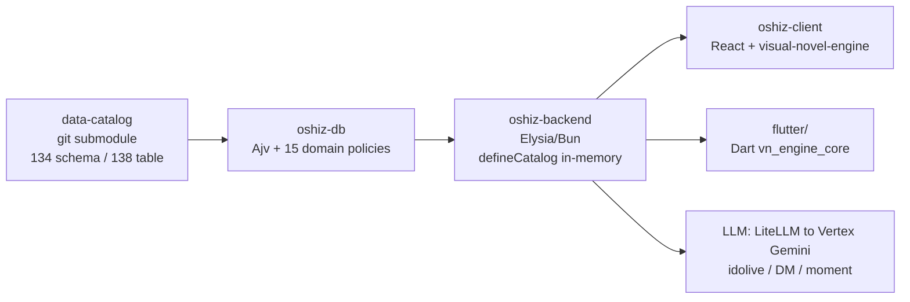
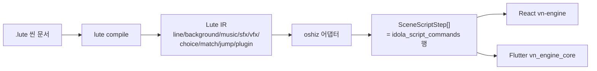
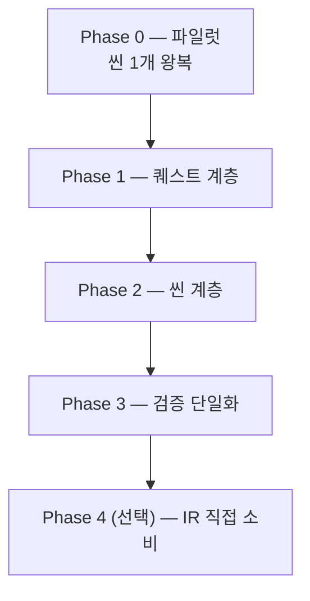

# Lute → OSHiZ 도입 타당성 보고서

**대상**: `~/Workspace/eevee` (OSHiZ 모노레포) · **평가 기준**: Lute 0.7.0 (언어=IR=툴체인)
**작성일**: 2026-07-27 · **근거**: 두 레포 직접 조사 + `packages/data-catalog` 실데이터 전수 집계

---

## 0. 결론 먼저

**적용 가능하다. 단, "런타임 교체"가 아니라 "authoring + 정적 검증 계층"으로 들어가야 한다.**

OSHiZ는 이미 Lute가 컴파일해 내는 것과 **구조적으로 같은 것**을 손으로 만들어 쓰고 있다 —
플랫 커맨드 레코드 스트림(`idola_script_commands`), 사실 스냅샷 기반 조건 평가기
(`ConditionFactSnapshot`), 선언형 퀘스트/목표/보상 테이블. 없는 것은 **그것을 쓰는 언어와
그것을 검사하는 컴파일러**다. 지금 그 자리는 Ajv + 손으로 쓴 15개 도메인 정책 모듈 +
**엔진 소스에서 수동 복사한 커맨드 타입 화이트리스트**가 메우고 있다.

| 도입 모드 | 내용 | 비용 | 권고 |
|---|---|---|---|
| **A. 컴파일 다운** | `.lute` → 기존 catalog JSON 테이블. 런타임 무변경 | 중 | ✅ **이것부터** |
| **B. IR 직접 소비** | 엔진이 Lute IR을 직접 실행 | 매우 높음 (TS+Dart 런타임 2개 신규 + Datalog/CEL 평가기) | ⛔ 지금은 아님 |

Mode A는 **언어 변경이 거의 필요 없다**. 필요한 건 대부분 툴체인/플러그인 매니페스트 작업이다.
아래 §4에 구체적 갭 12개를 우선순위와 함께 정리했다.

---

## 1. OSHiZ 실측 현황

### 1.1 제품과 토폴로지

OSHiZ = AI 아이돌 연애 시뮬 / 비주얼 노벨 모바일 게임. 8명의 플레이어블 캐릭터와
DM 채팅(LLM), 분기형 "promise date" VN, 사전 저작 + LLM 생성 "idolive" 씬, 월드맵,
퀘스트/일일미션, 수집(포토카드/모먼트), 재화(shard) 상점.



- 게임 데이터는 **DB에 적재하지 않는다**. `orchestrator.ts::seedAll()` 주석:
  "게임 데이터는 DB 비적재(data-catalog 인메모리 소비)로 전환 완료".
- **서버 권위**: 조건 평가·보상 지급·세션/선택 영속화는 전부 백엔드 DB 트랜잭션 안.
  클라이언트 엔진은 순수 표현/내비게이션 계층.
- **클라이언트 런타임이 2개** (React `@oshiz/visual-novel-engine`, Flutter `vn_engine_core`).
  둘은 같은 플랫 스텝 IR을 소비하며, `script_command_contract.dart`가
  "the canonical command contract; port FIRST"로 명시되어 있다 —
  **조직이 이미 이 스텝 포맷을 이식 가능한 IR로 취급하고 있다.**

### 1.2 VN 씬 스크립트 — 전수 집계 (직접 계산)

`packages/data-catalog/data/idola_script_commands/`

| 지표 | 값 |
|---|---|
| 씬 파일 | **777** |
| 커맨드 행 | **73,847** |
| 씬당 행 수 (중앙값 / 최대) | 61 / **428** |
| 분기를 포함한 씬 | **319 / 777** |
| 실제 사용되는 `type` | **19종** (엔진 enum은 37종, 구현 36종) |
| `next` 타깃 형태 | 태그 **5,404** · shot-index 785 |
| 최대 `index` 값 | 9,100 |
| 인라인 번역 행 | koKr 52,796 / enUs 44,074 / jaJp 40,059 |
| `lineId`가 이미 채워진 행 | 6,640 |

실사용 `type` 분포:
```
dialogue 31205 · narration 21437 · sfx 5231 · auto 5046 · choice 2427
background 2338 · music 2218 · end 1835 · branch 868 · foreground 430
external 366 · video 202 · vfx 153 · love-lockdown-choice 36
love-lockdown-branch 18 · ui 13 · split-screen-enter/exit 9/9 · love-lockdown-result 6
```

실제 분기 샘플 (`pd-yumenomiya-sofia-t2_1-station_front-meeting-01.json`):
```json
{ "type":"branch", "shot":"010","index":"1620", "interactionType":"BRANCH_CHOICE",
  "branchId":"...:bf_play_010", "translation-koKr":"갑자기 남자친구 역을 맡으라는 소피아. 어떻게 응할까?" }
{ "type":"choice", "index":"1640", "choiceId":"...:bf_a_010", "next":"bf_a_010", "value":"HIGH",
  "translation-koKr":"내가 너무 늦었지, 달링." }
{ "type":"choice", "index":"1660", "choiceId":"...:bf_b_010", "next":"bf_b_010", "value":"DOWN" }
{ "type":"dialogue","index":"1665","speaker":"sofia","tag":"bf_a_010",
  "assetId":"CH.sofia.athleisure.surprised.0","emotion":"surprised", ... }
```

**이미 존재하는 Lute적 관습**: `lineId: "npc_koyuki_ep05.koyuki-0010"` —
Lute의 `{character}.{episodeId}` + `{speaker}_{code}` 규약과 사실상 동일하다.
`lineCode` 컬럼도 스키마에 선언되어 있다 (실데이터 82행).

### 1.3 퀘스트 / 조건 / 보상 — 전수 집계

| 테이블 | 행 수 |
|---|---|
| `quests` | 583 |
| `quest_trigger_conditions` | 578 |
| `quest_clear_conditions` | 909 |
| `quest_rewards` | 1,759 |
| `idola_events` / `_conditions` / `_rewards` | 226 / 225 / 427 |
| `pass_tier_conditions` | 804 |
| `promise_date_interaction_events` | 738 |
| `translations` | 39,631 |

**조건 인코딩은 전 테이블 통일**: `{ id, <parent>Id, kind, target, amount }`.
12개 조건 테이블에 같은 44값 enum이 **파일마다 복붙**되어 있다.
그런데 **실제 사용되는 kind는 19종뿐**:

```
CHARACTER_INTIMACY_GTE 814 · IN_PROGRESS_QUEST_ID 477 · CLEAR_IDOLA_EVENT_ID 408
CLEAR_QUEST_ID 364 · OWN_ITEM_COUNT_GTE 338 · CHARACTER_TALK_AFTER 213
ARRIVE_SPACE_AFTER 183 · CLEAR_CHARACTER_TALK_ID 78 · PURCHASE_PRODUCT_ID_AFTER 51
USER_LEVEL_GTE 47 · DM_WITH_CHARACTER_AFTER 31 · CLEAR_SPACE_OBSERVE_ID 25
SPACE_OBSERVE_AFTER 25 · END_TIMESLOT 24 · DM_WITH_CHARACTER_COUNT_GTE 18
OPEN_CHARACTER_ID 4 · OPEN_SPACE_ID 2 · USER_LEVEL_LTE 1 · USER_STAT_GTE 1
```

보상도 통일: `{ rewardKind, target, amount, min, max }`, 실사용 16종
(SHARD 870 · EXP_ACCOUNT 824 · ECHO_MULTIPLIER 585 · ACCEPT_QUEST_ID 414 · ITEM 194 …).

**실제 퀘스트 하나 (완본)**:
```json
quests:                  { "id":"sub_quest_anon_look_0001", "kind":"SUB", "tier":"N",
                           "characterId":"anon", "locationId":"local_mart_indoor",
                           "isRepeat":true, "duration":86400, "weight":10 }
trigger_conditions:      [{ "kind":"CLEAR_IDOLA_EVENT_ID", "target":"npc_anon_ep01", "amount":1 }]
clear_conditions:        [{ "kind":"OWN_ITEM_COUNT_GTE", "target":"normal_..._empty_milk_carton", "amount":5 },
                          { "kind":"CHARACTER_TALK_AFTER", "target":"anon", "amount":1 }]
rewards:                 [{ "rewardKind":"ECHO_MULTIPLIER", "amount":1 },
                          { "rewardKind":"EXP_ACCOUNT", "amount":80 },
                          { "rewardKind":"ITEM", "target":"normal_..._empty_milk_carton", "amount":-5 }]
```

조건 조합은 **"같은 부모의 여러 행 = 암묵적 AND"**. 명시적 AND/OR은
`product_condition_groups`(operator 컬럼)에만 존재. clear 조건 분포: 1개 257 / 2개 326.

### 1.4 조건 평가기 — Lute와의 구조적 대응

`apps/oshiz-backend/.../evaluate-user-conditions.usecase.ts`:

```ts
export type ConditionFactSnapshot = {
  afters: Map<string, Date>;                                  // kind:target:baselineAt
  afterConditionProgressById: Map<string, AfterConditionProgressFact>;
  characterIntimacyById: Map<string, number>;
  counters: Map<string, CounterFact>;   // { amount, count, firstOccurredAt, lastOccurredAt }
  flags: Set<string>;                                          // kind:target
  flagSatisfiedAts: Map<string, Date>;
  openedCharacterIds: Set<string>; openedSpaceIds: Set<string>;
  ownedItemCountById: Map<string, number>;
  runtimeFlags: Set<string>;
  userLevel: number | null; userStats: Record<string, number>;
};
```

이건 **Lute의 fact store + scalar state를 손으로 구현한 것**이다:

| OSHiZ | Lute 대응 |
|---|---|
| `flags: Set<"KIND:target">` | `relations` + `holds(rel(target))` |
| `counters: Map<key, {count}>` | `count(rel(args))` |
| `counters: Map<key, {amount}>` | **대응 없음** — Lute `count()`는 튜플 수만 센다 → **갭 G6** |
| `afters: Map<key, Date>` | `validAt(rel, narrativeTime)` — 단, 저작 표면 부재 → **갭 G7** |
| `characterIntimacyById`, `userLevel`, `userStats` | scalar `state:` (`run.*`/`user.*`) ✓ |
| 여러 행 = AND / group operator = OR | CEL `&&` `\|\|` ✓ 갭 없음 |
| `ConditionExplain.satisfied` | 엔진 측 평가 (D1 경계) ✓ |

### 1.5 지금 이 데이터를 무엇이 검증하는가

- `oshiz-db/src/seeder/data-catalog-validation.ts` — Ajv로 행 단위 JSON Schema 검증.
  `strict:false`, `additionalProperties` 미설정 → **스키마에 없는 필드가 조용히 통과**
  (`quests.json` 실데이터의 `isRepeat`/`spendShard`/`duration`/`weight`가 스키마 미선언).
- `domain-policies/` 15개 모듈 — 손으로 쓴 참조 무결성 (조건 `kind`별 target 참조 테이블 매핑 등).
- `domain-policies/idola-script-commands.ts` — **엔진 `CommandFactory` switch에서 수동 복사한
  `ENGINE_SUPPORTED_SCRIPT_TYPES` 화이트리스트.** 소스에 "수동 동기화 필요" 경고와
  "`toggle`은 enum에 있지만 미구현이며 씬 전체 로딩을 크래시시킨다"는 주석이 그대로 있다.
- 행 타이핑 로직은 **최소 3중 중복**: Ajv 스키마 / `defineCatalog().map()` (~150 파일) /
  `oshiz-viewer/src/data/normalize.ts` (헤더에 "intentionally duplicated" 명시).
- **코드젠은 어디에도 없다.**

### 1.6 저작 워크플로

- 프로덕션 카탈로그 편집자 **1명** (단일 운영자, 명시적 설계 선택).
- 편집 표면 2개: `evectl repo` CLI, 그리고 `gamedesign-data-gen`(로컬 웹 UI :3100)이
  띄우는 **Claude Code 터미널 세션** — 9개 가드형 MCP 툴
  (`read_table` / `write_rows` / `validate_and_fix` / …), 강제 파이프라인
  `read_table → analyze → write_rows → validate_and_fix`.
- 씬/대사 상당 비중이 **LLM 생성** (`robot:bard` 커밋 저자 클래스, `bard-b3-*.json` 40개 씬).
- 릴리스 게이트: `catalog-flow`(5축 리스크 분류기) + eevee CI 3단 릴레이.

> **이 워크플로가 Lute에 유리한 결정적 사실**: 저작 주체가 이미 에이전트다.
> Lute의 `check()` 코어 + 구조화된 진단 + `lute context`는 정확히
> "에이전트의 write→verify 루프"를 위해 설계됐다.

---

## 2. Lute 현황 (0.7.0) — 가진 것

- **언어**: `kind: scene | quest`. 콘텐츠 라인(`@speaker{}: text`), 스테이징 리프
  (`::bg ::music ::sfx ::auto ::vfx ::cut ::video ::camera` — core 8개),
  로직 블록(`<branch>/<choice>`, `<match>/<when>/<otherwise>`, `<hub>`, `<timeline>/<track>`,
  `<on>`, `<quest>/<objective>`), 상태(`::set`), 사실(`::assert`/`::retract`), 컴포넌트(`::use`).
- **상태 모델**: 5티어 (`scene`/`run`/`user`/`app`/`quest.<id>`) + 관계형 사실
  (entities/enums/relations/facts/rules) + 계층화 Datalog.
- **검사**: ~155개 진단 코드. 망라성(`E-NONEXHAUSTIVE`), 확정 할당
  (`E-UNDECLARED`/`E-MAYBE-UNSET`), 도달 가능성(`E-QUEST-UNREACHABLE`,
  `E-OBJECTIVE-UNSATISFIABLE`), Datalog 안전성/계층화, 타임라인 쓰기 충돌,
  프로젝트 연결성(`E-CONN-*`).
- **IR**: 문서당 1 아티팩트, 커맨드 20종, `addr` 주소 기반 제어흐름,
  이식 가능한 CEL expr AST, 관계 어휘 데이터.
- **툴체인**: `check` `check-project` `compile` `tag` `fix` `context` `trace` `run` `test`
  `loc export` `scenario` `catalog refresh` `doctor`. LSP(진단 byte-identical 보장),
  tree-sitter, npm 배포(`@lute-lang/lute`), WASM 플레이그라운드.
- **플러그인**: `plugin.yaml` + directives/state/providers/bridge/defs/assetkinds/frontmatter.
  프로파일 활성화 → `capabilityVersion` 해시 스냅샷. **구현되어 있다**
  (`docs/plugin-system.md`의 "not yet implemented"는 문서가 낡은 것).
- **선례**: tactus(SRPG) 파일럿이 Lute 0.7 IR을 소비하는 TS 런타임을 직접 구현,
  relations + `::assert` + `count()` 목표 게이팅 + 전투 서브시스템 bridge 호출이
  실제로 동작함을 확인.

---

## 3. 레이어별 적합도

### 3.1 VN 씬 스크립트 — **적합도 높음**



| Lute IR kind | oshiz `type` | 상태 |
|---|---|---|
| `line` (role=dialogue/narration) | `dialogue` / `narration` / `fullscreen-narration` | ✓ 직결 |
| `background` | `background` / `bg` | ✓ |
| `music` / `sfx` / `vfx` / `video` | 동명 | ✓ |
| `sprite` (auto 주입) | `auto` | ✓ (Lute의 자동 주입이 오히려 상위 호환) |
| `choice` + `match` + `jump` | `branch` + `choice` + `next`/`tag` | ✓ 구조 변환 필요 |
| `cut` | `foreground` / `fg` | 이름만 다름 |
| — | `external` `end` `ui` `stamp` `weather` `chatting`<br/>`user-input` `answer` `suggestions` `pause`<br/>`asset-load` `reward` `challenge` `split-screen-*`<br/>`love-lockdown-*` | **플러그인 디렉티브로 선언** → `kind:"plugin"` |
| `camera` | — (oshiz에 카메라 없음) | Lute 초과 기능 (미사용) |

플러그인 디렉티브는 전부 `Command::Other { tag, fields, effects }`로 낮아진다
(`lute-compile/src/lower.rs:198-222` 확인). 어댑터가 `tag`로 스위치해서 행을 만들면 된다.
**언어 변경 불필요.**

### 3.2 퀘스트 / 조건 / 보상 — **적합도 높음, 갭 2개**

`sub_quest_anon_look_0001`을 Lute로 그대로 쓰면:

```lute
---
kind: quest
uses: oshiz.world.schema.yaml
profile: oshiz
---
<quest id="sub_quest_anon_look_0001"
       start="holds(clearedIdolaEvent(npc_anon_ep01))">
  <objective id="collect"
             done="count(ownsItem(normal_local_mart_indoor_empty_milk_carton)) >= 5" />
  <objective id="talk"
             done="holds(talkedWith(anon))" />
  <on event="questComplete">
    ::grant{kind="ECHO_MULTIPLIER" amount="1"}
    ::grant{kind="EXP_ACCOUNT" amount="80"}
    ::grant{kind="ITEM" target="normal_local_mart_indoor_empty_milk_carton" amount="-5"}
  </on>
</quest>
```

- `start` ← `quest_trigger_conditions` (Lute 퀘스트 라이프사이클이 정확히 이 개념)
- `<objective done>` ← `quest_clear_conditions` (여러 행 = 여러 objective = 암묵 AND ✓)
- `<on event="questComplete">` ← `quest_rewards`
- `::grant`는 플러그인 디렉티브 (bridge 또는 순수 effect)

`lute check`가 공짜로 주는 것: 조건 target이 실존 id인지(providers), 퀘스트가
**증명 가능하게 도달 불가**한지(`E-QUEST-UNREACHABLE`), objective가 **증명 가능하게
만족 불가**한지(`E-OBJECTIVE-UNSATISFIABLE`), 퀘스트 id 프로젝트 전역 유일성.
지금은 셋 다 검사되지 않는다.

**남는 갭**: `SHARD_SPEND_TOTAL_GTE`류의 **누적 합** (§G6), `*_AFTER`류의 **기준시각 이후** (§G7).

### 3.3 LLM 생성 씬 — **범위 밖**

`idolive/converse`·`intro`·`forced-ending`, DM 채팅, moment 생성은 런타임에
Gemini가 씬을 만든다. Lute는 빌드타임 컴파일러다. **이 경로는 Lute가 대체하지 않는다.**
다만 두 가지 접점은 있다:
1. LLM 출력 스키마를 Lute IR 부분집합으로 정의 → 동일 어댑터 재사용.
2. `::external`/bridge로 "여기서 LLM 씬을 삽입"을 사전 저작 씬 안에 선언
   (현재 `external` 366행이 하는 일과 동일).

### 3.4 나머지 ~120개 테이블 — **범위 밖**

에셋 등록, imagegen 프리셋, 스케줄, 번역, 상점, 밸런스 테이블은 Lute의 대상이 아니다.
**Lute는 카탈로그를 대체하지 않는다. 행동(behavior) 계층만 흡수한다.**
행동 계층 = 씬 스크립트 + 퀘스트/이벤트 + 조건/보상 + intimacy 스테이지 + space observe
+ pass tier ≈ **15~18개 테이블**.

### 3.5 데이터 선언 표면 — Lute가 카탈로그와 만나는 5개 접점

Lute에 "datadoc"이라는 이름의 기능은 없다. 대신 **데이터를 선언·검증하는 표면이 5개** 있고,
OSHiZ의 134개 테이블은 이 5개에 따라 갈린다. **이 층이 Mode A에서 가장 레버리지가 크다** —
씬/퀘스트 문법보다 먼저 값을 낸다.

| # | Lute 표면 | 실체 | OSHiZ 대응 | 적합 |
|---|---|---|---|---|
| D1 | **선언 문서**<br/>(`*.schema.yaml`, `uses:`/`extends:`) | body 없는 순수 선언 맵 (D14). 담을 수 있는 키는 정확히 `state` `defs` `enums` `entities` `relations` `facts` `rules` | 조건/보상 enum, tier·grade·timeslot·emotion·stage 도메인, 캐릭터/스페이스/아이템 엔티티 | ✅ 강함 |
| D2 | **`facts:`** | ground seed 사실 (와일드카드 불가) | 작은 정적 매핑 테이블 | ⚠️ 제한적 |
| D3 | **provider 스냅샷**<br/>(`catalog/<name>.yaml`) | `entries: { providerName: [id...] }` flat YAML. 스냅샷 우선 — 라이브 카탈로그 의존 금지 | `item_definitions` `quests` `spaces` `products` `idola_events` `characters` … **id 우주 전체** | ✅ **최고 가치** |
| D4 | **assetKinds** | 세그먼트 구조화 에셋 id 템플릿 | `CH.sofia.athleisure.surprised.0` (38,090행) | ✅ 강함 |
| D5 | **플러그인 `frontmatter:` export** | 플러그인 소유 meta 키 | 퀘스트 행 자체의 컬럼(`tier` `weight` `duration` `isRepeat` `spendShard` `locationId`) | ⚠️ **값 검증 미구현** (G13) |

#### D1 — 선언 문서로 없어지는 중복

지금 44값 조건 enum이 **12개 스키마 파일에 복붙**되어 있다
(`quest_trigger_conditions` `quest_clear_conditions` `pass_tier_conditions`
`space_observe_*_conditions` `product_conditions` `character_talk_*_conditions`
`idola_event_conditions` `promise_date_ending_conditions` …).
`uses:` 합성은 이걸 **한 번 선언**으로 바꾸고, 중복 선언은 `E-USES-DUP-*`가 잡는다.
`extends:`는 상위집합 재선언만 허용(`E-EXTENDS-STATE-TYPE`/`E-EXTENDS-RELATION-SIG`)이라
도메인별 파생(예: `promise_date`가 base 조건 어휘에 `MOOD_GTE`류를 추가)도 안전하다.

```yaml
# oshiz.world.schema.yaml  — 전 도메인이 uses: 하는 단일 어휘
entities:
  character: { members: [sofia, reiha, megumi, ann, bianca, iroha, koyuki, anon] }
  space:     { open: engine }        # 엔진이 id를 민팅 → 정적 멤버십 검사 불가
  item:      { open: engine }
enums:
  questTier:  [UR, SSR, SR, R, N]
  timeslot:   [DAWN, MORNING, NOON, AFTERNOON, EVENING, NIGHT, LATE_NIGHT, MIDNIGHT]
relations:
  clearedQuest:       { args: [quest],            tier: user }
  clearedIdolaEvent:  { args: [idolaEvent],       tier: user }
  talkedWith:         { args: [character],        tier: user }
  arrivedSpace:       { args: [space],            tier: user }
  ownsItem:           { args: [item],             tier: user }   # count() 대상
  openedSpace:        { args: [space],            tier: user }
state:
  user.level:              { type: number, default: 1 }
  user.spendShardTotal:    { type: number, default: 0 }   # G6: 누적합은 reserved scalar
```

이게 곧 `ConditionFactSnapshot`의 **선언형 사본**이다 (§1.4 대응표 참조).

#### D3 — provider 스냅샷이 손으로 쓴 참조 검증을 대체한다

`domain-policies/conditions.ts`는 조건 `kind`별로 "이 target은 어느 테이블에 있어야 한다"를
**손으로 매핑**한다 (`CLEAR_QUEST_ID`→`quests`, `OWN_ITEM_COUNT_GTE`→`item_definitions`, …).
Lute에서는 이게 provider 선언 한 줄 + `E-UNKNOWN-ID`다.

스냅샷 포맷은 이미 지극히 단순하다:
```yaml
manifestVersion: "<capabilityVersion>"
providerVersion: "1"
stale: false
entries:
  questId: [sub_quest_anon_look_0001, ...]      # data/quests.json 에서 생성
  itemId:  [normal_local_mart_indoor_empty_milk_carton, ...]
```
→ `data-catalog` → provider 스냅샷 생성기는 **스크립트 수십 줄**이고,
`lute catalog refresh`가 재스탬프를 이미 담당한다. **이것이 G8이며 가장 빠른 승리다.**

#### D4 — assetKinds가 잡는 것

`assetId`를 가진 행이 **38,090개**, `voiceAssetId` 889개. 오타 하나가 런타임 에셋 미스이고,
현재 검증은 `table-policies.ts`의 voice-asset 규칙 정도뿐이다.
`CH.{character}.{costume}.{emotion}.{variant}` 구조를 assetKind로 선언하면
`E-ASSET-DECOMPOSE` / `E-ASSET-SEGMENT` / `E-ASSET-UNKNOWN-ID`가 세그먼트 단위로 잡는다
— 캐릭터×코스튬 조합이 유효한지까지.

#### 안 되는 것 — 레코드 테이블 (~110개)

`quests`의 `title/tier/duration/weight`, `item_definitions`, `products`,
`dm_imagegen_*` 프리셋처럼 **행마다 여러 타입 컬럼을 갖는 테이블**은 Lute frontmatter로
표현할 수 없다. `Type::Record`/`Map`/`List`는 **플러그인 매니페스트 전용 타입 시스템**이고,
저작자 `state:`의 컬렉션 타입은 **미명세**다 (셰이프 검증기가 거부하지는 않지만
문서화·테스트되지 않았고, 스펙 본문은 "scalar-only"라고 쓴다).
→ **이 테이블들은 JSON으로 남는다. Lute는 그 id를 참조 검증할 뿐이다.**

예외적으로 **퀘스트 행 자체의 컬럼**은 D5(플러그인 frontmatter)로 퀘스트 문서 머리에
올릴 수 있다 — 단 값 검증이 아직 없다(G13).

### 3.6 Datalog(`derive:` + `rules:`) — **지금은 과잉, 켤 시점은 따로 있다**

0.3.0 관계형 커널은 **3층**이고 층마다 판정이 다르다.

| 층 | 내용 | OSHiZ 판정 |
|---|---|---|
| **L1** `relations:` `facts:` `::assert`/`::retract` | 사실 어휘 + 변이 | ✅ `ConditionFactSnapshot` 그 자체 |
| **L2** `holds()` `count()` `validAt()` | CEL 사실 질의 | ✅ 조건 평가 그 자체 (`count()`가 `OWN_ITEM_COUNT_GTE` 338행 커버) |
| **L3** `derive: true` + `rules:` (Datalog fixpoint) | 파생 술어 | ⚠️ **오늘 쓸 데가 사실상 없다** |

#### L3가 지금 안 맞는 이유 — 실측 3개

**(1) 조인할 대상이 없다.** 12개 조건 테이블 **3,104행 전수**:
target 보유(=unary) 3,056 · targetless(=nullary) 48 · **binary 이상 = 0**.
Datalog의 본체인 조인(`points(S) :- foundClue(C), implicates(C,S)`)이 물릴 데가 없다.

**(2) 이름 붙일 공통 술어가 없다.** 부모별 조건 세트 2,351개 중
**조건 2개 이상을 묶은 세트가 5회 이상 반복되는 경우 = 0개**.
`derive:`의 값은 "반복되는 조건 덩어리에 이름을 붙이는 것"인데, 그 덩어리가 없다.
(반복되는 건 *단일* 조건뿐 — `OWN_ITEM_COUNT_GTE` 특정 아이템 5개, 최대 19회.)

**(3) 부정이 어휘에 없다.** 44값 enum에 `NOT_*`가 하나도 없다.
계층화(stratification) 검사는 `not` 간선 위의 사이클을 잡는 분석인데, `not`이 없다.

#### n-ary 테이블은 있지만 Datalog 관계가 아니다

`character_intimacy_message_controls` 5,992행 (characterId × intimacyLevel × emotion ×
scheduleType × scheduleStatusType), `gift_effects` 1,573행 (itemId × characterId),
`promise_date_interaction_events` 738행 (courseId × stage × spaceId × timeslot × characterId),
`schedule_character_place_affinities` 32행 (charId × placeId × **weight**).

다차원이긴 하나 전부 **payload를 실은 lookup 테이블**이다 — `weight`, `successRate`,
`amount`, `directMessageSample`. **Lute의 relation은 payload가 없다** (args는 entity-kind/
enum/bool 도메인뿐, 튜플은 참/거짓). 따라서 이들은 §3.5의 "레코드 테이블 → JSON 유지"에 속한다.

#### 진짜 쓸 곳은 Datalog가 아니라 `after:` 다 — **중요한 교정**

퀘스트 의존 그래프 실측: **583 퀘스트 중 406개가 다른 퀘스트에 의존**,
`ACCEPT_QUEST_ID` 보상 간선 406개, **최장 의존 체인 깊이 29**
(`main_quest_sofia_0026`), 사이클 0.

이 그래프에는 **지금 아무 정적 검증도 없다.** 깊이 29짜리 체인에 손으로 행을 추가하다
사이클을 만들면 오늘은 "영원히 열리지 않는 퀘스트"로 런타임에 조용히 죽는다.

그런데 이건 **런타임 사실이 아니라 저작 시점 선행 관계**다 → Lute에서는
`relations:`/Datalog가 아니라 **`after:` 연결성 그래프**의 영역이다.
`after:`는 `visited("...")` / `completed("...")` **2개 프리미티브 + `&&`/`||`**만 있는
일부러 작은 프로파일이고 (`E-CONN-PROFILE`), 이게 정확히 오늘의
`CLEAR_QUEST_ID`(364) + `IN_PROGRESS_QUEST_ID`(477) = **841행의 형태 그대로**다.

```yaml
# main_quest_sofia_0026.lute
---
kind: quest
after: 'completed("main_quest_sofia_0025")'
---
```
얻는 것: `E-CONN-CYCLE`(사이클), `E-CONN-UNREACHABLE`(도달 불가),
`E-CONN-EPISODE-ID-DUP`, `lute scenario reach --format dot`(깊이 29 체인 시각화),
`scenario envelope`(각 퀘스트 진입 시 보장/가능 상태).

#### Datalog를 켜면 **잃는 것**

`W-UNPROVEN-RELATIONAL` — 사실 질의(`holds`/`count`/`validAt`)가 낀 게이트는
**정적으로 항상 `Unknown`**이다. 도달성·망라성·dead-arm 증명이 그 지점에서 멈춘다.
즉 조건을 relations로 옮기는 것은 **검증을 얻는 게 아니라 어휘를 얻는 것**이다.
검증은 provider(`E-UNKNOWN-ID`)와 `after:` 연결성에서 온다. 이 둘을 혼동하면 안 된다.

또한 엔진 비용: 현재 조건 평가는 사전 구축된 fact 스냅샷에 대한
O(조건 수) enum switch를 **DB 트랜잭션 안에서** 돈다. Datalog 최소 고정점 평가기를
그 자리에 넣는 것은 별개의 (그리고 지금 근거가 없는) 결정이다.

#### 언제 L3를 켜야 하나 — 3가지 트리거

1. **binary 이상의 boolean 술어가 생길 때.** 예: `characterAt(character, space, timeslot)`
   (스케줄 시스템을 사실로 노출), `implicates` 스타일의 단서–용의자 그래프.
   payload 없는 순수 관계여야 한다.
2. **파생 조건에 이름이 필요해질 때.** 지금 583 퀘스트에 2,351개 유니크 조건셋 =
   재사용률 0인데, 이게 의도된 설계인지 우발적 중복인지는 기획 판단이다.
   "소피아 루트 개방" 같은 개념이 여러 곳에서 반복되기 시작하면 `derive:`가 답이다.
3. **부정 게이팅이 필요해질 때.** "아직 X를 안 한 유저에게만" 류.
   그때 계층화 검사(`E-DATALOG-UNSTRATIFIED`)가 처음으로 값을 낸다.

**결론: L1·L2는 Phase 0.5에서 바로 켠다. L3는 선언만 해두고(관계는 이미 있으므로)
`rules:`는 비워둔다 — 단, `derive:` 관계에 규칙이 없으면 `W-DERIVE-NO-RULES`가 뜨므로
아예 선언하지 않는 쪽이 맞다.**

---

## 4. 갭 분석 — Lute에 무엇을 추가해야 하나

우선순위: **P0 = Mode A 차단 요소** · **P1 = 실용성 필수** · **P2 = 있으면 좋음**

### G1 (P0) — 프로젝트 레벨 테이블 방출 (`compile --emit`)

Lute는 **문서당 아티팩트 1개**를 낸다. OSHiZ가 소비하는 건 **테이블**이다
(`quests.json` 583행, `quest_rewards.json` 1759행, …).
N개 `.lute` 퀘스트 문서 → 4개 조인된 테이블로 투영하는 프로젝트 레벨 방출기가 없다.

필요: `lute compile --project --emit=<target>` 혹은 어댑터가 소비할 수 있는
**프로젝트 번들 아티팩트**(전 문서 아티팩트 + 프로젝트 그래프를 한 JSON으로).
`check-project`/`scenario`는 그래프를 이미 계산하지만 아티팩트를 방출하지 않는다.

### G2 (P0) — `addr` 자릿수 / 주소 규약

Lute `addr = "{shot:03}-{(index+1)*100:04}"` — index는 **shot 내 위치**다.
실측: 한 `(sceneId, shot)` 단위의 최대 행 수는 **114**
(`pd-yumenomiya-reiha-t2_1-station_front-meeting-01`/shot `010` = 114,
`onboard_prologue_02`/shot `3` = 113, 3위가 99). 즉 `(114)*100 = 11400` → **5자리**.
tactus 파일럿이 프로덕션에서 발견한 바로 그 버그
(`"002-11500" < "002-1400"` 사전식 비교) 구간에 **오늘 이미 2개 단위가 진입해 있고,
세 번째가 한 행 차이로 붙어 있다.** 그 중 하나가 온보딩 프롤로그다.

씬 전체 기준으로는 428행(`pd-yumenomiya-bianca-tcore-haunted_house-stat-01`)이 최대이고
100행 이상 씬이 **219/777** — shot 분할 방식이 바뀌면 언제든 확산된다.

또한 OSHiZ는 `index`를 1640/1660/**1665**처럼 **불균등 간격**으로 쓴다 — 삽입 여유를
남기는 저작 관습이다. Lute의 고정 ×100 stride는 이 관습을 파괴한다.

필요:
- (a) 어댑터/런타임 계약에 **세그먼트별 수치 비교** 명문화 + 컨포먼스 픽스처에 5자리 케이스 추가.
- (b) 주소 stride/자릿수를 프로젝트 설정으로 노출하거나, `shot`/`index`를 저작자가
  고정할 수 있는 방출 모드.

### G3 (P0) — 다국어 인라인 컬럼

OSHiZ 타깃 행은 `translation-koKr` / `-jaJp` / `-enUs`를 **행 안에** 갖는다
(각각 52796 / 40059 / 44074행). Lute 문서는 `contentLang` 단일 언어이고,
`lute loc export`는 있지만 **역방향 병합(import/merge)이 없다.**

필요: lineId 키 기반 로케일 오버레이 파일을 컴파일 시 아티팩트에 병합하는 경로
(`lute loc import` 또는 `locales:` frontmatter). 없으면 어댑터가 `translations.json`을
따로 읽어 조인해야 하는데, 그러면 **Lute 체커가 번역 누락을 못 잡는다**
(`E-L10N-PLACEHOLDER`는 있으나 단일 언어 범위).

### G4 (P1) — 안정 식별자 템플릿 (`lineId` 포맷)

카탈로그: `npc_koyuki_ep05.koyuki-0010`. Lute: `detective.s01ep01.narrator_0010`.
구분자(`-` vs `_`)와 조합 규칙이 다르다. 이미 6,640행이 카탈로그 포맷으로 존재하고
음성 에셋 키가 여기 물려 있다 (`voiceAssetId` 889행).

필요: `lineId`/`voiceKey` 템플릿을 프로젝트 설정으로. (현재는 하드코딩)

### G5 (P1) — 교차 절단(cross-cutting) 플러그인 attr

OSHiZ는 `bonusId`/`bonusScore`를 **임의의 스텝**에 붙인다 — 커맨드 종류와 무관하게
베이스 클래스가 `bonus:execute`를 발화한다 (`base-command.ts:36-39`, 실데이터 318행).
Lute의 stamp 필드는 고정(`wait`/`duration`/`delay`/`at`)이고, 플러그인 attr은
**디렉티브별**로만 선언된다. 모든 라인/디렉티브에 붙는 공통 attr을 선언할 수 없다.

필요: 플러그인이 **cross-cutting stamp attr**을 선언하는 능력
(plugin-system spec §10의 "reserved timing attrs"와 대칭인 확장 슬롯).

### G6 (P1) — 사실 집계 (`sum`)

OSHiZ 조건 `SHARD_SPEND_TOTAL_GTE` / `ITEM_USE_COUNT_GTE` 등은
`CounterFact.amount`(누적 합)를 읽는다. Lute의 fact query 표면은
`holds` / `count` / `validAt` / `now()`뿐 — **`count`는 튜플 수만 센다.**
"소비 금액 총합 ≥ N"은 표현 불가.

선택지:
- (a) CEL 프로파일에 `sum(rel(args), argIdx)` 추가 — Datalog 안전성/계층화 분석에
  집계 계층(stratified aggregation)을 도입해야 함. **비용 큼.**
- (b) 엔진이 채우는 **`reserved: true` scalar state**로 모델링 (`user.spendShardTotal`).
  Lute는 이미 `reserved` 관계와 `app` 티어 읽기 전용 상태를 갖고 있다. **권장.**
  → 언어 변경 없이 `oshiz.world` 스키마 문서에 선언만 하면 된다.

**결론: G6은 실제로는 갭이 아니라 모델링 결정**이다. (b)로 간다. 문서화만 필요.

### G7 (P1) — "기준시각 이후" 술어 (`*_AFTER`)

`ARRIVE_SPACE_AFTER`, `CHARACTER_TALK_AFTER`, `DM_WITH_CHARACTER_AFTER` 등
7종 × 실사용 452행. 의미: "조건이 부여된 시점(`baselineAt`) 이후에 해당 행동이 발생했는가".

Lute에는 `Type::NarrativeTime` + `validAt(rel, t)`가 있으나:
- `narrativeTime`은 **엔진 표면 전용** — 저작자가 `state:`로 선언하면 `E-TEMPORAL-ARG`.
- `validAt`는 **derive 관계에서 거부**(`E-VALIDAT-DERIVED`).
- 비교 표면은 **순서 비교만** (`!=` 거부).

`baselineAt`은 퀘스트 인스턴스가 활성화된 시각이다. Lute의 `quest.<id>.*` 티어에
엔진이 채우는 `quest.<id>.activatedAt: narrativeTime`을 **예약 슬롯**으로 두면
`validAt(arrivedSpace(x), quest.<id>.activatedAt)`로 표현된다.

필요: `quest.<id>` 예약 슬롯에 narrativeTime 앵커 추가 + 플러그인
`state_shapes`에서 narrativeTime 앵커를 선언하는 경로 문서화. **작은 언어 작업.**

### G8 (P1) — data-catalog → provider 스냅샷 생성기

Lute providers는 스냅샷 우선(snapshot-first)이고 `lute catalog refresh`가 있다.
OSHiZ의 id 우주(`item_definitions`, `quests`, `spaces`, `characters`, `products`,
`idola_events`, 에셋 id)를 provider 스냅샷으로 굽는 도구가 필요하다.

**언어 변경 아님 — 통합 작업.** 이게 되면 `domain-policies/conditions.ts`의
손으로 쓴 참조 세트 매핑이 `E-UNKNOWN-ID`로 대체된다.

### G9 (P2) — 선언적 lowering (`lower: { record, fields }`)

매니페스트 스키마는 `Lowering::Record`를 **파싱은 하지만**
`lute-compile`은 이 variant를 **한 번도 매치하지 않는다** (전 크레이트 grep 확인).
모든 플러그인 디렉티브는 `kind:"plugin"`으로 낮아진다.

Mode A에서는 치명적이지 않다(어댑터가 `tag`로 스위치). 하지만 구현되면
**OSHiZ 행 매핑을 매니페스트에 데이터로 둘 수 있다** — 어댑터 코드가 얇아지고,
지금 손으로 동기화하는 `ENGINE_SUPPORTED_SCRIPT_TYPES` 화이트리스트를
매니페스트 하나로 대체할 수 있다. **높은 레버리지.**

### G10 (P2) — `<branch>` converge 강제 완화 / 종결 표현

OSHiZ 씬은 `end` 행이 1,835개 — 씬당 평균 2.4개. 즉 **분기별 개별 종결**이 흔하다.
Lute `<branch>`는 converge addr을 갖고, 종료는 스트림 끝 또는 `jump`뿐이다.
표현은 가능하나(공통 종결 shot으로 jump) 저작이 어색하다.

필요: 코어 `::end{reason}` 또는 플러그인 디렉티브 + 도달성 분석이
"종결 후 코드"를 dead로 인식하게. (플러그인 디렉티브로 두면 체커가
그 뒤를 dead로 못 본다 — 이게 실질 갭.)

### G11 (P2) — 태그(라벨) 방출

OSHiZ `next` 타깃의 **87%(5,404/6,189)가 태그**다. Lute는 모든 제어 흐름 타깃을
컴파일 시 `addr`로 해소하고 IR에 라벨 개념이 없다. 어댑터가 addr로만 방출하면
사람이 읽던 `bf_a_010` 같은 의미 라벨이 사라진다 (diff 가독성/리뷰 손실).

필요: 커맨드 stamp에 선택적 `label` 필드 (저작자가 shot heading/`<choice id>`로 준 이름).

### G12 (P2) — 런타임 SDK 부재

**최대 실무 리스크.** Lute가 내놓는 실행 가능 소비자는 Rust `lute run`(참조 인터프리터)뿐.
tactus 파일럿은 TS 런타임을 직접 썼다. Mode B로 가면 OSHiZ는 **TS(백엔드) + Dart(클라)**
두 개를 새로 써야 하고, Dart 쪽은 기존 `vn_engine_core`와 동작이 일치해야 한다.

Mode A에서는 불필요 — 그래서 Mode A를 권한다.

### G13 (P1) — 플러그인 frontmatter 값 검증 미구현 (spec Appendix C2)

플러그인이 `frontmatter:`로 소유 meta 키를 선언하면 체커는 그 키를 **받아들이지만**
(`meta.rs:410`, `snapshot.frontmatter.contains_key`), **값을 선언된 타입으로 검증하지 않는다**
— plugin-system 0.0.1 Appendix C2가 "MUST이나 미구현"으로 명시.

OSHiZ에서 이게 걸리는 지점: 퀘스트 행의 컬럼(`tier: UR|SSR|SR|R|N`, `duration`, `weight`,
`isRepeat`, `spendShard`, `locationId`, `characterId`)을 퀘스트 문서 frontmatter로 올리려면
바로 이 검증이 필요하다. 없으면 Ajv 시절과 같은 "조용히 통과" 문제가 재현된다
(현재 `quests.json`의 `isRepeat`/`spendShard`/`duration`/`weight`가 스키마 미선언인 것과 동일).

함께 걸리는 C1(옵션 값 타입 검증 / 미지 옵션 거부)도 같은 배치로 처리하는 게 맞다.

---

## 5. 갭 요약표

| # | 갭 | 성격 | 우선 | Mode A 필수 |
|---|---|---|---|---|
| G1 | 프로젝트 레벨 테이블 방출 | 툴체인 | P0 | ✅ |
| G2 | addr 자릿수/stride, 수치 비교 | 계약 + 설정 | P0 | ✅ |
| G3 | 다국어 인라인 병합 | 툴체인 | P0 | ✅ |
| G4 | lineId/voiceKey 템플릿 | 설정 | P1 | ✅ |
| G5 | cross-cutting 플러그인 attr | 언어(플러그인 스펙) | P1 | ✅ |
| G6 | 누적 합 조건 | **모델링으로 해소** | P1 | ⚪ 문서화만 |
| G7 | `*_AFTER` 기준시각 술어 | 언어(작음) | P1 | ✅ |
| G8 | catalog → provider 스냅샷 | 통합 | P1 | ✅ |
| G9 | 선언적 lowering 구현 | 컴파일러 | P2 | ⚪ |
| G10 | 종결(`::end`) 표현 | 언어 | P2 | ⚪ |
| G11 | 라벨 방출 | IR(작음) | P2 | ⚪ |
| G12 | TS/Dart 런타임 SDK | 신규 구현 | P2 | ❌ (Mode B에서 P0) |
| G13 | 플러그인 frontmatter 값 검증 (spec C2) | 체커 | P1 | ✅ (퀘스트 메타 올릴 때) |

**Mode A 차단 요소는 8개(G1–G5, G7, G8, G13), 그 중 언어/스펙 변경은 G5·G7·G13 셋뿐이다.**
나머지는 툴체인·통합 작업이다. 그리고 **§3.5 데이터 선언 표면(D1·D3·D4)은
문법 도입 없이 먼저 켤 수 있다** — 가장 빠른 승리.

---

## 6. 도입 경로 (권고)



### Phase 0 — 왕복 파일럿 (가장 작은 증명)
1. `oshiz.vn` 플러그인 매니페스트 작성. 실사용 19개 `type` 중
   **11개는 core로 커버**(`dialogue`/`narration`→`line`, `background`→`::bg`,
   `music` `sfx` `vfx` `video`, `auto`→`::auto`, `foreground`→`::cut`,
   `branch`+`choice`→`<branch>/<choice>`),
   **8개만 플러그인 디렉티브**(`end` `external` `ui`
   `love-lockdown-{branch,choice,result}` `split-screen-{enter,exit}`).
2. `pd-yumenomiya-sofia-t2_1-station_front-meeting-01.json`
   (102 스텝 / 1,106 JSON 라인 — branch·choice·sfx·music·video·`{{userName}}` 보간·
   3개 로케일을 모두 포함하는 대표 씬)을 손으로 `.lute`로 옮긴다.
3. `lute compile` → 어댑터 → 원본 JSON과 **바이트 비교**(정규화 후).
4. **성공 기준**: 라운드트립 동등. 실패 항목이 갭 목록을 확정한다.

### Phase 1 — 퀘스트 계층부터 (씬보다 먼저)
이유: 583 퀘스트 / 3,246 조건·보상 행은 **씬보다 작고, 정적 검증 이득이 훨씬 크며,
서버 권위 경계 안에서 완결**된다. 씬은 LLM 생성 경로와 얽혀 있어 복잡하다.

- G8(provider 스냅샷) → G7(AFTER 술어) → G13(frontmatter 검증) → G1(테이블 방출) 순.
- 산출물: `.lute` 퀘스트 문서 → `quests.json` + `quest_*_conditions.json` + `quest_rewards.json`.
- **`after:` 를 반드시 함께 켠다.** `CLEAR_QUEST_ID`(364) + `IN_PROGRESS_QUEST_ID`(477)
  = 841행이 곧 선행 그래프이고, 실측 최장 체인 깊이 **29** / 의존 퀘스트 **406/583**에
  현재 아무 정적 검증이 없다 (§3.6).
- 즉시 얻는 것: `E-CONN-CYCLE`, `E-CONN-UNREACHABLE`, `E-QUEST-UNREACHABLE`,
  `E-OBJECTIVE-UNSATISFIABLE`, `E-UNKNOWN-ID`(조건 target), 퀘스트 id 전역 유일성,
  `lute scenario reach --format dot`(깊이 29 체인 시각화) + `envelope`.
- **Datalog(`rules:`)는 켜지 않는다** — §3.6 근거. `relations:`/`holds`/`count`까지만.

### Phase 2 — 씬 계층
- G2/G3/G4/G5 해소 후 신규 씬부터 `.lute` 저작.
- 기존 777개 씬은 **역컴파일 도구**(`json → .lute`)로 일괄 이관 후 라운드트립 검증.
- `lute tag`가 `lineCode` 백필을 담당 (이미 카탈로그에 컬럼 존재).

### Phase 3 — 검증 단일화
- `domain-policies/idola-script-commands.ts`의 수동 화이트리스트 폐기 →
  `oshiz.vn` 매니페스트가 단일 소스.
- `domain-policies/conditions.ts`의 손 매핑 폐기 → provider 스냅샷.
- 3중 중복된 행 타이핑 → 매니페스트에서 생성 (G9 구현 시).

### Phase 4 (선택) — IR 직접 소비
G12 해소 필요. 현 시점 권고하지 않음.

---

## 7. Lute가 OSHiZ에 실제로 주는 것 (정량)

| 현재 문제 | 근거 | Lute 해소 |
|---|---|---|
| 엔진 커맨드 화이트리스트 수동 복사, `toggle` 사용 시 씬 전체 크래시 | `domain-policies/idola-script-commands.ts` 소스 주석 | 매니페스트 단일 소스 + `E-UNKNOWN-DIRECTIVE` |
| 태그 점프 5,404개, 미존재 태그 = **런타임 throw**, 중복 태그 = "첫 번째 승" | `helpers.ts::parseNextTarget` | 컴파일 타임 타깃 해소 (미해소 라벨 = 컴파일러 버그) |
| 분기 씬 319/777에 망라성·도달성 검사 **없음** | 검증 파이프라인 전수 조사 | `E-NONEXHAUSTIVE` / 도달성 분석 |
| 조건 target 참조 검증이 손으로 쓴 kind→테이블 매핑 | `domain-policies/conditions.ts` | providers + `E-UNKNOWN-ID` |
| 44값 조건 enum이 12개 스키마 파일에 복붙 | `_schema/*_conditions.schema.json` | `enums:` 단일 선언 + `uses:` 합성 |
| 스키마 미선언 필드가 조용히 통과 (`isRepeat` 등) | Ajv `strict:false`, `additionalProperties` 미설정 | `E-UNKNOWN-ATTR` |
| 행 타이핑 로직 3중 중복 | Ajv / defineCatalog / oshiz-viewer normalize | 매니페스트 파생 (G9) |
| 저작 주체가 LLM 에이전트인데 피드백 루프가 Ajv 에러 문자열 | `gamedesign-data-gen` MCP 툴 | `check()` 구조화 진단 + fix-it + `lute context` |

---

## 8. 리스크

| 리스크 | 심각도 | 완화 |
|---|---|---|
| **Lute pre-1.0, 문법 2회 파괴적 변경** (0.2.2, 0.6.0) | 높음 | 툴체인 버전 핀 + `irVersion` 게이트 + `lute fix` 마이그레이션 경로 확인. Mode A는 IR이 내부 표현이라 노출 표면이 작다 |
| **addr 사전식 비교 버그** — shot당 114행 단위가 이미 5자리 addr을 만든다 (2개 단위 + 1개 경계) | 높음 | G2. 어댑터에 세그먼트 수치 비교 강제 + 5자리 컨포먼스 픽스처 추가 |
| 런타임 SDK 부재 (Rust 참조 인터프리터만) | 중 (Mode A) / 치명 (Mode B) | Mode A 고수 |
| 관계형 게이트는 정적으로 항상 `Unknown` (`W-UNPROVEN-RELATIONAL`) — 구조적 한계 | 중 | `lute trace` / `lute test`를 CI에 편입. 조건 검증의 일부는 여전히 런타임 |
| 저작 인력 1명 → DSL 학습 곡선 | 중 | 저작 주체가 실제로는 에이전트. `lute context` + LSP로 흡수. 역컴파일 도구로 기존 자산 보존 |
| data-catalog가 **별도 submodule**이고 다른 프로젝트도 소비 (`_schema`는 표준 JSON Schema 유지 계약) | 중 | Lute는 `_schema`/`data`를 **생성**하는 상류에 위치. 소비 계약 불변 |
| plugin-system §5/§6/§9/§14 일부 MUST 미구현 (Appendix C) | 낮음 | 옵션 타입 검증·frontmatter 스키마 검증 부재. OSHiZ 도입 전 보강 권장 |
| tree-sitter 문법이 0.4.0-current (언어는 0.7.0) | 낮음 | 에디터 표면만 영향 |

---

## 9. 한 줄 요약

> OSHiZ는 **Lute가 컴파일해 내는 것을 손으로 유지보수하고 있다**.
> 플랫 커맨드 스트림, 사실 스냅샷 조건 평가기, 선언형 퀘스트 테이블,
> 수동 동기화 화이트리스트, 3중 중복 행 타이핑 — 전부 컴파일러가 있어야 할 자리다.
> **Mode A(컴파일 다운)로 퀘스트 계층부터 넣으면, 언어/스펙 변경 3개(G5·G7·G13)와
> 툴체인 작업 5개로 도입 가능하다.**

---

## 10. 이 분석에서 도출된 **Lute 로드맵 제안** — ✅ 0.8.0으로 출시됨

> **상태 (2026-07-27): T1·T2·T3·T4 전부 구현 완료, Lute 0.8.0으로 릴리스.**
> 스펙: [`scenario-dsl/0.8.0.md`](../proposals/scenario-dsl/0.8.0.md) ·
> [`plugin-system/0.0.2.md`](../proposals/plugin-system/0.0.2.md) ·
> 변경 요약: [`CHANGELOG.md`](../../CHANGELOG.md).
> 언어·IR·툴체인 세 축 모두 `0.8.0`. 유일한 파괴적 변경은 새 `end` 커맨드 kind와
> `E-STATE-COLLECTION`(원래도 규범 텍스트상 무효였던 선언).
> "만들지 말아야 할 것"은 그대로 **만들지 않았고**, 그 근거를 0.8.0 스펙 §10에
> 박아 두어 재제안을 막았다. 플러그인 스펙 C3(`wait="false"` stale-default)만
> 미해결로 남겼다 — 체커가 하지 않는 지배(dominance) 분석이 필요해 반쪽으로
> 내보내지 않았다.
>
> 구현 중 발견해 함께 고친 것 두 가지 — 제안 목록에 없던 실제 결함이다:
> (1) `E-` 등급 capability 해석 진단이 **exit code를 게이트하지 않고** 있었다.
> 새로 추가한 `E-PLUGIN-OPTION-TYPE` 등이 출력만 되고 빌드를 통과하던 문제라
> 이진 severity 규칙(`E-`는 실패)에 맞게 고쳤다.
> (2) 선언적 lowering으로 만든 `background` 레코드가 core `::bg`와 달리
> `wait`를 싣지 않아, 엔진이 같은 `kind`를 다르게 블로킹할 뻔했다.

아래는 OSHiZ 전용 어댑터 작업이 아니라 **어떤 어댑터에도 이득인 Lute 코어 개선**만
골라낸 것이다. OSHiZ 실데이터는 근거일 뿐, 각 항목은 일반적이다.

### T1 — 지금, 싸고 큰 것

**T1-1. `addr` 폭 자동 정렬 (address.rs)** — *최고 ROI*
`addr_of` = `format!("{:03}-{:04}", shot, (position+1)*100)`. shot당 100번째 레코드부터
**5자리로 넘어가 사전식 정렬이 깨진다** (`"001-11500" < "001-1400"`).
tactus가 프로덕션에서 맞았고, OSHiZ는 이미 2개 `(scene,shot)` 단위가 진입, 3위가 99행 경계.
`conformance/`는 **4자리만** 커버한다(전수 확인).
→ 문서 컴파일 시 최대 position에서 폭을 계산해 **균일 패딩**.
그러면 "런타임이 세그먼트 수치 비교를 해야 한다"는 *계약상 주의사항*이
**데이터 차원의 불변식**으로 바뀐다 — 엔진 구현자마다 틀릴 여지를 없앤다.
비용: 함수 하나 + 5자리 컨포먼스 픽스처 + 골든 재기록.

**T1-2. `lute compile --project <dir> -o <outdir>`**
오늘 `compile`은 단일 파일이고 `--project`는 capability 스냅샷 해석용일 뿐이다.
그런데 `execution-model.md`는 엔진이 문서별 `relations`/`rules`/`seedFacts`/`entities`/
`enums`/`prereqEdges`를 **union**하라고 명시한다 → **그 union을 지금은 모든 어댑터가
각자 다시 구현**한다 (tactus도, OSHiZ도).
→ 문서별 아티팩트 + `project.index.json`(union된 어휘 · prereq 그래프 · addr→문서 맵) 방출.

**T1-3. `lute loc import` (다국어 왕복)**
`loc export`만 있고 역방향이 없다. 번역은 **반드시 왕복**한다 — 게임 DSL에서 이건
기능이 아니라 인프라다. lineId 키로 로케일 텍스트를 아티팩트에 병합
(`line.texts: {ko, ja, en}`) 하거나 `locales:` frontmatter.
부수 효과가 큼: **번역 누락이 컴파일 에러가 된다.**
(OSHiZ 실측 koKr 52,796 / jaJp 40,059 → 12,737행 누락이 오늘 조용히 통과 중.)

### T2 — 스펙 부채 청산 (이미 MUST인데 미구현)

**T2-1. plugin Appendix C1 + C2** — 옵션 값 타입 검증 / 미지 옵션 거부(C1),
frontmatter 값 스키마 검증(C2). 없으면 매니페스트가 "선언은 받되 검증은 안 함"이 되어
Ajv `strict:false`와 같은 구멍이 된다. **매니페스트를 신뢰 가능하게 만드는 최소 조건.**

**T2-2. `lower: { record, fields }` 구현 — 또는 제거**
매니페스트는 `Lowering::Record`를 파싱하지만 `lute-compile`은 이 variant를
**한 번도 매치하지 않는다**(전 크레이트 grep). 죽은 API다.
구현 쪽을 권한다: 그러면 플러그인이 자기 레코드 매핑을 **데이터로** 선언할 수 있고,
plugin-system이 원래 약속한 "trivial one-record directives는 선언적 lowering"이 실현된다.
OSHiZ 맥락에서는 손으로 복사·동기화 중인 엔진 커맨드 화이트리스트가
매니페스트 하나로 대체된다. 단 data↔code 경계 유지 — record form은 **1:1 유한 매핑만**.

### T3 — 실데이터가 요구한 언어 추가

**T3-1. `after:` 프로파일에 `active("questId")` 추가**
퀘스트 라이프사이클은 `unset → active → complete|failed`인데 prereq 프로파일은
`visited`/`completed` 둘뿐 — **`active`가 빠진 비대칭**이다.
실측 근거: OSHiZ `IN_PROGRESS_QUEST_ID` **477행**이 오늘 `after:`로 표현 불가.
비용: `PrereqFormula::Active` + `Atom::Active` + 그래프 간선 종류 구분. 작다.

**T3-2. cross-cutting 플러그인 attr (`stampAttrs:`)**
`Stamp`는 `wait`/`duration`/`delay`/`at`/`timeline`/`provenance`/`source` **고정 7필드**이고,
플러그인 attr은 디렉티브별로만 선언된다. 그런데 어떤 엔진에나
"모든 커맨드에 붙는 메타"가 있다 — OSHiZ는 `bonusId`/`bonusScore`(318행)를
**커맨드 종류와 무관하게** 베이스 클래스에서 처리한다. 분석/텔레메트리 태그도 같은 형태.
→ 플러그인이 `stampAttrs:`를 선언하면 모든 라인/디렉티브에서 허용되고 `Stamp`에 실려 IR로.

**T3-3. narrative-time 앵커 `quest.<id>.activatedAt` 예약 슬롯**
`validAt(rel, t)`는 있는데 **저작자가 쓸 수 있는 `t`가 없다**(narrativeTime은 엔진 표면 전용,
저작 `state:` 선언은 `E-TEMPORAL-ARG`). 퀘스트 인스턴스 활성화 시각은
모든 퀘스트 시스템의 보편 개념이다.
실측 근거: OSHiZ `*_AFTER` 7종 **452행** = "조건 부여 시점 이후 발생했는가".

### T4 — 작은 것

- **`::end{reason}` 코어 종결** — 분기별 개별 종결이 흔하다(OSHiZ 1,835행 / 씬당 2.4개).
  플러그인 디렉티브로 두면 도달성 분석이 그 뒤를 dead로 인식하지 못한다.
- **IR `label` stamp** — 제어 타깃이 전부 `addr`로 해소되면서 사람이 읽던 의미 라벨이 사라진다
  (OSHiZ `next` 타깃의 **87%가 태그**). diff 가독성·리뷰 손실.
- **`lineId`/`voiceKey` 템플릿 설정화** — 지금 하드코딩. 기존 자산이 다른 규약을 쓰면 막힌다.

### 만들지 말아야 할 것 (분석이 반증한 것)

- **집계(`sum`) 확장 — 하지 마라.** `SHARD_SPEND_TOTAL_GTE`는 enum에 있으나 **실사용 0행**.
  계층화 집계는 Datalog 안전성/계층화 분석을 크게 복잡하게 만드는데 근거가 없다.
  엔진이 채우는 `reserved` scalar state로 충분하다.
- **Datalog 확장 — 하지 마라.** §3.6: 조건 3,104행 전부 nullary/unary(조인 대상 0),
  반복 조건 조합 0개(파생 술어 없음), 부정 어휘 0개.
- **저작자 컬렉션 타입 — 추가하지 마라. 대신 모호함을 없애라.**
  현재 셰이프 검증기는 `state: { type: { list: ... } }`를 **거부하지 않는데**
  스펙 본문은 "scalar-only"라 하고 `state-lifecycle.md`는 `list<…>`/`map<…>`/`record`를
  유효한 `StateEntry.type`으로 문서화한다 — **셋이 서로 다르다.**
  명시적으로 거부(`E-STATE-DECL`)하거나 정식 명세하거나, 둘 중 하나. 지금 상태가 최악이다.

### 그리고 하나의 큰 것 — **참조 TS 런타임 (`@lute-lang/runtime`)**

Lute가 내놓는 실행 가능 소비자는 Rust `lute run` 하나뿐이다. tactus는 TS 런타임을
직접 썼고, OSHiZ는 **TS(백엔드) + Dart(클라)** 둘을 써야 한다.
즉 **모든 채택자가 같은 워커를 다시 구현**하고 있고, 그 과정에서 addr 비교 같은
동일한 버그를 각자 다시 만난다.

보기보다 싸다: `conformance/`가 이미 픽스처 코퍼스이고 `lute run`이 정답지다.
포팅은 기계적이고 **같은 픽스처로 검증 가능**하다.
이게 "언어"와 "플랫폼"을 가르는 항목이며, 채택 곡선을 가장 크게 바꾼다.
(Dart는 그 다음 — CEL은 `cel-dart`가 있고, IR 워커는 동일 계약.)

---

## 부록 A — 조사 근거 파일

**Lute**: `docs/proposals/scenario-dsl/{0.1.0,0.2.0,0.3.0,0.4.0,0.6.0,0.7.0}.md` ·
`docs/proposals/plugin-system/0.0.1.md` · `docs/runtime/{execution-model,bridge-protocol,quest-lifecycle,state-lifecycle,cel-and-facts,timeline-semantics}.md` ·
`docs/pilot-project-guide.md` · `schemas/lute-ir-0.7.schema.json` ·
`crates/lute-compile/src/lower.rs` · `crates/lute-manifest/src/{schema.rs,core.rs}` ·
`docs/examples/idola-project/plugins/idola.minigame/**`

**eevee**: `packages/oshiz-visual-novel-engine/src/{types/types.ts,base/constants/index.ts,features/script-to-command/models/command-factory.ts,features/executor/models/executor.ts,base/helpers/helpers.ts}` ·
`packages/data-catalog/{_schema/*.schema.json,data/**,CLAUDE.md,README.md}` ·
`packages/oshiz-db/src/{types/condition-evaluation.ts,seeder/data-catalog-validation*,scripts/sync-schema.ts}` ·
`apps/oshiz-backend/src/{libs/data-catalog/**,modules/user/usecases/condition-evaluation/**,modules/quest/**,libs/llm/workflows/idolive/**}` ·
`oshiz-text-system.md` · `flutter/packages/vn_engine_core/**`

## 부록 B — 재현 가능한 집계

```python
# packages/data-catalog/data/idola_script_commands/ 전수
files = glob("**/*.json")                     # 777
rows  = 73847                                 # 커맨드 행
types = Counter(r["type"] for r in rows)      # 19종 실사용
lineId_present = 6640
next_forms = {"tag": 5404, "shot-index": 785}
max_index, max_rows_per_scene = 9100, 428
scenes_with_100plus_rows = 219                # / 777
max_rows_per_shot = 114                       # (sceneId, shot) 단위 최대 → 5자리 addr
shot_units_with_100plus = 2                   # / 5841  (3위는 99, 경계)
```
