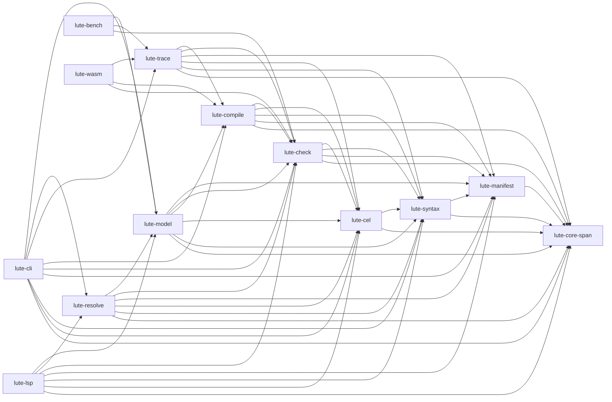
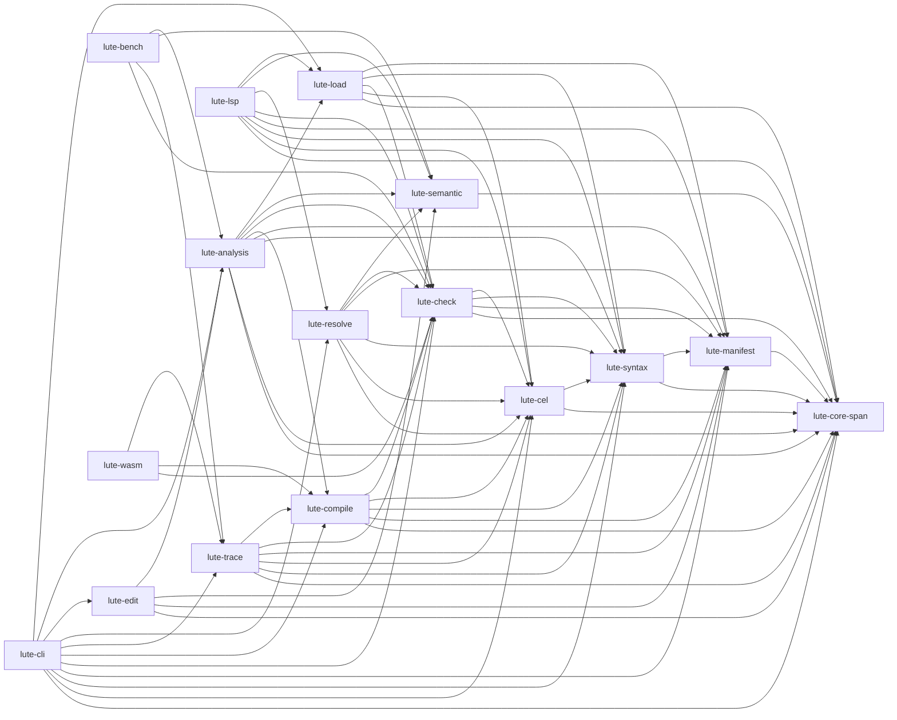

# `lute-model` crate split

## Decision summary

`lute-model` is named as a domain model, but it is currently an application
service at the top of the source/check/compile stack. Its `ProjectModel::build`
path discovers files, loads manifests and providers, assembles checker input,
checks and folds every document, reconciles project diagnostics, optionally
compiles and indexes artifacts, computes revisions, and lazily exposes a
semantic graph. The same crate also contains reverse-impact queries and the
entire staged semantic diff/patch surface.

This is the finding in the architecture audit: `lute-model` is a wide bottleneck
above `lute-check` and `lute-compile`, and `lute-resolve` depends on it for only
small graph/value types. The split is technically coherent, but it is not a
safe mechanical module split. It changes the owner and dependency of nearly
every public item in `lute-model` and touches all four direct production
dependents. The recommendation at the end is therefore conditional: approve
the design and an implementation spike only after the public-API gate accepts
an explicit crate migration; do not start the implementation as a behavior
change in the current byte-identity wave.

## Evidence and current responsibilities

The current crate has fifteen production modules declared from `src/lib.rs`:
`cache`, `identity`, `input`, `manifest`, `project`, `revision`, `diff`,
`reconcile`, `scenario`, `gate`, `constraints`, `graph`, `derivation`, `patch`,
`impact`, and `rename` (the test-only `identity_tests` module is excluded).
The manifest has direct dependencies on `lute-core-span`, `lute-manifest`,
`lute-check`, `lute-compile`, `lute-cel`, `lute-syntax`, `serde`, `serde_json`,
`serde_yaml`, `sha2`, and `rayon`.

| Responsibility | Current files | What the code actually owns |
|---|---|---|
| Discovery and loading | `project.rs`, `input.rs`, `cache.rs`, `manifest.rs` | `.lute` walking and root selection; document reads; manifest/provider/plugin loading; capability snapshots; schema/component imports; permission profiles; input memoization; diagnostic formatting helpers. |
| Per-document/project build | `project.rs` | `ModelOptions`, `ModelError`, `ModelDocument`, `ProjectModel`, optional desugaring/component splicing, `fold_env`, `check_parsed`, compilation, `ProjectIndex`, project revisions, identity-ledger validation, and the `roots_under` convenience operation. |
| Project reconciliation | `reconcile.rs`, `scenario.rs`, `gate.rs`, `constraints.rs` | Connectivity fixed point, project-wide diagnostic reconciliation and relocation, root scenarios/envelopes, single-root compile/trace gates, and manifest constraint evaluation. These are semantic analyses, not loading. |
| Semantic dependency model | `graph.rs`, `derivation.rs`, `identity.rs`, `impact.rs` | Canonical node keys and identity metadata; graph construction and Datalog dependency closure; graph serialization data; reverse impact traversal and human rendering. |
| Identity migration | `rename.rs` | Validation and expansion of manifest identity rename entries against a built graph. The build path invokes this before final artifact/index stamping. |
| Revisions and edit operations | `revision.rs`, `diff.rs`, `patch.rs`, `patch/*` | Exact-input SHA-256 project revisions; semantic comparison; patch wire decoding; target/edit/preserve validation; staged source mutation; rebuild, diff, and preservation reporting. |

The architectural audit and related inventories corroborate the seam: project
build/reconciliation is a measured hot path (`docs/design/quality-audit-0.36/performance.md`),
while semantic graph/impact and patch/diff are separate consumers of an
immutable model (`docs/design/phase3-inventory/project-model.md` and
`docs/design/phase4-inventory/context-patch-diff.md`).

### Direct consumers

The direct Cargo dependents are:

- `lute-cli`, which uses loading, project building, reconciliation, graph and
  impact views, constraints, diff, patch, and root helpers across command
  modules;
- `lute-lsp`, which uses `assemble_input_with_mode`, `BuiltInput`, `InputCache`,
  and `IdentityMetadata`/`IdentitySource`, but does not need project compilation,
  graph construction, diff, or patch;
- `lute-bench`, which builds `ProjectModel` values and measures resolution and
  semantic graph phases;
- `lute-resolve`, which uses `graph::NodeKey`, `graph::NodeKind`, and
  `SourceLocation` for cursor/declaration queries and canonical target parsing,
  but does not build a project.

Model integration tests also use the public loading, graph, impact, revision,
diff, and patch APIs. The architecture audit's wider dependency graph shows
that `lute-trace` and `lute-wasm` do not need to acquire `lute-model`; they
should remain below/alongside the split rather than become new dependents.

## Target layout

The target is four crates with one deliberately small value crate. The names
are descriptive; the implementation may choose an equivalent name before the
crate is created.

### 1. `lute-load`: source/project loading

`lute-load` is the reusable, non-compiling input boundary. It owns:

- `cache.rs`: `InputCache`, `LoadedProject`, and resolved snapshot/provider/plugin
  memoization;
- `input.rs`: `BuiltInput`, `read_document`, `assemble_input*`, `build_input*`,
  `project_diag_line`, and permission/import/component assembly;
- the loading subset of `manifest.rs`: `ManifestContext`, `manifest_context`,
  and `resolve_snapshot`;
- discovery and source helpers from `project.rs`: `find_lute_files`,
  `project_root_for`, `nearest_manifest_dir`, `discover_project`,
  `normalize_span_from_text`, and the parse-only `parse_project_docs` path.

It depends on `lute-manifest`, `lute-syntax`, `lute-check` (for `CheckInput`,
`Mode`, `TypedMeta`, and import caches), `lute-cel` only where input assembly
requires CEL parsing, and `lute-core-span` plus serialization crates. It MUST
NOT depend on `lute-compile`, `lute-analysis`, `lute-edit`, the CLI, or the LSP.
This is what makes the LSP and resolver paths cheaper and makes one source of
manifest/import resolution possible.

`ModelOptions` should be split at this boundary. Loading takes a
`LoadOptions` containing providers, permission profile, and checker mode;
compile, work-in-progress grading, and project-analysis settings belong to the
higher layer. This is a type migration, not an output change.

### 2. `lute-semantic`: small stable semantic values

`lute-semantic` owns values that are useful without constructing a project:

- `NodeKind`, `NodeKey`, `GraphNode`, `GraphEdge`, and the `SemanticGraph`
  representation plus deterministic key helpers;
- `IdentitySource` and `IdentityMetadata`;
- `SourceLocation` and the graph-independent parts of identity/rename errors;
- the graph-key fact formatting and overlap primitives.

Graph *construction* and Datalog closure remain in `lute-analysis`, because
those routines read `ModelDocument`, folded environments, checker vocabulary,
and project paths. The value crate must not depend on `lute-check`,
`lute-compile`, or a project snapshot. `lute-resolve` then depends on this
small crate instead of the application-service crate. `SourceLocation` belongs
here because resolver declarations and semantic diffs both need its stable
shape, while its constructors may remain private to their owner modules.

The identity-ledger resolver (`resolve_ledger`) can also live here if its input
is reduced to `IdentityRenameDecl` plus `SemanticGraph`; otherwise it should
stay in `lute-analysis` until the manifest declaration is given a neutral
input type. It MUST NOT be left as a hidden dependency cycle between analysis
and edit operations.

### 3. `lute-analysis`: project snapshot and semantic analysis

`lute-analysis` owns the high-level build and all analyses that require a
project-wide snapshot:

- the compiling portion of `project.rs`: `ModelOptions` (or an
  `AnalysisOptions` wrapper), `ModelError`, `ModelDocument`,
  `ReconciledOutputs`, `ProjectModel`/the replacement snapshot type,
  `ProjectModel::build`, `build_single_root`, `roots_under`, and accessors;
- compilation/index assembly and revision input collection from `project.rs`;
- `reconcile.rs`, `scenario.rs`, `gate.rs`, and `constraints.rs`;
- graph construction and Datalog closure from `graph.rs` and `derivation.rs`;
- impact queries from `impact.rs`;
- identity metadata/ledger integration not moved to `lute-semantic`.

It depends on `lute-load`, `lute-semantic`, `lute-check`, `lute-compile`,
`lute-manifest`, `lute-syntax`, `lute-cel`, `lute-core-span`, and `rayon`.
The important boundary is that loading returns resolved source inputs and
analysis consumes them; analysis does not reimplement manifest/provider/import
resolution.

The current `ProjectModel` combines the loaded documents, checked/folded
results, optional artifacts, reconciliation, revisions, and lazy graph. The
clean target is two explicit values: a loaded/compiled project snapshot and an
analysis result. If implementation cost requires one aggregate during the
first migration, it may remain an internal aggregate in `lute-analysis`; it
must not be recreated as a second public model in every new crate.

### 4. `lute-edit`: semantic diff and staged patch

`lute-edit` owns `revision.rs`, `diff.rs`, `patch.rs`, and `patch/*`:

- revision hashing and `FileRevision`/`ProjectRevision`;
- semantic value comparison and `SemanticDiff`;
- patch request/edit/preserve wire types and refusals;
- staged apply, preservation checks, and report generation.

It depends on `lute-analysis` for project snapshots and gates, on
`lute-semantic` for node/identity values, and on `lute-core-span`,
`lute-manifest`, `serde`, and `serde_json` for the wire boundary. The staging
operation must call the analysis build path; it must not grow a second loader.

## Dependency graph

The diagrams use the convention `A --> B` = “crate A depends on crate B”.
Third-party dependencies are omitted; arrows below are production Cargo edges,
not merely module imports.

### Before

The key architectural smell is not only the number of `lute-model` edges. It is
that `lute-resolve` is forced through a crate which itself depends on the
compiler, and that LSP's input-only use is coupled to a crate that also owns
staged filesystem edits.

### After

The graph has no Cargo cycle. It also has useful selective paths: resolver no
longer compiles project build/edit code; LSP can use `lute-load` without
`lute-analysis` or `lute-edit`; CLI remains the composition root; and the
runtime/wasm path remains independent of project analysis unless a command
explicitly asks for it.

## Migration sequence

Each step should land as a compiling, behavior-preserving change. The release
contract requires byte comparison against the 0.36.1 baseline for all affected
CLI surfaces; a changed golden, snapshot, conformance artifact, or
`REPORT.json` is a stop condition, not a migration task.

1. **Freeze the inventory.** Run the public-API gate at the merge base and
   record every public item under `lute_model`, including module-qualified
   paths. Record the Cargo metadata graph and the current model test ownership.
   Do not begin by moving files: first identify which callers need loading,
   analysis, semantic values, or edit operations.
2. **Extract semantic values.** Create `lute-semantic` with explicit modules
   and explicit `pub use` lists. Migrate `lute-resolve`, its tests, CLI graph
   consumers, and LSP identity consumers to the new value paths. Keep graph
   construction in the old crate until the value dependency is proven acyclic.
3. **Extract loading.** Move input/cache/manifest/discovery helpers to
   `lute-load`; introduce typed loading options and preserve all diagnostic
   wording and ordering. Migrate LSP first, then CLI single-document commands
   (`check`, `context`, `trace`, `doctor`, `lint`, and `loc`). This step is the
   highest-confidence payoff because those paths do not need staged patches.
4. **Split the project build.** Make `lute-analysis` consume one loading
   boundary and own compilation, indexing, revision-input collection,
   reconciliation, scenario, and gates. Migrate project commands and bench.
   Preserve the one immutable build and lazy graph behavior; do not move
   reconciliation into the checker or duplicate project discovery.
5. **Move semantic analyses.** Move graph construction, derivation, impact,
   constraints, and identity-ledger integration to `lute-analysis`, with
   graph values imported from `lute-semantic`. Keep `lute-check` filesystem-free
   and keep the checker/checker diagnostics contracts unchanged.
6. **Extract edits last.** Move revision, diff, patch, and patch submodules to
   `lute-edit`. Migrate `cmd_diff`, `cmd_patch`, edit-task tests, and model
   unit/integration tests. The staged after-model MUST use the same analysis
   builder and options as the before-model; no edit-specific loader is allowed.
7. **Cut over and remove the old crate.** Update all internal callers,
   rustdoc links, manifests, and test imports. Remove obsolete modules and
   re-exports only after the public-API decision is recorded. If the API gate
   requires preserving `lute_model::*` item paths, that is a deliberate
   compatibility-facade decision and must be approved as an exception to the
   clean-cutover rule; it MUST NOT be introduced accidentally as a hidden shim.
8. **Verify behavior and economics.** Run scoped crate tests first, then the
   required project-wide gate: docs consistency; public API; all byte-identity
   commands; conformance; and release A/B measurements. Compare the selective
   LSP/resolver dependency paths and the analysis/edit incremental rebuilds,
   not just one clean workspace build.

## Blast radius

### Source and manifests

At minimum, the implementation would touch:

- all `crates/lute-model/src/**` module wiring and every model test under
  `crates/lute-model/tests/**`;
- `crates/lute-model/Cargo.toml`, plus new manifests and workspace membership;
- `crates/lute-cli/Cargo.toml`, `src/main.rs`, and the command modules using
  model APIs: `cmd_catalog.rs`, `cmd_check.rs`, `cmd_check_project.rs`,
  `cmd_compile.rs`, `cmd_constraints.rs`, `cmd_context.rs`, `cmd_diff.rs`,
  `cmd_fmt.rs`, `cmd_impact.rs`, `cmd_patch.rs`, `cmd_trace.rs`,
  `compile_all.rs`, `differential.rs`, `doctor.rs`, `endings.rs`, `lint.rs`,
  `loc.rs`, `manifests.rs`, and `cmd_scenario/**`;
- `crates/lute-lsp/Cargo.toml`, `src/backend.rs`, and `src/features/mod.rs`;
- `crates/lute-bench/Cargo.toml` and `src/main.rs`;
- `crates/lute-resolve/Cargo.toml` and `src/lib.rs`;
- CLI integration/conformance/edit-task tests and any documentation links that
  name `lute_model::` paths.

The count is large because the current public facade is also the application
service boundary. The split is not confined to `lute-model/src/lib.rs`.

### Public rustdoc surface

The current facade explicitly re-exports these public groups:

- loading/build: `InputCache`, `assemble_input`, `assemble_input_with_mode`,
  `build_input`, `build_input_with`, `build_input_with_mode`,
  `project_diag_line`, `read_document`, `BuiltInput`, `discover_project`,
  `find_lute_files`, `nearest_manifest_dir`, `normalize_span_from_text`,
  `parse_project_docs`, `project_root_for`, `ByRoot`, `DocGroup`,
  `ModelDocument`, `ModelError`, `ModelOptions`, `ProjectModel`, and
  `ReconciledOutputs`;
- manifest/reconciliation/scenario/gates: `manifest_context`,
  `resolve_snapshot`, `ManifestContext`, `compute_conn_fixpoint`,
  `reconcile_collected`, `relocate_imported_diags`,
  `rollup_component_body_diags`, `assemble_root_scenario`,
  `node_cycle_degraded`, `RootScenario`, `gate_for_doc`,
  `project_gate_result`, `reconciled_project_results`, and
  `ReconciledProject`;
- graph/identity/impact/rename: `GraphEdge`, `GraphNode`, `NodeKey`,
  `NodeKind`, `SemanticGraph`, `IdentityMetadata`, `IdentitySource`,
  `resolve_ledger`, `RenameError`, `ResolvedRenames`, `ImpactItem`,
  `ImpactReport`, and `ImpactTarget`;
- edits: `project_revision`, `FileRevision`, `ProjectRevision`,
  `RevisionError`, `diff_models`, `ChangeKind`, `DiffError`,
  `SemanticChange`, `SemanticDiff`, `SourceLocation`, `apply_patch`,
  `apply_patch_to`, `PatchBase`, `PatchEdit`, `PatchRefusal`, `PatchReport`,
  `PatchRequest`, and `Preserve`.

Because the modules themselves are `pub mod`, module-qualified public items are
also reachable even when they are not re-exported at the root. In particular,
`lute_model::constraints::*`, `lute_model::graph::*`, `lute_model::impact::*`,
`lute_model::diff::*`, `lute_model::patch::*`, `lute_model::project::*`, and
`lute_model::scenario::*` need a rustdoc item-list comparison rather than a
manual root-list comparison. `ConstraintResult`, `ConstraintVerdict`,
`evaluate_constraints*`, `find_matching_roots`, `query`, `query_graph`, and
`human` are examples of module-qualified items that callers use today.

Moving these items removes paths from the `lute-model` rustdoc surface and adds
paths to new crates. That is an API event even if Rust types and serialized
JSON remain identical. C4's API gate therefore needs either an explicit
migration policy/label or a consciously retained facade. A facade would keep
external paths but would not by itself reduce internal dependency breadth; it
is acceptable only if it is a documented public boundary and not an accidental
alias layer.

### Behavioral risks

1. **Resolution drift.** `input.rs`, `cache.rs`, `manifest.rs`, CLI discovery,
   and LSP each have assumptions about project roots, defaults, profile
   restrictions, plugin origins, and import paths. A split that makes loading
   and analysis assemble inputs independently can change diagnostics or spans.
2. **Reconciliation drift.** `ProjectModel::build_impl` orders check,
   reconciliation, gate relocation, compilation, index construction, and
   identity stamping. Changing an ownership boundary can accidentally move a
   pass, clone an input, or emit diagnostics in a different order.
3. **Graph identity drift.** `NodeKey`, identity metadata, graph ambiguity, and
   rename-ledger expansion are consumed by context, impact, diff, patch, and
   resolver. Duplicate definitions would create type or serialization drift;
   changing canonicalization would be a behavior change.
4. **Patch safety.** `apply_patch_to` relies on the exact before revision,
   graph target ambiguity checks, staged rebuild, semantic diff, and preserve
   predicates. A separate edit builder can silently weaken stale-base or
   preserve checks.
5. **Cycle pressure.** Graph construction reads the full model, while rename
   validation is called during model construction and diff/patch consume both.
   Moving whole modules without first extracting value types produces a Cargo
   cycle or forces a second model abstraction.
6. **API and downstream breakage.** Public module paths are part of rustdoc and
   external Rust consumers may use them even though this repository's grep does
   not find them. The current contract says public API stays the same; a clean
   crate removal conflicts with that requirement unless the owner approves a
   facade or an API-change exception.
7. **Build-size disappointment.** Cargo compiles dependencies per crate. A
   clean workspace build may become slightly slower because of extra crate
   roots and codegen, while incremental builds improve only for consumers that
   stop depending on analysis/edit crates. A split that leaves CLI and bench
   depending on every new crate will not pay for itself.

## Build-time effect and measurement plan

No build measurement is claimed here. The permitted inspection (`cargo tree`
and `cargo metadata`) confirms the current direct dependency shape but cannot
predict compile wall time.

Expected effects are directional:

- **Likely improvement:** resolver no longer pulls `lute-model` and therefore
  no longer inherits `lute-compile` through it; LSP can use `lute-load` and
  avoid graph/diff/patch implementation units. Changes to edit code need not
  invalidate the input-only consumers.
- **Neutral:** CLI remains a composition root and will depend on loading,
  analysis, edit, resolve, and runtime crates. Its clean release build still
  compiles most of the stack.
- **Possible regression:** four new crate roots add metadata and codegen/link
  overhead; if public facade re-exports or broad shared types retain all edges,
  no selective benefit occurs.

The implementation gate should record, on the same machine and with no sibling
builds: clean release build times for the affected packages; incremental
rebuilds after changing one load, analysis, graph, and edit source; and the
resolver/LSP package build graphs from `cargo tree`. It should also repeat the
existing `lute-bench` resolution, graph, and serialization phases. A split is
worth keeping only if selective consumers lose real dependency breadth without
worsening the byte-identity commands or the named project-build benchmark.

## Go/no-go recommendation

**Recommendation: conditional GO for design acceptance, NO-GO for immediate
implementation in this release wave.**

The split has a real payoff: it removes the accidental `lute-resolve` to
application-service edge, gives LSP a loading-only path, makes edit operations
an explicit top-level consumer, and creates a place for project-wide analysis
to live without pretending that it is a domain model. The seams are visible in
the source and align with the architecture audit.

It is not safe to implement under the current wave's implicit constraints,
however. `ProjectModel` currently sequences all phases; public module-qualified
items are numerous; CLI callers span nearly every command family; and the
public-API gate requires no silent removals. A rushed move would either change
observable diagnostic/JSON behavior or leave a facade that preserves the old
bottleneck and pays only the extra crate cost.

Proceed only when all of the following are accepted: (1) the owner records
whether a deliberate `lute-model` facade is allowed or an `api-change`
exception is required; (2) `lute-semantic` and `lute-load` are approved as the
first two dependency cuts; (3) the implementation is staged with byte-identity
proof after each cut; and (4) selective build measurements demonstrate that
LSP/resolver actually stop depending on project analysis/edit code. Without
those decisions and measurements, keep `lute-model` intact and do not pay the
migration risk for a cosmetic file split.

## Owner decision (2026-10-05)

Accepted, staged, starting with the first two cuts in the 0.36.2 wave 2:

1. **No facade.** ADR D6 (clean cutover before 1.0) applies. The Rust crates
   have no external consumer; they ship only inside the npm binaries. Every
   caller moves to the new crate paths. There is no `lute-model` re-export
   shim.
2. **API gate.** The moved items count as one intentional `api-change`. The
   gate's report must show them as removed from `lute-model` and added under
   the new crate, with no other removals.
3. **Order.** `lute-semantic` first (identity, `NodeKey`/`NodeKind`,
   `SourceLocation`), then `lute-load` (discovery, input assembly, caches,
   manifest loading). Each cut must pass, on its own, the byte-identity
   matrix and the full suite.
4. **Keep-or-revert test.** After both cuts, `cargo tree -p lute-resolve` must
   no longer contain `lute-compile`, and `cargo tree -p lute-lsp` must no
   longer contain the graph/diff/patch code. Clean and incremental build times
   are recorded on an idle machine. If neither the dependency narrowing nor
   the build times improve, the cuts are reverted.
   `lute-analysis`/`lute-edit` are decided after that measurement.
