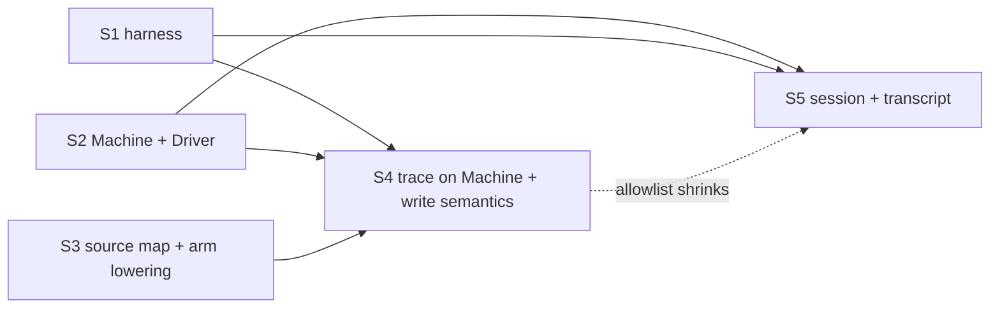

# Runtime unification: one walker, drivers, differential test

- **Spec:** `docs/proposals/scenario-dsl/0.27.0.md` §1 (decisions D-A, D-B)
- **Findings:** round-5 triage `lute-dogfood/round5/TRIAGE.md` T1-3, T1-5, T1-7, T1-9, T1-11
  (and §8 item 1), plus the divergences listed in §2.3 below
- **Status:** design for wave 2 of 0.27. Wave 3 (spec §3–§8) builds on the result.
- **Line references** are against `d35f4db` (0.27 spec commit; runtime code is
  identical to `654c1c8`, 0.26.0). Wave 1 moves some lines; function names are
  the stable anchor.

## 0. Summary

Lute executes a document in two places:

| | play / run | trace / test |
|---|---|---|
| walker | `crates/lute-cli/src/runner.rs` `Runner` (3709 lines) | `crates/lute-trace/src/walk.rs` `Walk` (3925 lines) |
| input | the compiled IR artifact (`commands: Vec<Json>`, `addr` jumps) | the parsed AST after `normalize_document` + `expand_document` |
| orchestration | `crates/lute-cli/src/play.rs` `World` (occasions, spends, clock, quest advance) | none: one presentation per invocation, plus `walk_quests` |
| shared already | `lute_trace::{eval, EffectiveState, FactStore, Value, UnresolvedAtom}`, `datalog::Program`, `clock`, `MockSet`, `bridge_result_writes`, `split_occasion`, `raise_judges` | same |

The evaluator layer (CEL `eval`, Datalog fixpoint, clock math, mock grammar)
is one implementation already. Everything above it (walking the constructs,
effects, derivation timing, exclusivity, quest lifecycle, handlers, labels
and jumps, interpolation, output records) is written twice, and every T1
divergence of rounds 4 and 5 sits in that layer.

**Decision.** The one walker executes the **compiled IR**. It is `Runner`,
moved into `lute-trace` as `exec::Machine`, parameterised by a `Driver`.
`lute run`, `lute play`, `lute trace`, `lute test` and `lute-wasm`'s
`trace_source` all execute through it. `walk.rs` is deleted. Trace keeps its
report format by reading spans and authored text from a **source map** that
`lute-compile` produces next to the artifact (never serialised). `World`
orchestration moves from `play.rs` into `lute-trace::exec::session`, so
eligibility, `once` spending and quest advance have one implementation too.

A differential test (`cargo test -p lute-cli`) runs every document of the
corpus through both paths with concrete inputs and compares transcript,
state, facts, quest states and exit. It lands first. Its allowlist of known
divergences must be empty when the last slice lands.

Five slices, S1–S3 in parallel, then S4 ∥ S5 (§5).

## 1. Why the IR, and why `lute-trace`

**Walk the IR, not the AST.**

- The IR is what an engine executes. A test that walks the AST certifies
  something no engine runs: T1-5(b) is exactly this. `lower_call`
  (`crates/lute-compile/src/expr.rs:311`) cannot lower a `holds(…)` subject,
  the arm is emitted without an executable guard, play falls to `otherwise`,
  and trace, walking the AST, takes the true arm.
- `lute run` is the conformance reference engine (`conformance/*/expected.json`,
  `crates/lute-cli/tests/conformance.rs`); it only has artifacts. An AST walker
  cannot serve it, so an AST choice keeps two walkers.
- Trace already runs compile's own front half: `trace_pipeline`
  (`walk.rs:3569-3654`) calls `lute_compile::normalize::normalize_document`,
  `canonicalize_builtin_directives` and `lute_compile::expand::expand_document`
  in compile's order. Finishing the compile (lowering, staging, addressing) is
  a small step.
- What the AST gives trace and the IR lacks is source positions and authored
  text (decision spans, coverage site keys `"{line}:{column}"`,
  `authoredId`/`authoredGuard`, the `Skipped` step's write text, the `into=`
  sugar flag). A compile-produced source map supplies them (§3.5).

Rejected: an AST walker for everyone (engine behaviour stays untested,
`lute run` keeps a second walker); shared helpers called by both walkers
(spec D-A: the glue around every helper is still duplicated, and that glue is
where T1-7's missing exclusivity check was).

**Put it in `lute-trace`, not a new `lute-exec` crate.** `lute-trace` is
already the evaluator crate. `lute-cli` and `lute-wasm` already depend on it,
it already depends on `lute-compile`, and the D1 quarantine test
(`crates/lute-trace/tests/quarantine.rs`) already keeps `lute-check` /
`lute-compile` / `lute-lsp` from depending on it. A new crate would move 3.6k
lines of `eval.rs`/`datalog.rs`/`value.rs`/`clock.rs`, only to rename them.
The walker lives in a module tree `crates/lute-trace/src/exec/`. It must stay
wasm-clean: no filesystem, no process exit, no `rayon`. `run_artifact`'s I/O
and printing stay in `lute-cli`.

## 2. The two runtimes today

### 2.1 Pipeline

**Play** (`play.rs`): `compile_project` (`:891`) compiles every document
through `lute_compile::compile_with_check` (`:960`) and builds the index
(`build_index`, `:993`). `seed_world` (`:2113`) runs, then `execute` (`:3443`)
loops over `run_step` (`:3622`): `run_occasion` (`:3969`) → `eligible_at`
(`:3032`; one throwaway `Runner` over `Project.eval_json` evaluates each
beat's `when`) → `presented` (`:3185`) / `deciding_unknown` (`:3164`) →
`present` (`:3279`) builds a fresh `Runner::with_carryover` per presented
beat → `absorb` (`:2398`) folds the `RunnerOutcome` into `World` →
`advance_quests` (`:2650`), a fixpoint of per-quest-document Runners
(`advance_pass`, `:2769`). Exclusivity is checked at seed (`:3447`) and at
step end (`:3519-3531`, `exclusive_violations` `:5513`).

**Run** (`runner.rs`): `run_artifact` (`:117`) → `Runner::new` (`:884`;
`blank` `:719` seeds defaults, seed facts and the mock) → `run` (`:1259`),
which dispatches to `run_quest` (`:2387`), `run_entry` (`:3117`),
`run_bundle_beat` (`:3176`) or the linear `step` loop (`:1333`) →
`output_value` (`:3225`) / `print_human` (`:3263`).

**Trace** (`walk.rs`): `trace_pipeline` (`:3569`): check gate → re-parse,
`fill_document`, `fold_env` → mock validation → normalize + expand →
`seed_state` (`:2796`) plus clock values (`:3665-3684`) → `FactStore` with
derivation (`:3689-3703`) → seeded-world exclusivity (`:3764`) →
`walk_document` (`:1513`) then `walk_quests` (`:2705`), or `walk_entry`
(`:1575`) per entry, or `walk_bundle_beat` (`:1649`) → notes → `TraceReport`
(`:3903`). `lute test` (`crates/lute-cli/src/testcmd.rs`) calls
`trace_with_check` / `trace_entries_with_check` / `trace_beat_with_check`
and judges expectations on the report. Its `*.play.yaml` files go to
`play::run_play_for_test` (`play.rs:5749`) instead.

### 2.2 Concern map

`R` = `crates/lute-cli/src/runner.rs`, `P` = `crates/lute-cli/src/play.rs`,
`W` = `crates/lute-trace/src/walk.rs`, `E` = `crates/lute-trace/src/eval.rs`,
`M` = `crates/lute-trace/src/mock.rs`, `X` = `crates/lute-cli/src/play_expect.rs`.

| # | Concern | play / run | trace / test | Difference |
|---|---|---|---|---|
| C1 | Line output | `R` `rec_line` 1448-1469. Under `play` it copies `role/lineId/voiceKey/as/emotion` into the record. Rendered by `P` `line_head` 4221, `render_record` 4419; canonical `said` `P` 4905 | `W` `walk_line` 702, `render_line_text` 679. `Step::Line{speaker,text}` only; `report.rs` `said` 567 | trace drops attributes and delivery (T3-18). Both canonical `said` forms drop attribute blocks, and the needle matcher strips them too (`X` `transcript_needle` 465-495) → T1-11 |
| C2 | Guards | one CEL chokepoint `R` `eval_raw` 1085: re-parses `raw`, builds an `EffectiveState` with an **empty** schema and a `FactStore` from cached `all_facts`. `truthy` 1117: `None` = unknown. A second evaluator, `expr_node_value` 1140, handles `is` arms | `E` `eval` over `slot_expr(raw)` (`W` 347). `as_guard_value` 362, `k3_and` 472, `eval_arm_guard` 485 | same `eval`, but different stores (§2.3 D6, D13) and a second evaluator in run |
| C3 | `::set` | `R` `exec_set` 1556-1593: compound op on non-number or absent → `0.0` | `W` `walk_set` 902, `apply_set_op` 889: absent or non-number → `Unknown` | D5. No recompute and no exclusivity after a set in either (D3, D4) |
| C4 | `::assert` / `::retract` | `R` 1595 / 1617: `recompute_facts` 1064, then `exclusive_check` 1665 | `W` 919 / 932, wrapped by `exclusive_check` 566 in `walk_node` 1381-1390 | same rule, two copies |
| C5 | Directive `effects.writes` | `R` `exec_plugin` 2118-2247 applies literal, `op` and `fromBridgeResult` writes (2211-2237) but records none of them. Note from `plugin_call_note` 3636, rendered `P` 4487-4494 ("not invoked") | `W` `walk_bridge_call` 813-871 applies only `fromBridgeResult` (`M` `bridge_result_writes` 1703-1715) | **T1-3** |
| C6 | Bridges | `BridgeAnswers` `R` 533-543 (step queue before top queue); `bridge_values` 2250. Unanswered: run proceeds and keeps the slot's old value; play halts at the call if content reads the field | cursor per tag. Unanswered → slot = `Unknown` plus a hint (`W` 855-869, `render_atom` 318) | D7 |
| C7 | Derivation, exclusivity | fixpoint only at construction (891, 920) and after assert/retract. `eval_raw` reads the cached `all_facts` with an empty vocab, so a derived relation whose rule reads state is **stale after `::set`**. Play checks exclusivity at step end (`P` 3519-3531) | `FactStore::with_derivation` derives on every query against live state. Exclusivity only at assert/retract and on the seeded world (3764) | **T1-7**, D4 |
| C8 | Interpolation | `R` `interpolate` 1484-1538: placeholder kinds `path` / `occasionTarget` / `ref`. Labels from the artifact `state[].labels`, with a `prev.` fallback (`path_text` 1541). `formatted` 3679 | `W` `resolve_interp` 617-663: cast name for `occasion.target`, labels only for `Type::Domain` (634-649). `formatted_text` 668 | D12. Both leave an unknown `{{…}}` verbatim |
| C9 | `occasion.target` | `bind_occasion_target` `R` 948 writes the reserved path. Play binds it in `eligible_at` and `present` | a mock only. `E` `EffectiveState::read` 105-127 has no exception, so unmocked reads `Unset`; `eval_is_pattern` `W` 446 makes every arm false and `walk_match` continues with "no arm" | **T1-9** |
| C10 | `once` | beat `once` run/user/day/slot: `P` `eligible_at` 3061-3089 (entry beats also check `entry.<id>.read` / `everRead`, 3071-3076), `spend_shared` 3251, `spend_at_clock` 3215, called from `present` 3311-3323. Hub option `once`: `R` `do_hub` 1858 (`visited_once` per presentation loop) | hub `once` reads `scene.visited.<hub>.<choice>` (`W` 1159-1172). Entry `once` via read flags (`W` 1575-1613). Scene `once: user` judged against mocked `visited:` (`scene_eligibility` 3330) | D8. World-level `once` has no trace counterpart |
| C11 | Lore entries | `R` `run_entry` 3117-3159: `apply_effects = first_read`, writes `entry.<id>.read`. `everRead` written by play after the fact (`P` `present` 3315-3323) | `W` `walk_entry` 1575; `read` and `everRead` written by the pipeline between entries (3812-3815). Eligibility enforced only under `gate_eligibility` | D11 |
| C12 | Quest lifecycle | `R` `run_quest` 2387-2565, `reevaluate` 2602-2757 (cap `len*8+16`; order: child activation, objective done, `by`, fail before complete, complete, cascade), `judge_occasion` 2794, `cascade_children` 2901, `emit_grants` 2977. Play resumes it: `advance_quests` `R` 2568, `P` 2650 | `W` `walk_quests` 2705, `quest_settle_fixpoint` 2625 (cap `len*4+4`), `try_activate_state` 2443, `settle_quest` 2201, `cascade_terminal` 2330, `emit_grants` 1886, `reopen_accepted` 2683 | D9: same rules, two copies |
| C13 | Handlers | `R` `fire_event` 3054-3095: each handler's `when` is evaluated live, one after another; `judge: before` defers bodies (`P` `run_deferred_handlers` 2719) | `W` `dispatch_event` 2103-2156: every handler of one event is judged against **one pre-event snapshot** | D10 |
| C14 | `::next`, `::mark`, `::end` | compiled to `jump` + `addr` (`R` step 1361). Unresolved addresses fall through to the next address (`resolve` 1243). `::end` sets `terminated` (2097) | three label layers: `walk_from_label` 1451, `walk_from_label_in` 1484, `walk_body` 1505, plus shot jumps in `walk_document` 1513-1553 | the unified walker deletes the three layers |
| C15 | Components | expanded by compile. Runner never sees `::use` | the same normalize + expand, then walks the AST (`W` 3635-3654) | none. Both consume compile's expansion |
| C16 | Timelines | pre-scheduled records plus `barrier` (`R` 2084) | `walk_timeline` 1322 → `schedule_timeline`, then walks each clip | trace shows no barrier step |
| C17 | `<match>` | `R` `do_match` 2039-2082 prefers the arm's `expr` (IR A13), else `test` raw. An empty `test` gives unknown, so no arm matches | `W` `walk_match` 962-1045, `eval_is_pattern` 436 (definite `Unset` for `is="unset"`). Unknown → `Flow::Incomplete` | **T1-5(b)**, D13 |
| C18 | Branch, hub | only `mock.choose` with `choice_cursor`. Unscripted → incomplete. A forced spent `once`: skipped under run, refused under play (2005-2012) | scripted, else **auto**: first eligible branch choice, one hub pass over eligible non-exit choices, then the first exit (`W` 1047-1157, 1216-1315). Forced unknown → `forced_unknown` | D6 (decision policy: a driver hook) |
| C19 | State model | flat `BTreeMap<String,Value>` with defaults seeded eagerly (`blank`). Tiers (`run`/`user`/`prev`) in `P` `World` 1954 and `new_run` 2259. `clock.*` refreshed after writes (`P` `refresh_clock` 3732) | `EffectiveState`: write → seed → reserved entry read → reserved quest default → schema default → unset (`E` 105-127). `clock.*` fixed for the whole walk | D14. Same `Value` type |
| C20 | Outputs | JSON records (`R` 3225; the `--json` conformance contract). `print_human` 3263. Play: `render_human` `P` 4680, `render_json` 5090, `PlayOutcome` `X` | `TraceReport` (`report.rs`): `Step`, `Decision{span,…}`, `Coverage` keyed by `site_key` (`report.rs:360`), `render_human` 485, `render_json` 474. Six `#[serde(skip)]` fields feed `lute test` | kept; the sinks differ per driver |

### 2.3 Divergences under concrete inputs

These are the differences the differential test must see. S1 pins them in its
allowlist; later slices delete them. `[INFERENCE]` means found by reading the
code and not executed.

| id | Divergence | Evidence | Fixed by |
|---|---|---|---|
| D1 = T1-3 | trace ignores literal and `op` directive writes; play applies them without recording them | `/tmp/r5t/r5-hollow-ward-3` | S4 |
| D2 = T1-5(b) | a def subject that expands to `holds(…)`: play goes to `otherwise`, trace takes the true arm | `/tmp/r5t/r5-hollow-ward-7`; live shape after wave 1: `fixtures/diff/r5-hollow-ward-7` (`d: "visited('find')"`) | S3 (IR), S4 (one evaluator). **Fixed by S3** (§8 S1: its three allowlist lines never landed) |
| D3 = T1-7 | a `::set` that makes a derived exclusive pair hold: play halts at step end, trace completes | `/tmp/r5t/r5-otome-2` | S4 |
| D4 | **stale derivation after `::set`** in play and run: a rule reading state is not re-derived until the next assert/retract | reproduced with 0.26.0: rule `onRoute(ren) :- cel("run.route == 'ren'")`, scene `::set{run.route = 'ren'}` then `@narrator{when="holds(onRoute(ren))"}: Derived after the set.` → play prints `skip @narrator "Derived after the set." — when: false`, trace prints `-> arm 1` and the line | S4 |
| D5 | compound `::set` on an absent or non-number value: run gives `0 op by`, trace gives `Unknown` | `R` 1568-1576 vs `W` 889-899. Unreachable in a check-clean document (`E-MAYBE-UNSET`) [INFERENCE] | S4 (tri-state wins) |
| D6 | no scripted decision: trace auto-picks, run and play go incomplete | by design. The harness makes trace's picks explicit (§4.3), so this never shows as a diff | S2 (driver hook) |
| D7 | unanswered bridge: run keeps the old slot value, trace writes `Unknown`, play halts at the call | `R` 2118-2247, `W` 855-869 | S4 (`Unknown`, plus a driver policy for the halt) |
| D8 | hub `once` memory: run keeps it per presentation loop, trace reads `scene.visited.<hub>.<choice>`. They differ when `::next` re-enters a hub [INFERENCE] | `R` 1858, `W` 1159 | S4 |
| D9 | quest settle is two implementations: fixpoint caps differ; a seeded active quest fires no `questActive` in trace (`W` 2478-2503); failed objectives remembered by span (`W` 1774) vs by id set (`R` `failed_objectives`) | code reading [INFERENCE for observable cases] | S4 |
| D10 | sibling `<on>` handlers of one event: play sees earlier siblings' writes, trace judges all of them against one snapshot | `R` 3080-3093 vs `W` 2103-2156 | S4 (the snapshot rule, the documented one) |
| D11 | `entry.<id>.everRead`: trace writes it, run does not (play writes it outside the Runner) | `W` 3812-3815, `P` present | S5 |
| D12 | `{{path}}` labels: trace only for `Type::Domain`, run from the artifact `labels` with a `prev.` fallback | `W` 634-649, `R` 1541-1553 | S4 |
| D13 | `is` arms: run uses the `ExprNode` evaluator (`isSet`/`has` = "present in map"), trace uses `eval_is_pattern` (definite `Unset`) | `R` 1140-1170, `W` 436-470 | S4 |
| D14 | `clock.*`: fixed per trace walk, refreshed after writes in play | `W` 3665-3684, `P` 3732 | S4 |
| D15 = T1-9 | unmocked `occasion.target`: trace walks "no arm" and passes. Not a concrete-input diff; a trace unknown-policy bug | `/tmp/r5t/r5-upgrade-crown-3` | S4 |
| D16 = T1-11 | an attribute needle matches a line with different attributes | `/tmp/r5t/r5-upgrade-summer-2` | S5 |
| D17 | an unwritten `quest.<id>.state` (a quest the document does not declare, unmocked): trace reads its reserved default `unset` (`E` `EffectiveState::read`), run reads it as absent, so a guard on it is undecided and the line / arm is skipped | found by S1 on the opt-in corpus: `corpus:monster-league/lore/mid/ghosts.lute#empty/beat:oriel` (`when="quest.midGhostStories.state == 'unset'"`), `lantern-academy/lore/hangouts.lute` beat `library` | S4 (`Store`'s reserved default) |

## 3. Target architecture

### 3.1 Module layout

```
crates/lute-trace/src/
  value.rs eval.rs datalog.rs clock.rs      unchanged (evaluator layer)
  exec/mod.rs          pub use; the Record shape doc
  exec/machine.rs      Machine: today's Runner dispatcher, effects, quests, handlers
  exec/driver.rs       Driver trait, Menu, Pick, Forced, UnknownSite, OnUnknown, BridgeReply
  exec/store.rs        Store: state + facts + derivation + exclusivity + clock refresh (one write path)
  exec/session.rs      (S5) World, tiers, spends, clock advance, eligibility, selection, quest advance, newRun
  exec/record.rs       canonical transcript (said) with attribute blocks, needle matcher (S5)
  trace.rs             trace pipeline (check → compile_mapped → Machine + TraceDriver → TraceReport)
  mock.rs report.rs quest_refs.rs lib.rs    kept; walk.rs deleted (S4)
crates/lute-cli/src/
  runner.rs            run_artifact, RunDriver, print_human / output_value only
  play.rs              script parse/plan, PlayDriver, rendering, run_play; orchestration moves out in S5
  differential.rs      #[cfg(test)] harness (S1)
crates/lute-compile/src/
  source_map.rs        SourceMap (S3)
```

### 3.2 Machine

`Machine` is `Runner` with the policy flags taken out:

- `play: bool` (`R` 427) is removed. Records always carry the play fields
  (`role`, `lineId`, `voiceKey`, `as`, `emotion`, `spent`, `ineligible`).
  `RunDriver`'s sink removes them before `output_value`, which keeps
  `conformance/*/expected.json` byte-identical. The different refusal rules
  become `Driver::forced`.
- Reading `mock.choose` directly becomes `Driver::choose`. The
  `choice_cursor` bookkeeping belongs to the driver (play and run share one
  `ScriptedChoices` helper in `exec/driver.rs`; trace's `branch_cursor`
  becomes the same helper).
- The `BridgeAnswers` queues become `Driver::bridge`. The two-tier queue
  type stays and is owned by the driver.
- `unresolved` / `incomplete` / `refused` / `fatal` / `terminated` stay
  Machine state. Whether an unknown halts is `Driver::unknown`.
- Construction: `Machine::new(art: &Json, seed: Seed, driver: D)` and
  `Machine::resume(art, carry: Carry, driver)`. `Carry` is today's
  `RunnerOutcome` minus the driver-owned fields; `Seed` is state, facts,
  visited, accepts, events and occasions (today read from `MockSet`).
  `with_entry`, `with_bundle_beat`, `bind_occasion_target`,
  `with_failed_objectives`, `with_deferred_by` and `with_deferred_handlers`
  stay as builders.
- Records stay `serde_json::Value` in today's shapes (list in §3.6). No
  typed record enum: the JSON is the contract and the conformance bytes.

### 3.3 Driver

```rust
// crates/lute-trace/src/exec/driver.rs
pub trait Driver {
    /// A <branch>/<hub> presentation. Option verdicts are already judged.
    fn choose(&mut self, menu: &Menu<'_>) -> Pick;
    /// A scripted pick of an option that is not Open.
    fn forced(&mut self, menu: &Menu<'_>, option: &str, verdict: Verdict) -> Forced;
    /// A plugin call that reads a bridge result.
    fn bridge(&mut self, call: &BridgeCall<'_>) -> BridgeReply;
    /// A value the walk needs but cannot decide.
    fn unknown(&mut self, site: &UnknownSite<'_>) -> OnUnknown;
    /// Every transcript record, in execution order.
    fn emit(&mut self, rec: Json);
}
pub struct Menu<'a> { pub construct: MenuKind /* Branch | Hub */, pub id: &'a str, pub addr: &'a str,
                      pub presentation: usize, pub options: &'a [MenuOption] }
pub struct MenuOption { pub id: String, pub verdict: Verdict, pub exit: bool, pub once: bool }
pub enum Verdict { Open, Closed /* guard decided false */, Unknown(Vec<UnresolvedAtom>), Spent }
pub enum Pick { Option(String), AutoFirst, HubAutoPass, Unscripted }
pub enum Forced { Take, Skip, Refuse }
pub enum BridgeReply { Answer(BridgeAnswer), Unanswered }
pub struct UnknownSite<'a> { pub kind: SiteKind, pub id: &'a str, pub addr: &'a str,
                             pub raw: &'a str, pub atoms: &'a [UnresolvedAtom] }
pub enum SiteKind { Arm, BranchAllUnknown, HubAllUnknown, Guard, SetValue, QuestStart, QuestFail,
                    ObjectiveDone, ObjectiveBy, ObjectiveUntil, Handler, Reward, BridgeResult,
                    OccasionTarget, EntryWhen, BeatWhen }
pub enum OnUnknown { Halt, Continue }
```

Policies (the only place the runtimes may differ):

| Hook | RunDriver (`lute run`) | PlayDriver (`lute play`, play files in `lute test`) | TraceDriver (`lute trace`, `lute test`, wasm) |
|---|---|---|---|
| `choose` | `mock.choose` with cursor, else `Unscripted` → incomplete | script `choose:` / step `choose:` with cursor (`P` `present_with_choose` 4138), else `Unscripted` | `--choose` / mock with cursor, else `AutoFirst` / `HubAutoPass` |
| `forced` | `Spent` → `Skip`, `Closed` → `Refuse` | `Spent` / `Closed` → `Refuse` (`E-TRACE-CHOICE`) | `Closed` / `Spent` → `Refuse`; `Unknown` → `Take` and record `forced_unknown` |
| `bridge` | mock `bridges:` queue | step queue, then top queue | mock `bridges:` queue |
| `unknown` | `Continue` everywhere (today's `lute run` exit logic is unchanged: incomplete only through the flags) | `Halt` for every site (plays know every value; the honesty gate moves to the site, see §6 R4) | `Halt` for `Arm`, `BranchAllUnknown`, `HubAllUnknown`, `Guard`, `OccasionTarget`; `Continue` (recorded in `unresolved`) for quest, objective, handler and reward sites and `BridgeResult` |
| `emit` | collects; strips the play fields | collects; `render_record` renders | builds `TraceReport` steps through the source map (§3.5) |

Semantics that are **not** hooks (one rule each, in `Machine` / `Store`):
guard evaluation (C2, one evaluator, §3.4), set ops (tri-state), effects
(literal, `op`, `fromBridgeResult`, and `fromAttr` as wave 1 lowers it,
applied and each **recorded** as `{"kind":"set","path","value","effectOf":"<tag>"}`
after the plugin record), derivation and exclusivity after **every** write,
interpolation and labels, `occasion.target` substitution, hub `once`
memory, entry first-read and `everRead`, quest settle order, handler
snapshot rule, jumps, `::end`.

### 3.4 Value model and Store

One tri-state `Value` (`Bool | Num | Str | Unknown`, `value.rs`), as today.
The play driver "knows every value" because of how its world is seeded, not
because it has another value type.

`Store` (`exec/store.rs`) replaces both `Runner.state/base_facts/all_facts`
and `Walk.state/facts`:

- state is an `EffectiveState` over the artifact's `state[]` table
  (type, default, labels), with seeds and writes. A read goes write → seed →
  reserved (quest, entry) default → declared default → `Unset`. `Unset` read
  by a general expression is `Unknown` plus a `Path` atom (today's
  `eval_path_read`). `is="unset"` reads `Unset` definitely (today's
  `eval_is_pattern`). Play seeds every tier value explicitly, as `seed_world`
  does now, so it never meets `Unset` on a declared path.
- `occasion.target` is a binding, not a stored path. Bound: its member.
  Unbound inside a kind-target beat: `Unknown` with an `OccasionTarget` atom
  whose hint is `--state occasion.target=<m1|m2|…>` (members from
  `BeatIr.target.members`). This fixes T1-9 under TraceDriver's `Halt`.
- facts: base set plus derivation. Derivation is recomputed **lazily**. A
  write marks the closure dirty when the path is read by any rule `cel()`
  guard (the Program knows its read paths), and every assert or retract marks
  it dirty. The next query or the exclusivity check recomputes it. This fixes
  D4 and gives trace's current "derive on every query" results without its
  cost.
- one write path, `Store::write(path, v, cause)`, used by `::set`, effects,
  bridge results, grant `credits`, `into=` and engine writes. After each
  write: `clock.*` refresh when the path is the clock's day or slot
  (`clock::refresh`), then `exclusive_check(before)`, which on a new violation
  emits `{"kind":"exclusive"}` and refuses. T1-7 is fixed where the docs
  promise ("right under the write"), in every driver.
- `derive: false` is unchanged: the vocab marks the derived relations, and
  unmatched reads of them are unknown.

Evaluator: one path. Every guard, including `is` arms, is evaluated by
`lute_trace::eval` against the `Store`. For an arm the Machine uses `test`
when it is non-empty; otherwise it evaluates the arm's `expr` by converting
it through `exec::expr_node::to_cel` (the `ExprNode` shapes are a subset of
CEL). S3 guarantees every arm has one of the two (T1-5(b)). `expr_node_value`
(`R` 1140) is removed from execution. It survives only as the harness's
**IR oracle** (§4.4), which checks that the engine-facing `expr` agrees with
the evaluated guard.

### 3.5 Source map (trace keeps its report)

`lute-compile` gains `compile_mapped(input, result, identity) ->
Result<(Artifact, SourceMap), Vec<Diagnostic>>`. `compile_with_check`
calls it and drops the map, so artifact bytes are unchanged.

```rust
// crates/lute-compile/src/source_map.rs
pub struct SourceMap {
    pub by_addr: BTreeMap<String, SourceInfo>,     // every emitted record
    pub quests: BTreeMap<String, QuestSource>,     // quest id -> span, objectives (id -> span, done/by/until authored), handlers (addr -> span)
    pub entries: BTreeMap<String, Span>, pub beats: BTreeMap<String, Span>,
}
pub struct SourceInfo {
    pub span: Span,                      // the construct's AST span as walk.rs reports it today
    pub authored_id: Option<String>,     // pre-expansion subject/id text (report.rs Decision::authored_id)
    pub authored_guard: Option<String>,  // pre-expansion guard text per arm/choice (by option id / arm index)
    pub guards: Vec<String>,             // rendered guard text per arm/option, as walk.rs renders it
    pub sugar: bool,                     // `into=` synthesized set (walk.rs is_into_sugar_set)
    pub write_text: Option<String>,      // authored write, for Step::Skipped
    pub component: Option<ComponentBoundary>,
    pub authored_jump: bool,             // a `::next` jump, not a structural one (Step::Jump)
}
```

It is built in the emitter (`crates/lute-compile/src/cfg.rs` `Rec` gains an
`origin: Option<Origin>` filled at lowering), and addresses are assigned
together with `address::assign_addresses` (`address.rs:42`). The map is the
only new channel from the AST to the trace report. The static notes
(`occasion_notes`, `unmatched_event_notes`, `mock_unproducible_notes`,
`reserved_quest_notes`, `beat_when_note`, `seed_fact_notes`) keep reading
the normalized AST, which the trace pipeline still has because compile
needs it.

### 3.6 Records and sinks

Records keep today's JSON shapes (`R` output, listed in
`runner.rs` `output_value` / `print_human`): `line`, stage kinds, `set`,
`assert`, `retract`, `skipped`, `choice`, `hub`, `match`, `barrier`, `end`,
`plugin`, `accept`, `occasion`, `objective`, `quest`, `grant`, `entry`,
`beat`, `exclusive`. Additions: `set` gains `effectOf` for effect writes
(T1-3), and `plugin` loses the "not invoked" note when the call only has
declared effects (T1-3, `plugin_call_note` `R` 3636). These additions are
the only changes to `lute run --json`, and no conformance fixture has a
plugin call.

`TraceDriver::emit` maps records to `report::Step` / `Decision` / coverage:
`line` → `Line`; `set` → `Set{sugar}` (from the map); `skipped` →
`Skipped{text}` (from the map); `match` / `choice` / `hub` → `Decision{span,
guard, authored_*}` and coverage (site key from the map span; totals from
the record's arm or option count); `plugin` → `Directive` + `Bridge`;
`end` → `Directive{reason}`; `jump` with `authored_jump` → `Jump`;
`accept`, `grant`, `entry`, `beat`, `exclusive` → same-named steps; the
first record of a new shot → `Shot{number, heading}` (from the artifact
`shots`); stage kinds → `Directive{tag}`; `barrier` → nothing (trace never
showed it). `quest` / `objective` / `on` outcomes → the decisions trace
shows today, spans from `SourceMap.quests`.

### 3.7 World and session (S5)

`exec/session.rs` takes over from `play.rs`: `World` (`P` 1954-2010: tiers,
`spent_run`, `spent_user`, `spent_at`, `share_spent_by`, `visited`, quests,
accepts, `failed_objectives`, `defer_by`, deferred handlers), `seed_world`,
`new_run`, `apply_writes`, `eligible_at`, `deciding_unknown`, `presented`,
`spend_*`, `present` (which builds the Machine), `absorb`,
`advance_quests`, `raise`, `advance_pass`, `run_deferred_handlers`, clock
movement (`move_clock`, `settle_before`) and `exclusive_violations`.
`play.rs` keeps script parsing (`parse_step`, `expand_includes`,
`resolve_writes`, `plan_steps`), the step loop's I/O and rendering. It
drives the session through a `Session` API:

```rust
impl Session { pub fn seed(project: &ExecProject, seed: WorldSeed) -> Result<Self, String>;
               pub fn occasion(&mut self, name: &str, target: Option<&str>, d: &mut dyn Driver) -> OccasionOutcome;
               pub fn advance(&mut self, to: ClockTarget, d: &mut dyn Driver) -> AdvanceOutcome;
               pub fn engine(&mut self, writes: &Writes) -> WritesOutcome;
               pub fn new_run(&mut self, seed: &Writes) -> NewRunOutcome;
               pub fn event(&mut self, name: &str, d: &mut dyn Driver) -> EventOutcome;
               pub fn eligibility(&self, id: &str) -> Verdict;   // one judgment for play, calendar, test `eligible:`, trace scene gate
               pub fn view(&self) -> WorldView; }
```

`ExecProject` is the part of `play::Project` (`P` 796) the session needs
(artifacts, index, occasions, state table, rules, seeds, kinds, quest
documents, accept maps). The project compile (`compile_project`) stays in
`lute-cli` because it reads files. `lute calendar`
(`crates/lute-cli/src/play/calendar.rs`) switches to the session API.
`testcmd.rs` `eligible:` judgment (both the presented path and
`eligibility_alone`) and trace's `scene_eligibility` (`W` 3330) call
`Session::eligibility` over a one-document project. Wave 3's world features
(`raisedWhen`, `terminal`, finite clocks, `once: week` / `season`, seasons,
rearm, occasion payload) land here and in `Machine`, once.

## 4. Differential test

### 4.1 What it compares

```rust
// crates/lute-cli/src/differential.rs  (#[cfg(test)] mod differential; in main.rs)
struct Observation {
    said: Vec<String>,                   // canonical lines WITH attribute blocks: `@sol{emotion="happy"}: Vega.`
    state: BTreeMap<String, String>,     // every path either side reports, missing side filled from the declared default; clock.* included
    facts: BTreeSet<String>,             // holding facts, base ∪ derived
    quests: BTreeMap<String, String>,    // unset | active | complete | failed
    exit: &'static str,                  // complete | ended | incomplete | refused:<code>
}
fn observe_trace(case: &Case) -> Observation;   // today: lute_trace::trace_*_with_check
fn observe_run(case: &Case) -> Observation;     // today: Runner::new(compile_with_check(..)) (+ with_entry / with_bundle_beat)
```

A case passes when both observations are equal. The signatures stay fixed
across the slices; only the bodies are re-pointed (S2: `observe_run` uses
Machine + RunDriver; S4: `observe_trace` uses Machine + TraceDriver, so the
test then compares drivers over one walker).

### 4.2 Corpus

Always (in-repo, runs in plain `cargo test -p lute-cli`):

- `docs/examples/**/*.lute`: 53 documents in 9 projects (`lute.project.yaml`
  roots; the rest as single files). Inputs: every `*.test.yaml` targeting
  the document (34, in `haven/tests` and `investigation/tests`), every file
  in `mocks/` (3), and the empty mock.
- `conformance/*/`: 10 fixtures. `source.lute` plus `mock.yaml`
  (`entry.txt` → entry case).
- `crates/lute-cli/tests/fixtures/{bridge-check,play-hub}`. Play-level cases
  come from `play-hub/plays/tour.play.yaml` (§4.3).
- `crates/lute-cli/tests/fixtures/diff/` (new, vendored by S1): the round-5
  repros `r5-hollow-ward-3` (T1-3), `r5-hollow-ward-7` (T1-5), `r5-otome-2`
  (T1-7), `r5-upgrade-summer-2` (T1-11), and `stale-derive` (D4, the scene in
  §2.3), each trimmed to what the case needs, plus one play file each. Copy
  from `/tmp/r5t/…`; never from `~/Workspace/lute-dogfood`.

Opt-in (`LUTE_DIFF_CORPUS=<dir>:<dir>…`, colon-separated project roots):
round-3 `summer-station`, `ember-road`, `lighthouse-keeper`,
`drowned-crown` and round-5 `lantern-academy`, `hollow-ward`,
`starfall-gacha`, `first-story`. Agents copy them to `/tmp` first. Every
slice's acceptance runs the opt-in corpus once (§5). When the variable is
unset the test prints one `note:` line naming it, and still runs the
in-repo corpus.

S1 records the number of in-repo cases its first run compares. The test
fails when a run compares fewer than 90% of that floor, so a broken
enumerator cannot pass vacuously.

### 4.3 Concrete inputs

Document level (`Case::Doc`), one per document × input set:

1. Run `observe_trace` with the input's mock. If the exit is `incomplete`,
   the input is not concrete: count it under `skipped (not concrete)` and
   skip it. Never compare it.
2. Make every decision explicit: copy trace's `report.decisions` picks
   (branch and hub, in presentation order) into `mock.choose`. Answer every
   bridge (unanswered → skip, as in step 1).
3. Run both paths with that mock and compare.

Entry and beat cases: lore documents are cased per `<entry id>`
(`trace_entry_with_check` vs `Runner::with_entry`) and per bundle beat
(`trace_beat_with_check` vs `with_bundle_beat`).

Play level (`Case::Presentation`), for each `*.play.yaml` in the corpus: run
the play in-process, and for every presentation it made, replay that one
presentation through trace, with a mock built from the presentation's
`state_before`, base facts, `visited`, quest states, the choices it
consumed and the bridge answers it consumed. Compare against the
presentation's own transcript and `state_after`. S1 extends
`play::Presented` (`P` 3201) with `facts_before`, `visited_before`,
`quests_before`, `choices`, `bridges`, and makes
`compile_project`, `seed_world`, `plan_steps`, `execute`, `Playthrough`,
`StepBody`, `Presented` visible to `crate::differential` with
`pub(crate)`. That is the only production-code hunk of S1.

### 4.4 IR oracle

For every `match` arm and guard the run path evaluates that also carries an
`expr`, the harness evaluates the `expr` with `expr_node_value` too (moved
into `differential.rs` in S4) and records a divergence of class `ir-expr`
when the results differ. This keeps the engine-facing `expr` honest after
execution stops reading it (§3.4).

### 4.5 Allowlist

`crates/lute-cli/src/differential/allowlist.txt`, one line per known
divergence:

```
# <case id>                                    <field>  <class>  <finding>
fixtures/diff/r5-hollow-ward-3/scenes/fright.lute#test:a   state    effects  T1-3
```

`<case id>` is `<corpus-relative document>#<input id>`; `<field>` is
`said|state|facts|quests|exit`; `<class>` is one of the D-ids of §2.3.
The test fails when (a) an unlisted divergence appears, or (b) a listed line
no longer diverges ("allowlist entry X is fixed; delete the line"). The list
therefore only shrinks. S5 deletes the file and the loading code; from then
on the test requires zero divergences.

## 5. Slices

Every slice keeps `cargo test` green, updates its own tests, adds
regression tests for what it fixes, and states its output diffs against
§6.2. Validation per slice: `cargo test -p lute-cli`, `cargo test -p
lute-trace`, `cargo test -p lute-compile`, `cargo check -p lute-wasm` (and
`--target wasm32-unknown-unknown` when installed), plus the byte-identity
check of §6.3.



Batch 1 runs S1, S2 and S3 in parallel. Batch 2 runs S4 and S5 in parallel
(S5's allowlist deletion lands last).

### S1: differential harness

- **Owns:** new `crates/lute-cli/src/differential.rs`,
  `crates/lute-cli/src/differential/allowlist.txt`,
  `crates/lute-cli/tests/fixtures/diff/**`; one `#[cfg(test)] mod
  differential;` line in `main.rs` (a shared file: announce it); the
  `pub(crate)` + `Presented` capture fields in `play.rs` (announce; S2 also
  edits `play.rs`).
- **Contract out:** `Observation`, `Case`, `observe_trace`, `observe_run`
  (§4.1), allowlist format (§4.5).
- **Do:** corpus enumeration (§4.2), concretization (§4.3), comparison,
  allowlist. Seed the allowlist from the first run: every entry must carry a
  D-id; a divergence that matches no D-id is new and gets a new D-id in this
  document (append to §2.3).
- **Acceptance:** `cargo test -p lute-cli differential` passes with a
  non-empty allowlist that includes the D1, D2, D3 and D4 cases from
  `fixtures/diff`; the run prints the counts (cases compared, skipped as not
  concrete, allowlisted). The opt-in corpus run is recorded in the slice
  report with its allowlist additions.
- **Fixes:** none. It makes T1-3, T1-5, T1-7 and D4 fail in CI instead of in
  a dogfood round.

### S2: Machine and Driver (pure move)

- **Owns:** new `crates/lute-trace/src/exec/{mod,machine,driver}.rs`,
  `crates/lute-trace/src/lib.rs` (exports), `crates/lute-cli/src/runner.rs`
  (shrinks to `run_artifact`, `RunDriver`, printing), the `Runner` call sites
  in `play.rs` (`eligible_at`, `present`, `advance_pass`,
  `run_deferred_handlers`, `absorb`) and `play/calendar.rs`. `explain.rs`
  only changes imports.
- **Contract out:** `Machine::{new, resume, run, advance_quests, eval_guard,
  run_deferred_handlers, into_carry}`, `Driver` and its types (§3.3),
  `Carry` (= today's `RunnerOutcome` minus driver-owned fields),
  `ScriptedChoices`, `BridgeQueues` (today's `BridgeAnswers`).
- **Do:** move the Runner verbatim, then replace `play: bool`,
  `mock.choose` reads, the `choice_cursor` field and the `bridges` field
  with hooks. `RunDriver` and `PlayDriver` reproduce today's behaviour
  exactly, including play's post-presentation honesty gate (the `unknown`
  hook answers `Continue` for both in S2; S4 changes play). Records keep
  today's shapes; `RunDriver` strips the play fields.
- **Acceptance:** conformance `expected.json` byte-identical; all
  `lute-cli` tests unchanged; the harness allowlist unchanged;
  §6.3 byte-identity over the opt-in corpus (play transcripts, `lute run`
  JSON).
- **Fixes:** none (behaviour-preserving).

### S3: source map and arm lowering

- **Owns:** `crates/lute-compile/src/{source_map.rs, cfg.rs, address.rs,
  lower.rs, expr.rs, lib.rs}` and lute-compile tests.
- **Contract out:** `compile_mapped` and `SourceMap` (§3.5). Invariant:
  every `MatchArm` has a non-empty `test` or an `expr`; when `lower_call`
  cannot lower a subject (`expr.rs:311`, `synth_arm_expr` `:134`,
  `synth_is_expr` `:184`), the arm's `test` carries the raw CEL condition
  (`(<subject>) == <literal>` for an `is` arm, the arm guard conjoined).
  A lowering that can produce neither is `E-COMPILE-INTERNAL`, never a silent
  empty arm.
- **Acceptance:** (1) a lute-compile test that, for every `docs/examples`
  document and every inline document of `crates/lute-trace/tests/*.rs`,
  compares the map's spans and authored texts with the `Decision.span`,
  `authoredId`, `authoredGuard`, coverage site keys and `Skipped` texts that
  today's `trace_document` reports (so S4 can reproduce the report);
  (2) the T1-5 repro compiles to an arm whose `test` is non-empty, and `lute
  play` on it takes the true arm (regression test in
  `crates/lute-cli/tests/`); (3) artifacts of every other example are
  byte-identical (the lute-compile insta corpus shows only arms that used to
  be empty).
- **Fixes:** T1-5(b) for play immediately (play executes the IR). With S4,
  trace follows the same arm, so D2 disappears.

### S4: trace on the Machine, one write path

- **Owns:** new `crates/lute-trace/src/{trace.rs, exec/store.rs}`, the
  TraceDriver, `exec/machine.rs` (write path, effects, evaluator, quest and
  handler rules), deletion of `crates/lute-trace/src/walk.rs`,
  `crates/lute-trace/tests/*` updates, `lute-wasm` (only if its call changes;
  `trace_source` keeps its signature and JSON), the `observe_trace` body and
  the IR oracle in `differential.rs`, and the allowlist lines it retires.
  It does not touch `play.rs` orchestration (S5 owns it).
- **Contract in:** S2 `Driver`/`Machine`, S3 `compile_mapped`/`SourceMap`.
  `trace_document`, `trace_with_check`, `trace_entry(_with_check)`,
  `trace_entries_with_check`, `trace_beat(_with_check)` keep their
  signatures, `TraceReport`, `TraceExit` and the six skip fields.
- **Do:**
  1. `Store` (§3.4) with the single write path: lazy re-derivation keyed on
     rule-read paths (D4); exclusivity after every write (T1-7, D3); clock
     refresh (D14); tri-state compound ops (D5); `Unknown` for unanswered
     bridge slots (D7).
  2. Effects: one function applies literal, `op`, `fromBridgeResult` and
     wave 1's `fromAttr` lowering (use `lute_compile::lower::effect_path` and
     the current `Effect` shape), and emits a `set` record with `effectOf`
     per write. Play renders `set run.sanity = 9  (effect of ::fright)`.
     The "not invoked" note goes (T1-3). Trace shows the same `::set` step.
  3. One evaluator (§3.4) for `test` and `expr` arms (D13, D2).
  4. Labels: artifact `labels` with the `prev.` fallback, cast `name:` for
     `occasion.target` (D12).
  5. Quest and handler rules: the Runner's `reevaluate` order; handlers of
     one event judged against the pre-event snapshot (D10, the documented
     rule; play changes); a seeded-active quest fires no `questActive` (D9;
     document the choice in `docs/…/quest-lifecycle.md` if it changes
     play); hub `once` memory in `scene.visited.<hub>.<choice>` (D8).
  6. `occasion.target` unbound inside a kind-target beat → `Unknown` with the
     members hint; TraceDriver halts, so `lute trace` exits incomplete and
     `lute test` fails, naming `--state occasion.target=<eel|regent>` (T1-9).
  7. TraceDriver and the report builder (§3.6); pipeline = check gate →
     mock validation → `compile_mapped` (a compile refusal on a check-clean
     document is a compile bug to fix, not a new trace refusal) → Machine →
     notes → report.
  8. PlayDriver's `unknown` → `Halt` at the site (§6 R4).
- **Acceptance:** every `lute-trace` and `lute-cli` test passes, with diffs
  only where the fixes above change output (listed in the slice report);
  `trace_source` JSON unchanged on the wasm smoke inputs; the allowlist loses
  D1, D2, D3, D4, D5, D7, D8, D9, D10, D12, D13, D14 (every line of those
  classes deleted); regression tests: T1-3 (`/tmp/r5t/r5-hollow-ward-3`:
  `lute test` passes with `run.sanity: 9`, play shows the effect line),
  T1-7 (`r5-otome-2`: play halts right after `set run.route`, trace refuses
  with `E-FACT-EXCLUSIVE`, the test that asserts both facts fails), T1-9
  (`r5-upgrade-crown-3`: trace exit 3 with the members hint, `lute test`
  fails), D4 (the §2.3 scene: play shows the line); `lute test` wall time on
  hollow-ward (35 tests) within 1.2× of the S3 baseline.
- **Fixes:** T1-3, T1-7, T1-9, T1-5 (trace half), D4.

### S5: session and one transcript

- **Owns:** new `crates/lute-trace/src/exec/{session.rs, record.rs}`,
  `play.rs` orchestration (moved out), `play/calendar.rs`, `play_expect.rs`
  (needle, `check_end`), `testcmd.rs` (`eligible:`, transcript
  expectations), `report.rs` `said`, the allowlist deletion.
- **Contract in:** S2 `Machine`/`Driver`. Coordinates with S4 through the
  `exec/mod.rs` exports only; S4 owns `machine.rs`/`store.rs`, S5 owns
  `session.rs`/`record.rs`.
- **Do:**
  1. Move World orchestration into `Session` (§3.7). `lute play`,
     `lute calendar`, play files in `lute test`, test `eligible:` and trace's
     scene gate use it. D11 is settled here: `everRead` written by the
     session for every driver.
  2. `record.rs`: one canonical transcript line form **with** attribute
     blocks (`@sol{emotion="happy"}: …`) and one needle matcher. A needle
     with attributes matches those attributes; a needle without them
     matches any attributes. The miss message quotes the nearest real line
     (same speaker, same step first), and `transcriptLacks` quotes the line
     that matched, never the needle (T1-11; `X` 465-495, 505, 802-846).
     Play's `said` (`P` 4905), `report.rs` `said` (567) and `testcmd.rs`
     all use it.
  3. Delete `allowlist.txt` and its loader once S4 has landed and the list
     is empty; the harness then requires zero divergences.
- **Acceptance:** round-3 games' play transcripts and `lute beats` output
  byte-identical (§6.3); `lute calendar` output unchanged on the opt-in
  corpus; T1-11 regression test (`/tmp/r5t/r5-upgrade-summer-2`: the sad
  needle is a miss under `transcriptContains` and holds under
  `transcriptLacks`); the differential test passes with no allowlist.
- **Fixes:** T1-11, D11, D16; the second `eligible:` path in `testcmd.rs`.

## 6. Risks and byte identity

### 6.1 Risks

- **R1 Trace starts compiling.** A document trace accepts today but compile
  refuses (project `gate_for_doc`, `E-COMPILE-*`) would become a trace
  refusal. S4 runs the full corpus. Every such case is a compile bug, fixed
  in compile.
- **R2 Report fidelity.** Spans, site keys and authored texts come from the
  source map. S3 proves them against today's trace output before S4 relies
  on them. Coverage totals change meaning only if IR arm counts differ from
  AST arm counts (guarded `::next` becomes a one-arm match in both, so they
  agree).
- **R3 Label and jump scoping.** Trace's three label layers (`W` 1414-1553)
  disappear in favour of compiled jumps. A `::next` whose AST scope
  resolution differed from compile's address fall-through (`R` 1243) shows
  as an S1 divergence before S4 lands. Record it as a D-id, don't patch
  around it.
- **R4 Play halts at the unknown site.** Today play finishes the
  presentation and halts after it (honesty gate over
  `RunnerOutcome.unresolved`). In S4 it halts where the value is needed.
  Transcripts of incomplete plays lose the lines after the undecidable
  construct: the walk could not have known them. Every changed test is
  listed in the S4 report.
- **R5 Handler snapshot rule (D10)** can change the play transcript of a
  quest with two same-event handlers where one writes what the other's
  `when` reads. S4 greps the corpus for such quests, lists them, and
  documents the rule on the quest-lifecycle page.
- **R6 Performance.** Lazy derivation replaces trace's derive-per-query and
  play's derive-per-construction. Compile per traced document adds
  lowering. S4 measures `lute test` on hollow-ward and starfall-gacha.
- **R7 Concurrency with wave 3.** Wave 3 features must land in
  `exec/machine.rs` / `exec/session.rs`, not in `play.rs` or `walk.rs`.
  Features that start before S4/S5 merge coordinate with those owners.
- **R8 wasm.** `exec/*` stays free of `std::fs`, `std::process` and
  `rayon`. `cargo check -p lute-wasm` is part of every slice.
- **R9 Quarantine.** Nothing in `exec` may be needed by `lute-check` /
  `lute-compile`. The source map lives in `lute-compile` and depends only on
  compile's own types.

### 6.2 Output that must stay byte-identical

| Surface | Guard | Allowed changes |
|---|---|---|
| `lute run --json` on `conformance/*` | `conformance.rs` `every_fixture_replays_byte_identically` | none |
| `lute compile` artifacts | lute-compile insta corpus, `examples_compile.rs` | S3: match arms that used to have neither `test` nor `expr` |
| `lute trace` human and `--json` on `docs/examples` and lute-trace test documents | lute-trace tests, `crates/lute-cli/tests/trace.rs`, S3 span test | S4: effect `::set` steps (T1-3), `E-FACT-EXCLUSIVE` after a set (T1-7), incomplete on unbound `occasion.target` (T1-9), derived reads after a set (D4), the arm D2 takes |
| `lute play` human and `--json` on `fixtures/play-hub`, `bridge-check` and the opt-in games | `play.rs`, `play_expect.rs`, `bridges.rs`, `quest_024.rs` tests, §6.3 | S4: effect lines and note (T1-3), halt under the write (T1-7), D4, halt at the unknown site (R4), D10 cases; S5: miss messages (T1-11) |
| `lute test` verdicts | `docs/examples` tests, game tests | true positives from T1-3/T1-7/T1-9/T1-11 only, each named in the slice report |
| `lute beats`, `lute calendar` | beats/calendar tests, round-3 byte check | none |
| `trace_source` (wasm) JSON | wasm smoke inputs | as `lute trace --json` |

### 6.3 Byte-identity procedure

Before a slice: build a baseline binary from the slice's base commit in a
scratch worktree with its own `CARGO_TARGET_DIR`. Copy the opt-in games to
`/tmp`. For every `plays/*.play.yaml` run `lute play <game> --script <p>`
and `--json`, `lute beats <game>`, `lute test <game>`, and `lute run
--json` on each `conformance` artifact, with both binaries, and diff. Every
diff must map to an "allowed change" row above and be listed in the slice
report. Round 5 showed this baseline for round 3 (16 play transcripts and
`lute beats` byte-identical from 0.25.1 to 0.26.0), so it is achievable.

## 7. Round-5 T1 items by slice

| Item | Where it lives today | Slice | Mechanism |
|---|---|---|---|
| T1-3 effects not applied by trace; not shown by play | `W` 813-819, `M` 1703-1715; `R` 2118-2247, 3636; `P` 4487-4494 | S4 | one effect function in `Machine`, `set` + `effectOf` records |
| T1-5(b) def-subject `<match>` | `crates/lute-compile/src/expr.rs:311`, `:134`, `:184`; `R` 2039; `W` 436 | S3 (IR), S4 (trace) | arms always carry `test` or `expr`; one evaluator |
| T1-7 exclusivity after `::set` | `R` 1556; `W` 1377-1380; `P` 3519-3531 | S4 | `Store::write` → exclusivity after every write |
| T1-9 unmocked `occasion.target` | `E` 105-127; `W` 446, 962-1035 | S4 | unbound target is `Unknown` + members hint; TraceDriver halts |
| T1-11 attribute needles | `X` 465-495, 505, 802-846; `P` 4905; `report.rs` 567 | S5 | `exec/record.rs` canonical line + one matcher |
| (new) D4 stale derivation after `::set` | `R` 1064, 1098-1105 | S4 | lazy dirty-tracking derivation |

T1-1, T1-2, T1-4 (the manifest and IR half), T1-6, T1-8 and T1-10 are
checker items owned by wave 1. S4 consumes T1-4's `fromAttr` lowering and
adds nothing of its own for it.

## 8. Implementation notes

### S2: Machine and Driver

**Where.** `crates/lute-trace/src/exec/{mod,machine,driver}.rs`, exported as
`lute_trace::exec`. `runner.rs` keeps `run_artifact`, `run_machine`,
`RunDriver`, `output_value` / `print_human` and `plugin_call_note`.
`PlayDriver` and `Walked` (carry + what the driver collected) live in
`play.rs`; `World::evaluator` builds the eval-only Machines (`eligible_at`,
`exclusive_violations`, `world_view`, calendar's `holds_at` /
`cell_facts`). `Fact` is `lute_trace::datalog::Fact` everywhere (the
`crate::runner::Fact` alias is gone). The differential harness's run path
(`observe_run` / `run_one`) uses `run_machine` and `Machine::resume` +
`RunDriver::from_mock`.

**API as built (deviations from §3.2/§3.3, each for a reason):**

- `Machine::new(art, seed: Seed, driver)`; `Machine::resume(art, seed,
  carry: Carry, driver)`. `resume` takes a `Seed` too: a quest advance
  needs the seed's `accepts` / `events` / `occasions` / `derive` next to
  the carried world. `resume` reads only `carry.state`, `base_facts` and
  `quest_status`; `Carry::world(state, facts, quests)` builds that input.
- `Seed { state: Vec<(path, literal)>, facts, visited, accepts, events,
  occasions, derive: bool }`, `impl From<&MockSet>`. `choose:` and
  `bridges:` are not in it (driver-owned).
- `into_carry(self) -> (Carry, D)`: the driver comes back with it, since it
  holds the transcript, the choice cursor and the unconsumed bridge answers.
  `Carry` = the old `RunnerOutcome` minus `transcript`, `choice_cursor`,
  `bridges`.
- Builders kept: `with_entry`, `with_bundle_beat`, `with_display_names`,
  `with_visited`, `with_failed_objectives`, `with_deferred_by`,
  `with_deferred_handlers`, `bind_occasion_target`; new
  `with_bridge_reads(Arc<BridgeReads>)` (the project's readers for play;
  `new` computes the artifact's own). `with_choice_cursor` / `with_bridges`
  are gone (driver state). Read accessors: `driver()`, `kind()`, `state()`,
  `all_facts()`, `quest_status()`, `incomplete()`, `terminated()`,
  `refused()`.
- `Driver::forced(&mut self, menu, option, verdict: &Verdict)` takes the
  verdict by reference (`Unknown` carries atoms).
- `Pick::Unscripted { scripted: usize }`: the count of a scripted branch
  list that ran out rides the `choice` record (`"scripted": n`, play's
  "all n decisions … were used" halt), so the driver has to report it.
- `BridgeQueues { step, top }` (+ `queue`, `next`) is today's
  `BridgeAnswers` without `reads`; `BridgeReads` moved to `exec` unchanged
  and is Machine configuration, not driver state (the Machine validates an
  answer against it and decides whether content reads a result).
- `ScriptedChoices { choose, cursor }::pick(menu)`: a branch uses the
  cursor rule (single decision answers every presentation, a list is
  consumed one per presentation); a hub takes decision
  `menu.presentation` of its list (the old per-visit `forced_cursor`,
  never carried across visits).
- Record constants: `LINE_DELIVERY_KEYS` (`role`, `lineId`, `voiceKey`,
  `as`, `emotion`), `MENU_MARK_KEYS` (`spent`, `ineligible`) — the Machine
  always emits them, `RunDriver::emit` strips exactly these from `line` /
  `choice` / `hub` records. `NOTE_NO_DECISION` is the note play's halt
  matches. The quest record's `failedBy` is now built before `emit`
  (it used to be patched onto the last transcript record).

**Hook behaviour in S2.** `RunDriver`: `forced` Spent → Skip, Closed →
Refuse, Unknown → Take; `unknown` → Continue. `PlayDriver`: Spent / Closed
→ Refuse, Unknown → Take; `unknown` → **Halt for `SiteKind::BridgeResult`
only** (today's halt at an unanswered plugin call whose result content
reads), Continue elsewhere, the post-walk honesty gate unchanged. The
Machine consults `unknown` only at `BridgeResult` so far; every other
`SiteKind` is declared for S4, which wires them with the Store (and makes
`PlayDriver::unknown` Halt everywhere, §6 R4). `forced` is consulted for a
scripted pick that is not `Open` (branch: guard Closed/Unknown; hub: Spent,
then guard Closed/Unknown); `Forced::Skip` on a branch halts incomplete
with `NOTE_SKIPPED` (no S2 driver returns it).

**For S4 (TraceDriver).** `Pick::AutoFirst` takes the first `Open` option;
`Pick::HubAutoPass` walks the hub's non-exit options in menu order, one per
presentation, each judged fresh at its turn, then the first `Open` exit;
no open option → incomplete with `NOTE_NO_ELIGIBLE` (trace's pass reports
"exit eligibility" unresolved). An auto pick is never passed to `forced`.
Menu verdicts: `Unknown(atoms)` carries the atoms the guard evaluation
recorded; a branch's menu evaluation is display-only (atoms dropped from
`unresolved`), a hub's is not (as before). Hub `once` memory is still the
per-visit set (D8 is S4's).

**For S5.** `Walked::of(Machine<PlayDriver>)` + `absorb(w, &Walked)` is
the fold a session will own; `World::carry()` / `World::evaluator(art)` are
the two construction patterns; `PlayDriver::new(choose, &World)` resumes
the world's cursor and bridge queues.

**Evidence.** Scratch worktree = `f257c94` + S2 (+ S1's lute-cli files, no
lute-compile changes): `cargo test -p lute-cli -p lute-trace -- --skip
differential` 814 passed / 0 failed over 66 test binaries (one
`doctor_flags_a_lute_lsp_whose_version_differs` failure in one run, green
on three reruns: process-timing flake, unrelated); `cargo check -p
lute-wasm` for host and `wasm32-unknown-unknown` clean. §6.3 byte check
against a `f257c94` binary over the opt-in games (round 3 `drowned-crown`,
`ember-road`, `lighthouse-keeper`, `summer-station`; round 5
`first-story`, `hollow-ward`, `lantern-academy`, `starfall-gacha`): 35
plays × (human, `--json`, `calendar --script`), `beats`, `test`,
`calendar` per game, `lute run` human + `--json` on all 181 compiled
artifacts, and `lute run` human + `--json` on the 10 conformance fixtures
— 511 files, `diff -r` empty. S1's harness on the same worktree (run
path = Machine + `RunDriver`): 210 compared, 7 skipped, 36 allowlisted,
plus exactly the two `r5-hollow-ward-7` D2 cases S3 fixes (the base-API
run allowlisted 38 = the same 36 + those 2), so the allowlist is unchanged
by S2.

### S3: source map and arm lowering

**API.** `lute_compile::compile_mapped(input, result, identity) ->
Result<(Artifact, SourceMap), Vec<Diagnostic>>`; `compile_with_check` runs the
same pipeline without a map (`compile_inner(…, None)`), so no map is built
unless asked for. `SourceMap` (`crates/lute-compile/src/source_map.rs`) is
re-exported at the crate root. The emitter records an origin per record only
when mapping (`cfg::Emitter::new(true)`; origins are closures, never run
otherwise), `address::assign_addresses_into` files them under the final
`addr`.

**Shape (deviates from §3.5 where the sketch could not carry what trace
reports):**

- `by_addr[addr]: SourceInfo` for **every** record (the test asserts
  `by_addr.len() == commands.len()`): `span`, `authored_id`, `arms`,
  `directive`, `sugar`, `write_text`, `injected`, `authored_jump`, `before`.
- `arms: Vec<ArmSource { span, guard, authored_guard }>` replaces
  `authored_guard: Option<String>` + `guards: Vec<String>`: a branch / hub
  `Decision.span` is the **chosen choice's** span, so each option needs its
  own span. For a `match` record `arms` has one entry per authored arm,
  `<otherwise>` included, in source order, so `Decision.outcome` `arm N` is
  `arms[N-1]` and `CoverageCount.total == arms.len()`. For `choice` / `hub` one
  per option, record order. `guard` is trace's rendered text
  (`is="a|b" && <test>`, or the choice `when`); `authored_guard` is the
  pre-expansion text when expansion rewrote it.
- `span`: the construct's own span for `match` / `choice` / `hub` (the
  coverage site: `report::site_key(&span)`), and also for the structural
  `jump` that closes one of its arms; the node's span for every lowered
  primitive; the timeline's span for `barrier`; the `<quest>` / `<on>` /
  `<entry>` / `<beat>` span for their head records.
- `component: Option<ComponentBoundary>` is replaced by **markers**: the
  component sentinels, `::mark`, and any directive that lowers to no record
  of its own (`::clear` — its exits are injected records — and `::use`)
  emit no record, yet trace shows each as a `Step::Directive`. They are
  `SourceMarker { tag, span, component: Option<ComponentBoundary> }` in the
  `before` list of the next record pushed (in walk order), or in
  `SourceMap.trailing[<unit number>]` when nothing follows in that unit.
  `ComponentBoundary` is compile's own enum (the quarantine forbids naming
  `lute_trace::ComponentBoundary`).
- `injected: true` marks the stage reducer's records (anchor, preload,
  posReset, hide); trace shows none of them. `directive` is the authored tag
  of a record lowered from a `::directive` (a plugin record lowering changes
  the record kind). `authored_jump` marks a `jump` lowered from `::next`.
- `write_text` on `set` / `assert` / `retract` records is exactly
  `Step::Skipped.text` (`run.x += 1`, `knows(a, b)`); `sugar` marks the `set`
  normalize synthesized from a `<choice into=…>`.
- `quests[id]: QuestSource { span, start, fail, objectives[id] { span, done,
  by, until }, handlers[addr] -> span }` (texts are the expanded slot text,
  trimmed); `entries[id]` and `beats[<doc id>.<beat id>]` hold spans.
- Not in the map (S4/S5 own them): a line's `delivery` text (trace renders it
  from the AST attrs *before* `expand::fold_attr_refs`, which compile runs and
  trace does not), `Step::Shot` headings (artifact `shots`; a shot that emits
  no record has no `addr` to hang a marker on).

**Arm lowering (T1-5(b)).** `stage::walk_match`: when an arm has an `is`
pattern and its `expr` does not lower (subject or `test` outside the portable
profile), `MatchArm.test` is the whole raw CEL condition from
`expr::raw_arm_test`: each alternative `(<subject>) == <literal>` (a range, its
inclusive bounds; `unset`, `!isSet(path)` / `== 'unset'` on a quest state),
joined `||`, the `test` guard `&&`-joined; an operand already one
parenthesized group (a `@def` expands to `(<body>)`) or a bare path is not
wrapped again. An arm left with neither `expr` nor `test` is
`E-COMPILE-INTERNAL`. Two shapes change:

1. `is` arm, subject has no `expr` (post-wave-1 the live repro is
   `defs: { d: "visited('find')" }` + `<match on="@d"><when is="true">`; the
   `holds(…)` def of `r5-hollow-ward-7` is now `E-MATCH-RELATION-SUBJECT` at
   check): `test` was `""`, play fell to `<otherwise>`.
2. `is` arm whose `test` has no `expr` (`<when is="active"
   test="count(carrying(_)) >= 3">`): `test` was the `test` text **alone**, so
   play ignored the `is` pattern. Round-3 summer-station `lore/talks.lute`
   beat `wrenLantern` is the only corpus artifact that changes
   (`quest.lantern.state == 'active' && (count(carrying(_)) >= 3)`), and
   `plays/wren-thursday` now takes arm 3 (quest complete) where it took arm 1;
   trace always took arm 3. This is the only play-output diff of S3.

**For S4.** The map is proven against today's trace
(`crates/lute-trace/tests/source_map.rs`: every `docs/examples` document,
project-aware, and every single-literal inline document of the lute-trace
tests; default mock, each branch / hub option forced once, each lore entry
first-read and re-read, each bundle beat: 103 documents, 348 decisions, 176
coverage sites, skipped writes and into-sugar sets). When trace moves onto
the Machine, re-point that test at the new report builder or delete it with
`walk.rs`. The `ArmSource.guard` text is the one to show for a match
decision; the IR `test` of a fallback arm is engine-facing and differs from
it. `lute_compile::compile` still re-derives the document; trace's pipeline
does not call `apply_quest_tier_default` / `fold_attr_refs` today and will
once it compiles. The IR oracle (§4.4) compares only arms that carry an
`expr`; a fallback arm carries none.

### S1: differential harness

**Files.** `crates/lute-cli/src/differential.rs` (`#[cfg(test)] mod
differential;` in `main.rs`), `crates/lute-cli/src/differential/allowlist.txt`
(`include_str!`), `crates/lute-cli/tests/fixtures/diff/**`. In `play.rs`:
`Presented` is `pub(crate)` and gains `member`, `facts_before`, `facts_after`,
`visited_before`, `quests_before`, `bridges` (the answers the presentation
consumed, `consumed_bridges`); a `#[cfg(test)]` block at the end of the file
(`PlayedBeat`, `presentations_for_diff`) runs a play in process and returns
every presentation with whether its step ended holding exclusive facts and
whether the play halted there.

**Running.** `cargo test -p lute-cli differential -- --nocapture` prints
`differential: N case(s) compared (M in-repo), K skipped as not concrete, …
document(s) and … play(s) refused by check, L divergence(s) allowlisted` and
the skip reasons. `LUTE_DIFF_CORPUS=<dir>[:<dir>…]` adds every
`lute.project.yaml` project found below each directory (documents outside a
project are ignored there). `LUTE_DIFF_ONLY=<substring>` keeps only the cases
whose id contains it and prints both observations of each (and the mock of a
presentation): the tool for looking at one divergence. The floor
(`COMPARED_FLOOR`) is 210 in-repo cases.

**Case ids.** `<corpus doc>#<input>`. Corpus prefixes: `docs/examples/…`,
`conformance/…`, `fixtures/…` (relative to `crates/lute-cli/tests/fixtures`),
`corpus:<project dir name>/<path in project>` (stable wherever the games are
copied). Inputs: `empty`, `test:<stem>`, `mock:<stem>` (`mocks/*.yaml`),
`mock` (a conformance `mock.yaml`, whose subject is `source.lute`); a lore
document without an explicit presentation is cased `<input>/entry:<id>` and
`<input>/beat:<id>`; a presentation is `#play:<play stem>/<n>`, `n` the
1-based presentation index in the play.

**Allowlist format** (extends §4.5): `<case> <field> <class> <slice>
<reason…>`. `<class>` / `<slice>` may be comma lists (`D7,D11  S4,S5`) when one
field diverges for two reasons; the slice that fixes one class drops it from
the line and deletes the line only when no class remains. Opt-in lines
(`corpus:`) are judged only when their case was enumerated. A listed case that
is no longer compared (renamed, skipped) fails too.

**Deviations from §4.**

1. `Observation.exit` is a `String` (`refused:<code>` carries the code).
2. `said` is `@speaker: text` without attribute blocks: today trace's
   `Step::Line.delivery` is the authored attribute text and `lute run`'s
   record carries no attributes, so there is no common canonical form yet.
   `said_line` is the one place to change when S5's `record.rs` lands.
3. No `choices` field on `Presented`: the picks are read back from the
   presentation's `choice` / `hub` records (S2 moved the cursor into the
   driver). `member` and `facts_after` were added.
4. Instead of making `compile_project`, `seed_world`, `plan_steps`, `execute`,
   `Playthrough`, `StepBody` `pub(crate)`, one `#[cfg(test)]`
   `play::presentations_for_diff` (their private types stay private).
5. Not concrete (skipped, counted): trace incomplete; a mock trace refuses
   (`E-TRACE-*`); a scripted pick trace refuses (`E-TRACE-CHOICE`): what a
   runtime does with an option that is not offered is its driver's `forced`
   policy, which differs by design (§3.3), e.g. `conformance/hub-once-exit`
   `mock.yaml`; a pick forced past an unknown guard; a plugin call with no
   answer at all. A partial answer (unread result fields omitted, dsl 0.25 §7)
   is compared, and that is where D7 shows.
6. Presentation replay: the trace mock is the document's declared
   non-`scene.*` paths from `state_before`, the `prev.` copy of each, every
   `entry.*` flag and `quest.<id>.state` the document's text names,
   `occasion.target` = `member`, the base facts of base relations,
   `visited_before`, the picks and the consumed bridge answers. It is judged
   on the declared non-`scene.*` paths plus its own entries' `everRead` and on
   base facts; quests are not compared (the advance is not the
   presentation's). A world that retracted a project seed fact has no trace
   mock (a mock's facts join the seeds) and is skipped. A step that ends
   holding exclusive facts gives its last presentation the exit
   `refused:E-FACT-EXCLUSIVE`.
7. A state path one side does not report is filled from the artifact's
   declared default; `entry.<id>.read` / `.everRead` from their reserved
   `false`.
8. Gate: every document gates on its project's reconciled verdict
   (`gate_for_doc`, what play and `compile --project` use), else the
   standalone check. The reconciliations are computed before the parallel
   section (they run rayon; a lock held across one deadlocks a worker).

**First run** (base `f257c94` + S1). In-repo: 210 compared, 7 skipped (6 trace
incomplete, 1 scripted pick not offered), 14 documents and 2 plays refused by
check (checker-only round-5 repros), 38 divergences: D1 ×12
(`r5-hollow-ward-2` `fromAttr`, `r5-hollow-ward-3` `op`, document and play
level), D2 ×2, D3 ×1 (`r5-otome-2` play), D4 ×7 (`stale-derive`, `r5-otome-2`
facts), D11 ×16 (every lore entry case). Opt-in (`lute-dogfood` round3,
round4, round5 copied to `/tmp`; 14 projects): 2937 compared, 421 skipped
(412 trace incomplete, 4 rebuilt mock refused, 4 retracted seed, 1 pick),
41 documents and 17 plays refused by check (wave 1's stricter checker refuses
parts of monster-league, the ml-* splits and three round-5 games), 1109 more
divergences: D11 ×994 (mostly the monster-league lore; some mixed with D7),
D7 ×79 (`scene.battle.fight.*`, `scene.check.*`: trace `unknown`, run `0`),
D1 ×22 (hollow-ward `run.sanity`), D4 ×6 (derived facts after a set), D17 ×5
(new, §2.3), D2 ×1 (summer-station `wrenLantern`), D9 ×1 (hollow-ward
`quest-left-him`: the `questFailed` handler reads `failedBy`), D12 ×1
(starfall-gacha `gold-pity`: `Aria` vs `aria`). S3 had landed by the time the
allowlist was ported to the shared tree, so the three D2 lines were dropped
(they read "fixed"); the shared tree passes with 36 in-repo and 1108 opt-in
lines, S2's Machine included, so S2 left the allowlist unchanged.
Not seen on this corpus: D5, D6, D8, D10, D13, D14, D15, D16.

**For S4.** Re-point `observe_trace` (and `trace`) at the Machine +
TraceDriver; keep `trace_observation`'s mapping (`Step::Line`, `final_state`,
`final_facts`, disposition). Delete every line of D1, D3, D4, D7, D9, D12,
D17 and drop those classes from mixed lines (`D7,D11` → `D11`). The IR oracle
(§4.4) goes into `differential.rs`. Run the opt-in corpus once; the case ids
are stable across machines.

**For S5.** The D11 lines are yours; `said_line` switches to `record.rs`'s
canonical line (with attribute blocks) for both sides; then delete
`ALLOWLIST`, `allowlist()`, `Allowed`, the listed / fixed checks and the
allowlist file, so any divergence fails.

### S5: session and one transcript (in progress at hand-off)

**Where.** `crates/lute-trace/src/exec/{record.rs, session.rs}` (`pub mod`,
session items are not re-exported at the `exec` root: `Verdict` / `Pick`
there are the menu types).

**record.rs.** `said_line(rec, cmd)` = `line_head(speaker, cmd)` + `: ` +
text, `cmd` the artifact command at the record's `addr`; `line_head` /
`render_attrs` / `str_of` moved here from `play.rs`, so play's human line
and the canonical `said` line are one string. `record::{find, nearest,
judge}` is the one needle matcher: substring over the bare `@speaker: text`
form, and every needle line with a `{…}` block must start at a transcript
line whose attributes include the ones it names (values compared unquoted,
so `variant=0` and `variant="0"` agree). `judge` returns the miss text:
`absent (nearest line: "…")` / `present (line: "…")`. `play_expect`'s
`transcript_needle` / `nearest_said_line` are gone; play's `said`, testcmd
and `TraceReport::said` use it. `TraceReport` gained a seventh skip field,
`said: Vec<String>`; `said()` joins it. Contract with S4: the TraceDriver
pushes `said_line(&rec, cmd)` per `line` record. Until then walk.rs fills it
from the authored delivery (`@speaker{delivery}: text`), which differs from
the canonical form only in attribute order / number quoting — the matcher
does not care, the harness would; so the harness's `said_line` switch waits
for S4.

**Envelope.** `impl ReconciledProject { fn gate(&self, file) }` (main.rs) is
the one "document's project verdict" lookup: `project_gate_result`
(`lute trace/compile --project`), the harness's `Gates::gate`, and
`lute test` (new `Shared::gates`, one reconciliation per project root, the
root being `--project` else the nearest manifest; `eligibility_alone` takes
the same verdict). Regression: `tests/test_project.rs`
`a_test_gates_its_document_on_the_project_verdict_as_trace_does` over
`fixtures/diff/test-project-envelope`.

**Session.** `play.rs`'s `Project` is `session::ExecProject` (all fields,
`authored` included; the pure half of `compile_project` is
`ExecProject::assemble`, returning `(exit code, lines)` on a vocabulary /
state-type conflict). `World` (+ a `choose` field: the script-wide
`choose:`), `SaveSeed`, `WorldSeed`, `Write(s)`, the resolvers
(`resolve_state/fact/bridges`, `typed_literal`, `domain_members`),
`seed_world`, `new_run`, `apply_writes`, `absorb`, `PlayHalt`
(`exit_code() -> u8`, wasm-clean), `outcome_halt`, `QuestAdvance`,
`advance_quests`, `raise`, `advance_pass`, `run_deferred_handlers`,
`handlers_skipped`, `Candidate`, `eligible_at` (per-beat judgment split out
as `judge_beat`), `deciding_unknown`, `presented`, `Presented` (now always
`Clone`), `spend_*`, `present`, `StepBody` / `DayRaise` / `Played`,
`run_occasion`, `run_advance`, clock moves, `exclusive_violations`,
`world_view`, `WorldView` / `ClockView` moved verbatim. `Session<'p>
{ project, pub world }`: `seed`, `resume`, `settle`, `exclusive`, `view`,
`clock_at`, `refresh_clock`, `candidates`, `eligibility(id, member)`,
`occasion`, `advance`, `engine`, `new_run`, `event`, each returning
`StepOutcome = (StepBody, Vec<QuestAdvance>, Option<PlayHalt>)`. `play.rs`
keeps parsing, planning, `execute` (the step loop over a `Session`),
`run_step` (a dispatch on `Action`), rendering. `lute calendar` uses the
session's free functions and `execute(…, Session::resume(…))`.

**Deviations from §3.7.** The session builds every walk's Machine, so the
walk driver is the session's: `PlayDriver` and `Walked` moved into
`session.rs` (no `&mut dyn Driver` parameters — the driver's state, cursor
and bridge queues, is world state carried between walks). `PlayDriver::unknown`
answers `Halt` for every site (S4 item 8, R4; the post-walk honesty gate
stays). Step operations take the step number `n` for their messages.

**Not done at hand-off** (budget): testcmd `eligible:` and trace's scene
gate do not call `Session::eligibility` yet (S4 kept its own port of
`scene_eligibility`); D11's allowlist lines (16 in-repo, 994 opt-in), the
harness `said_line` switch and the allowlist/loader deletion wait for S4's
Machine (`everRead` write, TraceDriver `said`); byte-identity (§6.3) and the
opt-in corpus run were not repeated after the session move.

### S4 (integration)

**Landed.** `crates/lute-trace/src/trace.rs` is the trace pipeline (check
gate → mock validation → normalize/expand for the static notes →
`compile_mapped` → `Machine<&mut TraceDriver>` → notes → `TraceReport`);
`lib.rs` exports `trace_*` and `NOTE_*` from it; `walk.rs` and
`tests/source_map.rs` (S3's proof of the map against the old walker; the
report is now built from the map) are deleted. An entry sequence builds one
Machine per entry (`new`, then `resume` over the previous carry); the
report's reads (reserved quest reads, derived reads) accumulate across them.
The Machine observes every `jump` (`{kind:"jump", addr}`) so trace shows an
authored `::next` and the component / `::mark` markers the map hangs on a
structural jump; a menu pick or a halt at an arm / menu opens its shot head
and markers before (or instead of) its record.

**Old-vs-new** (every `docs/examples` document with its `mocks/`, every
inline document of the lute-trace tests; default mock, each branch / hub
option forced, each entry read and re-read, the entry sequence twice, each
bundle beat: 220 reports, human + JSON + the skip fields). Differences, all
accepted: the `said` form (canonical `@speaker{…}: text`, S5); final state
lists every declared default (`scene.choices.<branch>: unset` on a walk that
never reached the branch); pending objectives reported once, not once per
settle pass, quest decisions in `reevaluate` order, an all-optional quest
completes (D9); a reserved read the one evaluator makes on both sides of a
false `&&` adds its "unverified" note (D13).

**`lute run`.** State output omits an undeclared `entry.<id>.everRead`
(conformance byte-identical); `plugin_call_note` is empty for a call with
only declared effects; play renders an effect write `set … = v  (effect of
::tag)`.

**Harness.** The allowlist file, its loader, `Allowed` and the listed /
fixed checks are gone: any divergence fails. `said` is
`exec::said_line` on both sides; the run path passes the cast display names;
a run refusal with an `exclusive` record is `refused:E-FACT-EXCLUSIVE`, as is
a presentation whose transcript holds one. The IR oracle (§4.4):
`Machine::with_arm_probe` observes each `expr`-judged arm with the state it
read; `differential::Oracle` (wrapping `RunDriver`) re-judges it with
`expr_node_value` (moved here) and a decided disagreement is an `ir-expr`
divergence. Runs: in-repo 208 compared, 9 not concrete, 0 divergences (46
arm exprs judged by the oracle); opt-in (round 3/4/5 copies) 2934 compared,
424 not concrete, 0 divergences. Allowlist before: 36 in-repo + 1108 opt-in
lines; after: none.

**Not done.** `lute test`'s `eligible:` (`eligibility_alone`, the presented
path) and trace's scene gate (`trace.rs` `scene_eligibility`) still judge
with their own rule rather than `Session::eligibility` / `judge_beat` over a
one-document `ExecProject` (their explanation texts — `its \`when\` (…) is
false`, the `after:` mock hint — would have to be derived from the session
verdict). §6.3 byte identity against a `b8dc82c` binary and `node
crates/lute-wasm/smoke.mjs` were not run in this pass (`cargo check -p
lute-wasm --target wasm32-unknown-unknown` is clean).
