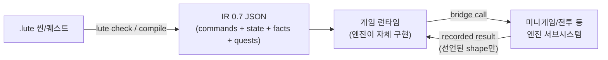

# Lute 파일럿 프로젝트 가이드

첫 파일럿 **tactus**(Triangle Strategy류 웹 SRPG, 1막 수직 슬라이스, `~/Workspace/tactus`)를 Lute 0.7로 완주하며 검증된 레시피와 함정을 정리한다. 다음 파일럿은 이 문서를 출발점으로 삼는다.

대상 독자: Lute로 시나리오를 저작하고, 자체 런타임(엔진)으로 IR을 실행하는 게임 프로젝트를 새로 시작하는 팀(사람 또는 에이전트).

---

## 1. 아키텍처 계약 (변하지 않는 것)

Lute는 **저작·기획 언어**다. `.lute` → `lute compile` → **IR 0.7 JSON**까지가 Lute의 책임이고, 그 JSON을 어떻게 실체화할지는 전적으로 엔진(런타임) 몫이다.



- 스토리 로직은 **선언된 상태와 팩트만** 본다. 엔진 내부(전투 데미지 계산 등)는 브리지 결과 shape 뒤에 숨는다.
- 엔진↔스토리 결합은 플러그인 디렉티브 1개(`::battle` 류) + 브리지 결과 3~4필드면 충분했다. 결합면을 이보다 넓히고 싶어지면 설계를 의심하라.

## 2. 툴체인 준비

```sh
cd ~/Workspace/lute && cargo build --release -p lute-cli
target/release/lute --version   # 0.7.0 확인 — 스테일 바이너리 주의
```

- `LUTE_BIN` 환경변수로 절대경로를 프로젝트 스크립트에 주입한다. npm `@lute-lang/lute`도 있지만 로컬 소스가 항상 최신.
- **에디터 LSP는 소스상 0.8 정합이다 — 위험은 스테일 *바이너리*다.** `lute-lsp`는 모든 진단을 공유 `lute_check::check`로 흘려보내므로 CLI와 바이트 단위로 일치한다(`crates/lute-lsp/tests/divergence.rs` 골든이 강제). 파일럿 시점의 "cinematic shot heading 오진"은 문법이 아니라 PATH에 깔린 **낡은 lute-lsp 바이너리**가 원인이었다. 이제 서버가 `serverInfo.version`으로 구현 언어 버전을 광고하고, VS Code 확장이 문서의 `luteVersion:`보다 서버가 낮으면 경고한다(`lute.versionCheck`, 기본 on). 그래도 정본은 CLI `lute check` / `check-project`이며, 편집기를 새로 세팅하면 `cargo install --path crates/lute-lsp`로 서버를 최신화하라.

## 3. 프로젝트 스켈레톤 (검증된 형태)

```
project/
  story/                          # Lute 프로젝트 루트
    lute.project.yaml             # defaultProfile + profiles.plugins
    scenes/*.lute  quests/*.lute
    plugins/<id>/                 # 커스텀 capability 플러그인
      plugin.yaml  directives/  bridge/  state/  providers/
    catalog/<provider>.yaml       # providerRef id 스냅샷
    cast.json  flow.json          # 엔진용 부속 데이터(Lute 밖 계약)
  public/story/*.json             # 컴파일 산출물 (CI로 재생성)
  scripts/compile-story.ts        # compile + ajv 스키마 검증 일괄
  src/contracts.ts                # 팀 간 인터페이스 정본 (Phase 0에 확정, 불변)
```

- 플러그인 매니페스트는 `docs/examples/idola-project/plugins/idola.minigame/`을 복사해 개명하는 게 가장 빠르고 정확하다. tactus의 실전 사례: `~/Workspace/tactus/story/plugins/tactus.battle/`.
- **Phase 0에서 스모크 씬 1개**(대사 1줄 + 브리지 디렉티브 1회 + `<match>`)로 `check → compile`이 exit 0인지 즉시 검증해 매니페스트 스키마 오차를 소진하라. 스키마: `schemas/lute.plugin.json`, `schemas/lute-ir-0.9.schema.json`.
- 컴파일 스크립트에서 ajv는 **draft 2020-12** 필요: `import Ajv from 'ajv/dist/2020'`.

## 4. 저작 규칙 (check를 통과하는 형태)

- 프론트매터: `kind: scene`, `mode: inline`, `luteVersion: "0.9.0"`, `profile: <capability profile>`. 상태 선언의 enum 스칼라는 `{ type: { enum: [...] }, default: ... }` 형태(`values:`/`domain:` 아님).
- 관계 선언: `relations: { persuaded: { args: [character, route], tier: run, key: [0] } }` + `entities`/`enums`. `::assert{rel(a,b)}`로 기록, 퀘스트 objective에서 `count(persuaded(_,_)) >= 7`로 판정 — 이 패턴은 0.7에서 완전 동작한다.
- number 대상 `<match on=...>` + `<when test="$ >= 4">`도 정상 동작한다 (파일럿 계획 때 우려했던 거부 없음).
- 대사 `emotion=`은 **lute 내장 enum**(neutral, surprised, delighted, shy, content, angry, sad)만 허용된다. 엔진 포트레이트 키(serious/soft 등)와 다르면 엔진 쪽에서 매핑 테이블을 둬라.
- 브리지 호출은 항상 `sync="true"` + 후속 `<match on="scene.<ns>.<key>.outcome">`에 **defeat(실패) 방어 아암**을 작성한다 — 정상 경로가 victory만 돌려줘도.
- `count()` objective는 `W-UNPROVEN-RELATIONAL` 경고를 낸다. 정적 분석 한계이며 정상 — `lute trace`로 양 경로를 실측하면 된다.
- CI 게이트로 `lute trace <scene> --project story --choose ... --mock <bridge mock>`를 분기 루트별 1회씩 넣어라 (mock 형식: `conformance/*/mock.yaml`).

## 5. 런타임(엔진) 구현 시 함정 — 전부 실전에서 밟은 것

정본: `docs/runtime/*.md` + `crates/lute-cli/src/runner.rs`(유일한 레퍼런스 구현). TS 포팅 전 정독.

1. **addr 비교는 세그먼트별 숫자 비교** — 최중요. addr(`002-11500`)의 라인 번호는 가변 자릿수 십진수다. converge 폴백 해석("해당 addr이 없으면 그 뒤 첫 addr로")을 **사전식 문자열 정렬**로 구현하면 `"002-11500" < "002-1400"`이 되어 허브 converge가 앞 바디로 되감기고, 바디가 무한 재생되며 run 상태가 무한 증식한다(tactus에서 7표 설계가 171표까지 증가). conformance 픽스처는 4자리 addr만 써서 이 버그를 **잡지 못한다** — 5자리 라인 넘버가 나오는 긴 씬에서만 발현. 반드시 숫자 비교 + 자체 회귀 테스트(참고: tactus `src/runtime/__tests__/addr-order.test.ts`).
2. **hub `once`는 내구 기록으로**: 로컬 Set만으로도 동작하지만, converge 해석이 잘못되면 hub가 재진입되며 리셋된다. `scene.visited.<hub>.<opt>` 상태 기록과 병행하면 방어적이다.
3. conformance 5종(`conformance/{choice-basic,quest-complete,hub-once-exit,match-otherwise,facts-datalog-rule}`)은 필수 게이트지만 **충분조건이 아니다**. 실제 컴파일된 자기 씬으로 헤드리스 완주 테스트를 추가하라 — tactus는 이걸로만 addr 버그를 재현했다.
4. 그 외 계약: 티어별 리셋(씬 경계 `scene.*` 리셋, `run.*` 유지), Kleene 3치(unknown 가드 = 선택지 숨김/objective 미완), 계층화 Datalog 전체 재계산(파일럿 규모에선 증분 불요), 퀘스트 fail-우선·이벤트 1회 발화, 브리지 effects 3형(fromBridgeResult / op+by / literal).

## 6. 엔진 통합 체크리스트 (tactus 실측 기준)

- 셸이 `registerBridge(service, op, fn)`에 **1줄 스텁**(`async () => ({outcome:'victory',...})`)을 먼저 꽂고 개발을 병렬화한 뒤, 실 서브시스템으로 교체하는 순서가 잘 동작했다.
- UI 자동화/QA를 위해 `?debug` 게이트 하에 심(예: 'k' = 적 전멸)과 상태 오버레이(`run.votes.*`)를 넣어라. 단 **디버그 전역(window.*)은 서브시스템 destroy 시 반드시 정리** — 스테일 전역이 QA 자동화를 오도한다.
- e2e는 브라우저에서 **분기 루트 전부** 완주해야 한다. 인페이지 오토플레이어(choice/dialogue/battle 우선순위 루프)가 CDP 왕복 클릭보다 수십 배 빠르다.

## 7. 에이전트 조직 운영 (1-N-M) — 무엇이 통했나

- **통한 것**: Phase 0에서 `src/contracts.ts`(팀 간 인터페이스)를 메인이 직접 확정 → 부서장 5인(시나리오/런타임/전투/UI/아트) 병렬 파견, 컨텍스트는 공유 `local://` 정본 문서 1개 + 각자 절만. 부서 간 질문은 hub 메시징. 완료 기준을 "명령 + exit 0" 형태로 명시.
- **함정 1 — 아트는 디렉션 체계부터**: 레퍼런스 리서치 → 아트 바이블(팔레트/렌더링 규정/프롬프트 템플릿) → 캐릭터 레퍼런스 시트 → 시트를 입력 이미지로 강제한 파생 생성 → 크기/알파/동일인물 검수 루프. 이 순서를 건너뛰고 개별 프롬프트로 뿌리면 화풍이 흩어진다. (참고: tactus `docs/art/art-bible.md`, `_key.py` 그린스크린 키잉 파이프라인 — 생성 모델이 알파를 지원 안 할 때.)
- **함정 2 — 리드 완료 보고 ≠ 검증**: 메인이 전체 `tsc --noEmit` + 전체 vitest + 실제 플레이를 다시 돌려라. 부서별 스코프 체크만으로는 통합 타입 에러와 크로스 팀 버그(플리커, HUD 겹침)가 남는다.

## 8. 검증 게이트 요약 (다음 파일럿의 Definition of Done)

```sh
$LUTE_BIN check-project story                  # exit 0
bun run story                                  # compile + IR 스키마 검증
$LUTE_BIN trace ... --choose ... --mock ...    # 분기 루트별 1회
bunx tsc --noEmit && bunx vitest run           # conformance + 자체 씬 헤드리스 완주 포함
# 브라우저 e2e: 타이틀→전 챕터→전 분기 루트→엔딩 (스크린샷 증빙)
canon gate check                               # 스펙/태스크 원장 클린
```

## 9. tactus에서 아직 안 쓴 것 (다음 파일럿 후보)

- `<timeline>` 연출 타임라인, `::retract`, Datalog `derive:` 파생 룰(런타임은 구현·테스트됨 — 저작이 안 씀), assetKinds, 프로파일 상속 옵션 레이어링, 다중 브리지 서비스.
