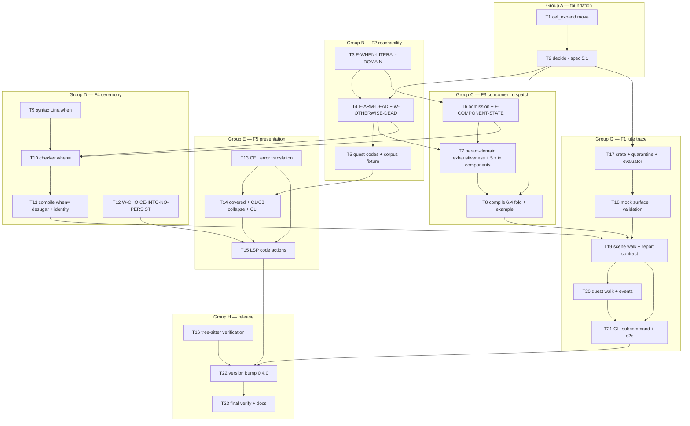

# Lute 0.4.0 — Writer Experience Implementation Plan

> **For agentic workers:** REQUIRED SUB-SKILL: Use superpowers:subagent-driven-development (recommended) or superpowers:executing-plans to implement this plan task-by-task. Steps use checkbox (`- [ ]`) syntax for tracking.

**Goal:** Implement Lute 0.4.0 (spec: `docs/proposals/scenario-dsl/0.4.0.md`, commit d7a4b4c) — the writer-experience layer: the shared §5.1 decided-constant fragment (`decide()`), provable reachability/softlock diagnostics (§5), param-scoped `<match>` dispatch in component bodies (§6), the `when=` gated-line sugar plus the `W-CHOICE-INTO-NO-PERSIST` guard-rail (§7 — the into⇒persist sugar was **DROPPED**, do not implement it), the diagnostic-presentation contracts (§8: CEL error translation + root-cause collapse), and the quarantined `lute trace` authoring evaluator (§4) as a **new terminal crate** wired only into the CLI.

**Architecture:** Eight dependency-ordered groups. **A) Foundation** — the textual `@def` expander moves to `lute-check` so the checker can expand-then-decide (§5.1), then `decide()` lands as the one reusable primitive consumed by F2 (reachability), F3 (§6.4 fold), and F1 (trace ground-op semantics). **B) Reachability (§5)** — `E-WHEN-LITERAL-DOMAIN` in the exhaustiveness engine, then a new whole-document `reachability.rs` pass (`E-ARM-DEAD`, `W-OTHERWISE-DEAD`, then the quest codes), gated by the normative corpus-fixture rule. **C) Component dispatch (§6)** — checker admission (`E-COMPONENT-STATE`, narrowed `E-COMPONENT-BODY`), param-domain exhaustiveness, compile-side §6.4 static-selection/residual fold. **D) Ceremony (§7)** — `Line.when` in the AST, checker semantics, the normalize-pass desugar with byte-identity proof, and the bare-`into=` warning. **E) Presentation (§8)** — pre-parse CEL error translation, the `covered` field + C1/C3 collapse, LSP code-actions over `fixits`. **F) tree-sitter verification** — corpus cases proving the spec's zero-grammar-change claim. **G) `lute trace` (§4)** — evaluator, mock surface, scene/quest walks, output contract, CLI subcommand, Cargo-edge quarantine assertion. **H) Release** — version bump + the single whole-workspace verify gate + docs.

**Tech Stack:** Rust workspace crates (`lute-core-span`, `lute-syntax`, `lute-cel`, `lute-manifest`, `lute-check`, `lute-compile`, `lute-cli`, `lute-lsp`, **new `lute-trace`**), cel-parser 0.10.1 (parse-only), serde_yaml 0.9, insta 1 (yaml), clap, tree-sitter corpus tests, tower-lsp-server.

## Global Constraints

- **Version: `0.4.0`.** Additive vocabulary-and-tooling release: ZERO new grammar productions (spec §3 B1 — verified, not assumed, by Task 16). The only pre-1.0 breaking allowance exercised is §3 B3: provably-defective documents newly ERROR under §5. Everything else preserves parse/compile/check behavior (B1/B2/B3), warnings are not compatibility surface (B4), and `trace` is invisible to check/compile (B5).
- **The D1 quarantine is structural (spec §4.2).** The tree's ONLY evaluator lives in the new `crates/lute-trace`, a terminal crate wired exclusively into `lute-cli`. `lute-cel` stays parse-only (it holds no evaluator and MUST NOT gain one); adding `lute-trace` to `lute-check`'s or `lute-compile`'s dependencies is a conformance violation. Task 17 ships a manifest-parsing test that FAILS the build on any such edge. `decide()` (Task 2) is NOT an evaluator: it is a closed static constant-folder (§5.1 R1–R5) and never reads runtime state.
- **Provable-only errors (§5 boundary).** A §5 error emitted for a document that has a satisfying run is a conformance BUG. `decide()` implements exactly R1–R5 — no SAT, no interval or path-sensitive narrowing, no cross-shot flow. When in doubt, return undecided.
- **TDD per task:** write the failing test first, run it, implement minimally, re-run, commit. One commit per task. Run ONLY the affected crate's tests per task (`cargo test -p <crate> [filter]`); no formatters, no linters, no whole-workspace runs until Task 23 (the sole exceptions are Task 14's `cargo check --workspace` — a struct-field change is compiler-driven across crates — and Group B/H's `check-project docs/examples` corpus gate, which the spec itself mandates as a fixture).
- **Single worktree ⇒ sequential by default.** Execute tasks in numeric order. The DAG below marks provably-disjoint parallel-safe pairs; exploit them ONLY with separate git worktrees (the git index races otherwise).
- **Diagnostic conventions** (match the codebase): `Diagnostic { code, severity, message, span, layer, fixits, provenance }` from `lute-core-span/src/lib.rs:117-127`; `E-*` = `Severity::Error`, `W-*` = `Severity::Warning`; every new module defines its own small private `diag(code, message, span)` helper (house precedent: `match_check.rs:1059`, `content_line.rs:33`). Hoist each code into `pub const E_… : &str = "E-…";` with a doc comment citing the spec § (house style, e.g. `content_line.rs:27`). New-module layers: `decide.rs`/`reachability.rs` → `Layer::Logic`; `cel_message.rs` → `Layer::Cel`; component-body additions reuse `use_diag`'s layer (`Layer::Staging`, check.rs:1222). Extend `diags` in `check()` step 8 (check.rs:696-719) BEFORE `dedup_undeclared`/sort — the `(byte_start, code)` stable sort at check.rs:729-736 is the determinism contract; never hand-sort.
- **Reuse existing patterns; NEVER add a second convention.** Key precedents named per task: whole-document passes (`check_line_codes` match_check.rs:687, called check.rs:711), post-pass suppression (`suppress_exhaustive_subject_reads` check.rs:722), guard forking (`walk_hub`/`walk_on` defassign.rs:207-227/249-262, `apply_condition` defassign.rs:339), desugar-in-normalize (`synth_persist` normalize.rs:354), insta goldens (`golden()` lute-compile/tests/e2e.rs:174), binary-spawn CLI tests (lute-cli/tests/examples_check.rs), synthetic-snapshot unit harness (lute-check/tests/domains.rs `ctx()`), temp-dir component harness (lute-check/tests/component_import.rs `unique_dir`/`write_lute`).
- **Every Appendix A diagnostic ships with at least one minimal adversarial fixture test** (one-fixture-per-invariant, `0.3 §12`). The coverage map is at the end of this plan.
- **Corpus discipline:** the shipped examples (`docs/examples/`) + the 5 insta goldens + the tree-sitter corpus stay green after EVERY task. New examples land as NEW files with NEW goldens; existing goldens change only in Task 22 (version bump).

## Decisions & Spec Deviations (READ FIRST — every task honors these)

- **D1 — No evaluator outside `lute-trace`; `decide()` is not an evaluator.** `decide()` is the closed §5.1 fragment: it folds constants that are provably the runtime value in EVERY state, and returns `None` for anything touching runtime knowledge (R5). Stronger reasoning is a spec revision, not an implementation liberty (§5.1 Closure). `lute-cel` remains parse-only (§4.2 rule 4).
- **D2 — The textual `@def` expander moves `lute-compile` → `lute-check` (`cel_expand.rs`).** §5.1 is explicit: expansion is "a static, hygienic text substitution the checker performs itself". Hosting it in `lute-check` lets `decide()` expand-then-decide without a dependency cycle (`lute-compile` already depends on `lute-check`), avoids a new `lute-cel`→`lute-manifest` edge (the expander's `DefTable` carries `lute-manifest` `Type`s), and is behavior-identical: `lute-compile/src/expand.rs` keeps its AST-walking D4 driver and imports the moved text-level functions.
- **D3 — The `decide()` sharing seam.** `Decided` (the constant value type) and `apply_op` (R3 ground-operation semantics: comparison, arithmetic, equality, `?:` selection, `in`-list) are the code shared with `lute-trace`'s evaluator — written ONCE in `lute-check/src/decide.rs`. `$` is modeled as `DollarBinding::Domain(&DomainInfo)` in checker contexts (R2 domain reasoning) and `DollarBinding::Value(Decided)` in the compile-time §6.4 fold (the subject already decided). `decide()` runs on the MARKED re-parse (`lute_cel::parse_slot_marked_refs`) so `@param` markers resolve to param domains; `@def` refs are textually expanded FIRST via `cel_expand` — a ref with no body (a component param) or a failed expansion is left intact and lands in R5 (undecided). Trace's evaluator = `apply_op` + effective-state reads + K3 unknown propagation; it is a strict superset by construction, not by duplication.
- **D4 — `E-WHEN-LITERAL-DOMAIN` owns the foreign-literal root.** An arm whose defect is a literal outside the domain gets ONLY that code — never an additional `E-ARM-DEAD` (§8.2 C4; the §5.4 worked example shows exactly this split). Foreign literals are excluded from subsumption unions and from `W-OTHERWISE-DEAD` coverage computations; an arm whose ENTIRE `is` set is foreign (and has no live guard) is already rooted and is skipped by the dead-arm pass.
- **D5 — C4 suppression = post-pass span filters.** `reachability.rs` emits roots; a new suppressor in `check()` (modeled on `suppress_exhaustive_subject_reads`, check.rs:722) drops any `W-OVERLAP-ARMS` whose span overlaps an `E-ARM-DEAD` arm. The quest-level consequence of `E-OBJECTIVE-UNSATISFIABLE` is carried IN that diagnostic's message (a note), never emitted as a second `E-QUEST-UNREACHABLE` — enforced by construction (Task 5 emits `E-QUEST-UNREACHABLE` only for its two standalone causes).
- **D6 — `E-COMPONENT-STATE` mechanism.** A positive scan over every component-body CEL slot and `{{…}}` interpolation (state-path uses via `cel_paths::collect_path_uses`; fact queries via `is_profile_fact_query`; `now()`) emits `E-COMPONENT-STATE`; `validate_components`' post-map (check.rs:1401-1403) then RETAIN-filters the incidental `E-UNDECLARED`/`E-RELATION-UNKNOWN` the empty component env produces for the same sites (misleading codes, spec §6.2). `E-UNDECLARED-REF` (an unknown `@param`) is untouched — that defect really is an unknown ref.
- **D7 — State-writing directive predicate (§6.2 "directive effects").** In a component body, a non-`use` directive whose RESOLVED decl declares actual writes — `state.as_ref().is_some_and(|s| !s.declares.is_empty()) || effects.as_ref().is_some_and(|e| !e.writes.is_empty())` (`DirectiveDecl`, lute-manifest/src/schema.rs:54-68: `DirectiveState.declares: Vec<SlotDecl>` = engine-written result slots; `DirectiveEffects.writes: Vec<WriteDecl>` incl. `WriteValue::FromBridgeResult`) — is `E-COMPONENT-STATE`. Test the Vecs for NON-EMPTINESS, NOT merely `Option::is_some` (a future `DirectiveEffects` variant carrying a non-write effect must not false-flag a presentational directive; §6.2 is specifically about `writes[]`). A `bridge:` ref alone has no state surface without a declared landing site. A doc comment on the predicate obligates any future builtin lowering that desugars to a state write to extend it.
- **D8 — `when=` desugar shape.** A normalize-pass rewrite (new arm in `normalize_nodes`, normalize.rs:42-119, the `synth_persist` slot): `Node::Line{when: Some(g), ..}` ⇒ `Node::Match{ subject: g, arms: [When{is: None, test: "$", body: [the line, when=None]}, Otherwise{body: []}] }`, running BEFORE expand/stage/address. Task 11's identity test pins §7.2's "MUST lower to that same match record" by JSON-comparing the sugared artifact's `MatchCmd` (incl. `arms[].expr`) against the hand-expanded twin's, modulo `addr`/label churn.
- **D9 — `$` is NOT in scope in a content-line `when=`** (§7.2, matching `<on when>`): the slot is checked under a `Ctx { in_match: false, match_subject: None, .. }` clone even when the line sits inside a `<match>` arm — `E-DOLLAR-OUTSIDE-MATCH` fires there.
- **D10 — The T2 "(empty slot)" translation is presentation-only.** It rewords the existing backend-panic path (`"invalid CEL expression"`, lute-cel/src/lib.rs:313-321). NO new error is introduced for empty condition slots that are silent today (`fill_document` skips empty raws) — B3 permits only §5 errors to change verdicts.
- **D11 — C1 collapse runs after the `(byte_start, code)` sort**: the primary is the first document-order occurrence; the root subject is the first backtick-quoted token of the message (generalizing `undeclared_path`, check.rs:2235). `covered: Vec<Span>` is an additive field on `Diagnostic` (`#[serde(default, skip_serializing_if = "Vec::is_empty")]`); adding it is a compiler-driven mechanical edit at every `Diagnostic` literal in the workspace (each module's private `diag()` helper).
- **D12 — C3 suppression is document-wide per failed namespace**: any `E-USES-NOT-FOUND`/`E-USES-PARSE`/`E-USES-CYCLE` in the result ⇒ drop `E-UNDECLARED`, `E-UNDECLARED-REF`, `E-MAYBE-UNSET`, `E-RELATION-UNKNOWN`; any `E-COMPONENT-PARSE` ⇒ drop `E-COMPONENT-UNDECLARED`. Runs after `dedup_undeclared`, before C1 collapse.
- **D13 — Version bump.** `LUTE_LANG_VERSION`/`LUTE_IR_VERSION` (lute-compile/src/lib.rs:33,38) → `"0.4.0"` in Task 22, with the 5 goldens + lib.rs:570-585 + lute-cli/tests/compile.rs:20-21 assertions updated in the same commit. Spec B2's "byte-identical" is read as modulo the version stamp — the 0.3.0 D15 precedent; frontmatter `luteVersion` is a universal key only (meta.rs:125), never validated against the consts. Flagged for spec confirmation.
- **D14 — `trace` walks the NORMALIZED + EXPANDED document.** `lute-compile`'s `normalize::normalize_document` and `expand::expand_document` become `pub` (Task 19) and `lute-trace` calls them: component binding (§13.2), the `when=` desugar, and the `persist=` desugar are inherited by construction — §4.4's "expanded exactly as compile expansion binds them" holds with zero duplication. Desugared records render with a `"(… sugar)"` annotation (the §4.6 `(persist sugar)` precedent). Post-D4-expansion slots are `@`/`$`-free, so trace's evaluator never resolves refs.
- **D15 — `lute-trace` dependency set:** `lute-core-span`, `lute-syntax`, `lute-cel`, `lute-manifest`, `lute-check`, `lute-compile` — wired ONLY into `lute-cli`. The workspace `members = ["crates/*"]` glob (root Cargo.toml:3) picks the crate up with no root edit. The quarantine test (crates/lute-trace/tests/quarantine.rs) reads the six sibling manifests + lute-lsp's and fails if ANY names `lute-trace`.
- **D16 — Fixit surfacing.** The two `W-CHOICE-INTO-NO-PERSIST` remedies and the §8.1 T2 fixits ride `Diagnostic.fixits` with `kind: "refactor"` (never `"migrate"`). `lute fix` cannot apply them by construction — `fix_document` (lute-check/src/fix.rs:53) never reads checker diagnostics — and Task 12 pins that with a regression test. The author-chosen surface is a NEW LSP code-action provider (Task 15).
- **D17 — The §5.1 corpus-fixture rule** is executed as `cargo run -p lute-cli -- check-project docs/examples` in Task 5's acceptance and re-gated in Task 23. Any hit is triaged on its merits — a genuine latent softlock fixes the EXAMPLE (own commit, documented); an over-aggressive check fixes the CHECK (with a regression test). An example is never silenced or special-cased.
- **D18 — `E-TRACE-MOCK-FACT` reuses `rel_schema::check_atom`** (already `pub`, lute-check/src/lib.rs:55) for unknown/arity/foreign-arg checks, re-coding every produced diagnostic under the one trace code (§4.3). Derived (`derive: true`) and `reserved: true` relations are ALLOWED as mock facts — a mock is a supplied answer, not a content write.
- **D19 — Trace `isSet()`/`has()` are definite** (true iff an effective value exists via trace-write → seed → schema default; false on unset), while a VALUE-read of an unset path is `unknown`. This keeps `has()`/`isSet()` inside §4.3's "Evaluated" list and makes `!isSet(run.x)` decide on a fresh mock world. Flagged as an interpretation for spec confirmation.
- **D20 — Trace auto-selection honesty.** At a `<branch>`/`<hub>` with no `--choose` entry, zero true-eligible choices, and ≥1 unknown-guarded choice, the trace halts incomplete (exit 3, unresolved atoms reported) — trace never guesses past unknown eligibility; forcing past an unknown guard via `--choose` is the documented escape hatch (§4.4).
- **D21 — `E-QUEST-UNREACHABLE` is ONE diagnostic per defective quest**, its message naming whichever standalone cause(s) hold (`start` decides false; `fail` decides true). Objective-derived unreachability NEVER produces this code (C4; it rides `E-OBJECTIVE-UNSATISFIABLE`'s message). A quest with a dead `start` AND a dead objective yields both codes — distinct roots (§5.4's parenthetical).

## File Structure

| File | Responsibility | Task |
|---|---|---|
| `crates/lute-check/src/cel_expand.rs` | NEW — the textual `@def` expander (`DefTable`, `expand_cel`, `expand_ref`, `substitute_params`, `subject_text`), moved verbatim from lute-compile | 1 |
| `crates/lute-compile/src/expand.rs` | keeps the D4 AST driver (`expand_document`/`expand_nodes`/`expand_attrs`/`expand_slot`); imports the moved text core from `lute_check::cel_expand` | 1 |
| `crates/lute-check/src/decide.rs` | NEW — §5.1: `Decided`, `DollarBinding`, `DecideCtx`, `apply_op` (shared R3 ops), `decide`, `decide_slot` | 2 |
| `crates/lute-check/src/match_check.rs` | `E-WHEN-LITERAL-DOMAIN` (+ per-literal spans via `is_pattern_literals`); `DomainInfo.resolved`; `pub(crate)` exposure of `infer_domain`/`subject_path`; `check_match_with_domain` refactor + `check_param_match` | 3, 7 |
| `crates/lute-check/src/reachability.rs` | NEW — §5.2/§5.3 whole-document pass: `E-ARM-DEAD`, `W-OTHERWISE-DEAD`, `E-OBJECTIVE-UNSATISFIABLE`, `E-QUEST-UNREACHABLE`, `W-OBJECTIVE-HIDDEN`; per-construct fns reused inside component bodies | 4, 5, 7, 10 |
| `crates/lute-check/src/check.rs` | wire `check_reachability` + the C4 overlap suppressor (step 8/9); `walk_component_body` rewrite (param-`<match>` admission, `E-COMPONENT-STATE`, directive-effects predicate); `check_choice_persist` warning; `Line.when` walker + component checks; E-CEL-PARSE construction via `cel_message`; C1 collapse + C3 suppression | 4–7, 10, 12–14 |
| `crates/lute-check/src/defassign.rs` | `Node::Line` guard fork for `when=` (apply_condition + forked `assigned`) | 10 |
| `crates/lute-check/src/cel_message.rs` | NEW — §8.1 pre-parse lexical scan (T2 table), T3 fallback, fixits | 13 |
| `crates/lute-core-span/src/lib.rs` | `Diagnostic.covered: Vec<Span>` (additive, C5) | 14 |
| `crates/lute-syntax/src/ast.rs` / `parser.rs` / `walk.rs` | `Line.when: Option<CelSlot>`; `parse_line` `take_cel`; `node()`/`node_mut()` visits | 9 |
| `crates/lute-compile/src/normalize.rs` | §6.4 fold (`fold_component_matches` inside `expand_use`); §7.2 `when=` → one-arm-match desugar (`synth_when_match`); both `pub` entry points for trace (Task 19) | 8, 11, 19 |
| `crates/lute-lsp/src/features/completion.rs`, `features/mod.rs` | `when` completion item; `Node::Line` when-slot cursor | 10 |
| `crates/lute-lsp/src/backend.rs`, `convert.rs`, NEW `code_action.rs` | `code_action_provider` capability + `fixits` → `CodeAction`/`WorkspaceEdit`; `covered` → `relatedInformation` | 15 |
| `tree-sitter-lute/test/corpus/writer_experience.txt` | NEW — corpus cases: `when=` on a content line; `<match>` in a component-file body (zero grammar diff asserted) | 16 |
| `crates/lute-trace/` | NEW crate — `src/{lib,value,eval,mock,walk,report}.rs`, `tests/quarantine.rs` + fixtures | 17–20 |
| `crates/lute-cli/src/main.rs` | `(+N more: …)` human suffix; `Trace` subcommand + `run_trace` (build_input reuse); exit codes 0/1/2/3 | 14, 21 |
| `crates/lute-cli/Cargo.toml` | `lute-trace` path dep (the ONLY reverse edge) | 21 |
| `docs/examples/components/reaction.component.lute`, `docs/examples/affinity-reaction.lute` | NEW — the §6.5 worked example pair + insta golden | 8 |
| `docs/examples/gated-line.lute` | NEW — §7.2 worked example + insta golden | 11 |
| `crates/lute-compile/src/lib.rs` | version consts → `"0.4.0"` | 22 |
| `docs/architecture.md`, `editors/README.md` | 0.4.0 writer-experience documentation | 23 |

New test files: `crates/lute-check/tests/decide.rs` (T2), `crates/lute-check/tests/reachability.rs` (T3–5), `crates/lute-check/tests/component_match.rs` (T6–7), `crates/lute-check/tests/line_when.rs` (T10), `crates/lute-check/tests/cel_message.rs` (T13), `crates/lute-check/tests/collapse.rs` (T14), `crates/lute-syntax/tests/line_when.rs` (T9), `crates/lute-compile/tests/component_fold.rs` (T8), `crates/lute-compile/tests/when_sugar.rs` (T11), `crates/lute-lsp/tests/code_action.rs` (T15), `crates/lute-trace/tests/{quarantine,mock,walk,quest,e2e}.rs` (T17–20), `crates/lute-cli/tests/trace.rs` (T21). Unit tests additionally live inline in `#[cfg(test)] mod tests` blocks per house style.

## Task DAG



**Execution order (single worktree):** 1 → 2 → 3 → 4 → 5 → 6 → 7 → 8 → 9 → 10 → 11 → 12 → 13 → 14 → 15 → 16 → 17 → 18 → 19 → 20 → 21 → 22 → 23.

**Provably-disjoint parallel-safe pairs** (separate worktrees only; disjoint file sets, no shared symbols):
- **T16 ∥ anything** — it touches only `tree-sitter-lute/test/corpus/`.
- **T1 ∥ T3** — `cel_expand.rs`+`lute-compile/src/expand.rs` vs `match_check.rs`.
- **T9 ∥ T12** — `lute-syntax` vs `check.rs`'s persist region + `fix.rs` tests.
- **T8 ∥ T13** — `lute-compile/src/normalize.rs` vs `cel_message.rs` (+ the check.rs:538-547 construction site).
- **T17/T18 ∥ T15** — `crates/lute-trace` vs `crates/lute-lsp`.

NOT parallel-safe despite temptation: T4/T5/T6/T10/T12/T14 all edit `check.rs`; T8/T11/T19 all edit `normalize.rs`.

---

## GROUP A — Foundation: the shared `decide()` seam (spec §5.1)

### Task 1: Move the textual `@def` expander to `lute-check` (`cel_expand.rs`)

§5.1 requires the CHECKER to perform `@def` expansion before deciding. The expansion text-core today lives in `lute-compile/src/expand.rs` (D4). Move it down the DAG — behavior-identical — so Task 2 can call it (D2).

**Files:**
- Create: `crates/lute-check/src/cel_expand.rs` (move: `DefTable`, `expand_cel`, `expand_ref`, `substitute_params`, `subject_text` — currently lute-compile/src/expand.rs; `DefTable` + `expand_cel` + `subject_text` become `pub`, the rest stay private to the new module)
- Modify: `crates/lute-check/src/lib.rs` (`pub mod cel_expand;` + `pub use cel_expand::{expand_cel, DefTable};`)
- Modify: `crates/lute-compile/src/expand.rs` (delete the moved items; `use lute_check::cel_expand::{expand_cel, DefTable};` — the AST driver `expand_document`/`expand_nodes`/`expand_attrs`/`expand_slot` stays put, `pub struct DefTable` construction sites in lute-compile/src/lib.rs update their import path)
- Test: the pure-text unit tests in expand.rs's `#[cfg(test)]` block that exercise `expand_cel`/`substitute_params` MOVE with the code into `cel_expand.rs`; AST-level tests stay in lute-compile.

**Interfaces** (moved verbatim — signatures already exist at lute-compile/src/expand.rs):

```rust
/// The merged def table (plugin < imported < inline), borrowed from
/// `FoldedEnv { def_bodies, env.def_params }`.
pub struct DefTable<'a> { /* moved as-is */ }
/// Expand one raw CEL fragment; `stack` is the cycle guard. Unknown-ref and
/// arity failures return Err (gate-proven unreachable in compile; Task 2's
/// decide_slot treats Err/unknown-ref as leave-intact → undecided).
pub fn expand_cel(raw: &str, defs: &DefTable<'_>, subject: Option<&str>, stack: &mut Vec<String>) -> Result<String, String>;
pub fn subject_text(subject: &str) -> String;
```

- [ ] **Step 1: Write the failing test** — in the new `crates/lute-check/src/cel_expand.rs`, start with ONLY the moved `#[cfg(test)]` tests (plus one new one proving the lute-check path):

```rust
#[test]
fn expands_zero_arity_def_through_check_crate() {
    let mut bodies = std::collections::BTreeMap::new();
    bodies.insert("never".to_string(), "1 > 2".to_string());
    let params = std::collections::BTreeMap::new();
    let defs = DefTable::new(&bodies, &params); // mirror the existing constructor shape
    let out = expand_cel("@never || run.x", &defs, None, &mut Vec::new()).unwrap();
    assert_eq!(out, "(1 > 2) || run.x"); // bodies parenthesize (D4 doc)
}
```

- [ ] **Step 2: Run to verify it fails** — `cargo test -p lute-check cel_expand` → COMPILE ERROR (module absent).
- [ ] **Step 3: Implement** — cut the five items + their text-level tests from `lute-compile/src/expand.rs`, paste into `cel_expand.rs`, adjust visibility (`pub` as above), fix imports (`lute_cel::scan_refs`, `lute_manifest::schema::Type`); rewire lute-compile (`use lute_check::cel_expand::…`). If `DefTable` construction is a struct literal today, add a `pub fn new(…)` constructor ONLY if field privacy forces it — otherwise keep fields `pub` exactly as they are.
- [ ] **Step 4: Run to verify it passes** — `cargo test -p lute-check cel_expand && cargo test -p lute-compile` → PASS; all 5 insta goldens byte-identical (pure move).
- [ ] **Step 5: Commit** — `git add -A && git commit -m "refactor(check): host the textual @def expander (cel_expand) below the compiler (0.4.0 T1)"`

### Task 2: `decide()` — the §5.1 decided-constant fragment (`lute-check/src/decide.rs`)

The ONE reusable primitive of this release. Consumed by Tasks 4/5 (reachability), 7 (param matches), 8 (§6.4 fold), 10 (`when=` dead guards), and 17 (`apply_op` reuse in trace). Total; never panics; returns `None` = undecided (R5) for everything outside R1–R4.

**Files:**
- Create: `crates/lute-check/src/decide.rs`
- Modify: `crates/lute-check/src/lib.rs` (`pub mod decide;` + `pub use decide::{decide, decide_slot, apply_op, Decided, DecideCtx, DollarBinding};` — `pub` because lute-compile's T8 fold and lute-trace's T17 evaluator consume it)
- Modify: `crates/lute-check/src/match_check.rs` (make `infer_domain` + `subject_path` `pub(crate)`; make `DomainInfo`/`Domain`/`DomainValue` `pub` — `Domain` may already be; re-export `DomainInfo` from lib.rs for lute-compile/lute-trace)
- Test: `crates/lute-check/tests/decide.rs` + inline `#[cfg(test)]` for `apply_op`

**Interfaces:**

```rust
/// A §5.1-decided constant — provably the expression's value in EVERY
/// reachable runtime state (soundness note, dsl 0.4 §5.1).
#[derive(Clone, Debug, PartialEq)]
pub enum Decided { Bool(bool), Num(f64), Str(String) }

/// What `$` denotes while deciding (`parse_slot` substitutes `$` → `Ident("_")`).
pub enum DollarBinding<'a> {
    /// Checker contexts: `$` is a finite-domain subject (R2).
    Domain(&'a DomainInfo),
    /// Compile-time §6.4 fold: the subject itself already decided.
    Value(Decided),
}

pub struct DecideCtx<'a> {
    pub schema: &'a StateSchema,
    pub dollar: Option<DollarBinding<'a>>,
    /// Component params (name → domain) for §6 slots; empty elsewhere.
    pub params: &'a BTreeMap<String, DomainInfo>,
}

/// R3 ground-operation semantics, shared with lute-trace (D3). `op` is the CEL
/// synthetic operator name (`_&&_`, `_==_`, `_+_`, `_?_:_`, `@in`, `!_`, … —
/// the `is_profile_operator` vocabulary, cel_resolve.rs:~467). Non-finite
/// numeric results (overflow, /0) → None (stay undecided, total).
pub fn apply_op(op: &str, args: &[Decided]) -> Option<Decided>;

/// Decide a MARKED CEL AST (`lute_cel::parse_slot_marked_refs`) under R1–R5.
pub fn decide(expr: &cel_parser::ast::Expr, ctx: &DecideCtx<'_>) -> Option<Decided>;

/// The §5.1 entry point: textually expand `@def`s (cel_expand; a bodiless or
/// unknown ref is left intact → marker → param lookup or R5), re-parse marked
/// into a scratch CelArena, then `decide`.
pub fn decide_slot(raw: &str, defs: &DefTable<'_>, ctx: &DecideCtx<'_>) -> Option<Decided>;
```

Rule map (implement EXACTLY — the Closure clause forbids more):
- **R1**: `Expr` literal nodes → `Decided`.
- **R2**: for `_==_`/`_!=_`/`@in` nodes, resolve ONE side as a finite-domain subject: `Ident("_")` → `ctx.dollar` (`Domain` arm); a marker ident `__lute_at_ref__<p>` → `ctx.params[p]`; a dotted path (reuse the `is_subject`-style extraction, match_check.rs:1017, / `cel_paths`) → `infer_domain(path, schema)` — only when `resolved` (Task 3 adds the flag). Literal outside the domain ⇒ `==` false / `!=` true; `in […]` with empty domain∩list ⇒ false. Literal INSIDE the domain ⇒ `None` (value unknown). `unset` never participates here (no CEL `unset` literal; R2's unset note is is-pattern-side, Task 3).
- **R3**: all operands decided → `apply_op`.
- **R4**: `&&`: either false ⇒ false; both true ⇒ true; else propagate through decided single side per K2 (a decided-true left with undecided right ⇒ None). `||` dually. `!d` negates. `_?_:_` with decided condition → decide the chosen branch.
- **R5**: `Select`/`Ident` path reads, `isSet`/`has`, `holds`/`count`/`validAt` (reuse `is_profile_fact_query`, cel_resolve.rs:516 — widen to `pub(crate)` if needed), `now()`, comprehensions, anything unrecognized → `None`.

- [ ] **Step 1: Write the failing tests** — `crates/lute-check/tests/decide.rs` (build `StateSchema` via the `domains.rs` harness idiom; enum path `run.rank: [fail,bronze,silver,gold]`, bool `run.flag` default false, number `run.n`):

```rust
#[test] fn r1_literals()            { assert_eq!(d("true"), Some(Decided::Bool(true))); assert_eq!(d("3"), Some(Decided::Num(3.0))); }
#[test] fn r3_ground_ops()          { assert_eq!(d("1 > 2"), Some(Decided::Bool(false))); assert_eq!(d("2 + 3 == 5"), Some(Decided::Bool(true))); assert_eq!(d("'a' == 'b'"), Some(Decided::Bool(false))); }
#[test] fn r4_connectives()         { assert_eq!(d("1 > 2 && run.flag"), Some(Decided::Bool(false))); assert_eq!(d("1 < 2 || run.flag"), Some(Decided::Bool(true))); assert_eq!(d("!(1 > 2)"), Some(Decided::Bool(true))); assert_eq!(d("1 > 2 ? run.n : 7"), Some(Decided::Num(7.0))); }
#[test] fn r2_domain_membership()   { assert_eq!(d("run.rank == 'platnum'"), Some(Decided::Bool(false))); assert_eq!(d("run.rank != 'platnum'"), Some(Decided::Bool(true))); assert_eq!(d("run.rank == 'gold'"), None); assert_eq!(d("run.rank in ['platnum', 'wood']"), Some(Decided::Bool(false))); }
#[test] fn r2_dollar_domain()       { /* dollar bound to run.rank's DomainInfo */ assert_eq!(d_dollar("$ == 'gone'"), Some(Decided::Bool(false))); assert_eq!(d_dollar("$ == 'gold'"), None); }
#[test] fn r2_dollar_value()        { /* dollar = Value(Str("fond")) — the §6.4 mode */ assert_eq!(d_val("$ == 'fond'"), Some(Decided::Bool(true))); assert_eq!(d_val("$ == 'cold'"), Some(Decided::Bool(false))); }
#[test] fn r2_param_domain()        { /* params: tier → enum [cold,warm,fond] */ assert_eq!(d_param("@tier == 'gone'"), Some(Decided::Bool(false))); assert_eq!(d_param("@tier == 'warm'"), None); }
#[test] fn r5_undecided()           { for e in ["run.n > 1", "isSet(run.flag)", "has(run.rank)", "holds(inParty(x))", "count(r(_)) > 0", "now() < run.t"] { assert_eq!(d(e), None, "{e}"); } }
#[test] fn def_expansion_precedes() { /* def never = "1 > 2" in the DefTable */ assert_eq!(d_defs("@never"), Some(Decided::Bool(false))); }
#[test] fn soundness_no_guessing()  { /* an in-domain comparison NEVER decides */ assert_eq!(d("run.flag == true"), None); }
```

(`d`/`d_dollar`/`d_val`/`d_param`/`d_defs` are 5-line local helpers building `DecideCtx` variants and calling `decide_slot` with an empty/one-entry `DefTable`.)
- [ ] **Step 2: Run to verify it fails** — `cargo test -p lute-check --test decide` → COMPILE ERROR.
- [ ] **Step 3: Implement** per the rule map. `apply_op` first (inline unit tests: truth tables, numeric compare, string equality, `in`-list, non-finite → None). Recursive `decide` over `cel_parser::ast::Expr` mirroring `check_cel_profile`'s match shape (cel_resolve.rs:357) — same node vocabulary, different verdict.
- [ ] **Step 4: Run to verify it passes** — `cargo test -p lute-check decide` → PASS (inline + integration).
- [ ] **Step 5: Commit** — `git add -A && git commit -m "feat(check): decide() — the 5.1 decided-constant fragment (0.4.0 T2)"`

## GROUP B — F2: provable reachability & softlock diagnostics (spec §5)

### Task 3: `E-WHEN-LITERAL-DOMAIN` — foreign `is` literals (§5.2)

Per-literal domain membership inside the existing exhaustiveness engine. No `decide()` needed — this is pure `DomainInfo` membership — but Task 4/7 reuse the classification, so the helper is `pub(crate)`.

**Files:**
- Modify: `crates/lute-check/src/match_check.rs` — new const `E_WHEN_LITERAL_DOMAIN` (doc comment citing §5.2/§6.3); `DomainInfo` gains `pub resolved: bool` (`infer_domain` returns `resolved: false` for an unresolvable subject, match_check.rs:817-822, `true` otherwise — the unresolved case emits NOTHING here); new `pub(crate) fn is_pattern_literals(raw: &str, span: Span) -> Vec<(String, Span)>` computing per-literal sub-spans (split on `|`, track byte offsets from `span.byte_start`, trim-adjust); the arm loop in `check_match` (match_check.rs:161-236) gains the per-literal check.
- Test: `crates/lute-check/tests/reachability.rs` (new file; full-pipeline `run()`/`codes()` harness copied from `tests/hub.rs`)

Emission rules (all require `dom.resolved`):
1. `Domain::Finite` of `Str` members: a `Str` literal not a member → error AT THE LITERAL's span, message naming the literal and the domain (`\`platnum\` is not a member of the subject's domain [fail, bronze, silver, gold] (dsl 0.4 §5.2)`).
2. Domain-shape mismatch: a `Num`/`Bool` literal against an enum domain, or a `Str`/`Num` literal against a bool domain → same code.
3. `unset` literal when `!maybe_unset` (a defaulted path; later a param, Task 7) → same code — including for `Domain::Infinite` subjects (a defaulted number path is never unset).
4. `Domain::Infinite` subjects: rules 1–2 do not apply (no finite claim); only rule 3.
Interaction: an arm carrying this code contributes its FOREIGN literals to nothing downstream (D4) — but coverage/`E-NONEXHAUSTIVE` behavior is otherwise unchanged.

- [ ] **Step 1: Write the failing tests** — in `tests/reachability.rs` (frontmatter const with `run.rank: { type: { enum: [fail, bronze, silver, gold] } }`, `run.flag: { type: bool, default: false }`, `run.n: { type: number, default: 0 }`):

```rust
#[test] fn foreign_enum_member_is_literal_domain() {
    let c = codes("<match on=\"run.rank\">\n<when is=\"platnum\">\n@n: x\n</when>\n<otherwise>\n</otherwise>\n</match>\n");
    assert!(c.contains(&"E-WHEN-LITERAL-DOMAIN".into()), "{c:?}");
}
#[test] fn span_points_at_the_literal() { /* run() variant asserting diagnostic.span slices the source to exactly "platnum" */ }
#[test] fn mixed_alternation_flags_only_foreign() { /* is="gold|platnum" → exactly one E-WHEN-LITERAL-DOMAIN; NO E-ARM-DEAD */ }
#[test] fn bool_literal_against_enum_flags()     { /* is="true" on run.rank */ }
#[test] fn unset_on_defaulted_path_flags()       { /* is="unset" on run.flag (defaulted bool) and on run.n (defaulted number) */ }
#[test] fn unset_on_maybe_unset_path_is_clean()  { /* is="unset" on an un-defaulted run path stays legal */ }
#[test] fn unresolved_subject_is_silent()        { /* on="scene.nonsense.x" is="whatever" → E-UNDECLARED etc. but NO E-WHEN-LITERAL-DOMAIN */ }
```

- [ ] **Step 2: Run to verify it fails** — `cargo test -p lute-check --test reachability` → FAIL (code never emitted).
- [ ] **Step 3: Implement** per the emission rules; reuse `analyze_is_pattern`'s literal classification (match_check.rs:911-921) on each `is_pattern_literals` element.
- [ ] **Step 4: Run to verify it passes** — `cargo test -p lute-check --test reachability && cargo test -p lute-check match` (existing match fixtures untouched).
- [ ] **Step 5: Commit** — `git add -A && git commit -m "feat(check): E-WHEN-LITERAL-DOMAIN foreign is-literal diagnostics (0.4.0 T3)"`

### Task 4: `reachability.rs` — `E-ARM-DEAD` + `W-OTHERWISE-DEAD` (§5.2)

The new whole-document pass, modeled on `check_line_codes` (free function over `&Document`, called once in `check()` step 8). All analysis is LOCAL to one construct (§5.2 — no cross-construct graph).

**Files:**
- Create: `crates/lute-check/src/reachability.rs`
- Modify: `crates/lute-check/src/check.rs` — call `check_reachability(&doc, &folded)` near check.rs:711, extend `diags`; add `suppress_dead_arm_overlaps(&mut diags)` beside `suppress_exhaustive_subject_reads` (check.rs:722)
- Modify: `crates/lute-check/src/lib.rs` — `pub mod reachability;` (per-construct fns `pub(crate)` for Task 7; the doc-level fn wired internally)
- Test: extend `crates/lute-check/tests/reachability.rs`

**Interfaces:**

```rust
/// §5.2/§5.3 whole-document pass. Walks doc.shots + doc.quests recursively
/// (arm/choice/on/objective bodies); Layer::Logic.
pub(crate) fn check_reachability(doc: &Document, folded: &FoldedEnv) -> Vec<Diagnostic>;
/// Per-construct engines, reused inside component bodies (Task 7):
pub(crate) fn check_match_reach(m: &Match, defs: &DefTable<'_>, ctx: &DecideCtx<'_>) -> Vec<Diagnostic>;
pub(crate) fn check_choices_reach<'a>(whens: impl Iterator<Item = (&'a CelSlot, Span)>, defs: &DefTable<'_>, ctx: &DecideCtx<'_>) -> Vec<Diagnostic>; // branch + hub choices
```

Rules:
- **Dead guard (cause 1).** An arm `test` (non-empty raw) or a `<choice when>` whose `decide_slot` → `Some(Bool(false))` → `E-ARM-DEAD`, message naming the guard text and "provably false". For match arms, `ctx.dollar = Domain(&infer_domain(subject))`; for choices, `dollar = None`. If the arm ALSO has an `is` pattern, the decided-false guard alone kills it — same code, cause named.
- **Subsumption (cause 2).** Walking arms top-to-bottom, accumulate `U` = union of DOMAIN-VALID literals (+ `covers_unset`) of earlier UNGUARDED arms (`test.raw.trim().is_empty()`, foreign literals excluded per D4). An arm (guarded or not — "a guard cannot resurrect a subsumed pattern") whose non-empty residual `is` set ⊆ `U` → `E-ARM-DEAD`, message citing the first covering arm's `line:column` and pattern, first-match-wins, dsl 0.4 §5.2 (the §5.4 message shape). An arm whose residual set is EMPTY (fully foreign) is skipped (D4-rooted).
- **`W-OTHERWISE-DEAD`.** If an `<otherwise>` exists and `U` (unguarded arms only) ⊇ the full finite domain AND (`covers_unset` ∨ `!maybe_unset`) → warning at the otherwise span. Requires `dom.resolved && Domain::Finite`.
- **C4:** `suppress_dead_arm_overlaps` drops any `W-OVERLAP-ARMS` whose span overlaps (reuse `spans_overlap`, check.rs:2225) an `E-ARM-DEAD` span.
- DefTable built from `folded.def_bodies` + `folded.env.def_params` — `@def`-hidden dead guards (`test="@never"`) ARE caught.

- [ ] **Step 1: Write the failing tests** (extend `tests/reachability.rs`):

```rust
#[test] fn decided_false_test_is_arm_dead()      { /* <when test="1 > 2"> → E-ARM-DEAD */ }
#[test] fn foreign_dollar_eq_guard_is_arm_dead() { /* on="run.rank", test="$ == 'gone'" → E-ARM-DEAD */ }
#[test] fn def_hidden_false_guard_is_arm_dead()  { /* defs: never: "1 > 2"; test="@never" → E-ARM-DEAD */ }
#[test] fn spec_54_subsumption_example() {
    // gold|silver then gold → arm 2 E-ARM-DEAD citing arm 1; platnum arm → E-WHEN-LITERAL-DOMAIN only;
    // exactly those two codes from the block; no W-OVERLAP-ARMS on the dead arm (C4).
}
#[test] fn guarded_earlier_arm_never_subsumes()  { /* <when is="gold" test="run.flag"> then <when is="gold"> → clean (partial overlap stays W-OVERLAP-ARMS semantics) */ }
#[test] fn dead_choice_when_in_branch_and_hub()  { /* <choice when="1 > 2"> → E-ARM-DEAD; E-BRANCH-ALL-GUARDED unchanged */ }
#[test] fn otherwise_dead_on_covered_bool()      { /* is="true" + is="false" on defaulted bool + <otherwise> → W-OTHERWISE-DEAD (warning; res.ok stays true) */ }
#[test] fn otherwise_live_when_maybe_unset()     { /* same arms, un-defaulted subject → no warning */ }
#[test] fn undecided_guard_is_never_flagged()    { /* test="run.n > 1" → clean — the provable-only boundary */ }
```

- [ ] **Step 2: Run to verify it fails** — `cargo test -p lute-check --test reachability` → FAIL.
- [ ] **Step 3: Implement** module + wiring + suppressor. Recursion mirrors `check_admission`'s walk (admission.rs:220-296): shots → nodes → arm/choice/on/objective bodies; timeline clips carry no arms (skip).
- [ ] **Step 4: Run to verify it passes** — `cargo test -p lute-check` (crate-wide: existing fixtures must stay green — B3 for non-defective docs).
- [ ] **Step 5: Commit** — `git add -A && git commit -m "feat(check): reachability pass — E-ARM-DEAD + W-OTHERWISE-DEAD (0.4.0 T4)"`

### Task 5: Quest reachability — `E-OBJECTIVE-UNSATISFIABLE`, `E-QUEST-UNREACHABLE`, `W-OBJECTIVE-HIDDEN` (§5.3) + the corpus fixture rule

**Files:**
- Modify: `crates/lute-check/src/reachability.rs` — quest section iterating `doc.quests`
- Test: extend `crates/lute-check/tests/reachability.rs`

Rules (quest guards decide with `dollar: None`; DefTable as Task 4):
- `quest.start: Some(slot)` deciding false → `E-QUEST-UNREACHABLE` (cause: never activates). `quest.fail: Some(slot)` deciding TRUE → same code (cause: fail precedes completion, `0.2 §6.3`). ONE diagnostic per quest naming the holding cause(s) (D21). `start: None` never fires.
- Per `<objective>`: `done` deciding false → `E-OBJECTIVE-UNSATISFIABLE`; when `!optional`, the message APPENDS the quest consequence note ("; the objective — and, being required, the quest — can never complete (dsl 0.4 §5.3)") — never a second quest-level error (C4).
- `!optional && when: Some(slot)` deciding false → `W-OBJECTIVE-HIDDEN`, message carrying `0.2 §6.3`'s advice (mark it `optional` or fix the gate). An `optional` objective → silent.

- [ ] **Step 1: Write the failing tests**:

```rust
#[test] fn dead_start_is_quest_unreachable()      { /* <quest id="q" start="1 > 2"> → E-QUEST-UNREACHABLE, message names start */ }
#[test] fn true_fail_is_quest_unreachable()       { /* fail="2 > 1" → same code, names fail */ }
#[test] fn foreign_done_is_objective_unsat()      { /* done="run.rank == 'platnum'" → E-OBJECTIVE-UNSATISFIABLE; message contains the required-quest note */ }
#[test] fn optional_dead_done_has_no_quest_note() { /* optional objective: code fires, note absent */ }
#[test] fn spec_54_quest_example_two_roots()      { /* start="1 > 2" AND foreign done → BOTH codes (distinct roots), exactly one each */ }
#[test] fn hidden_required_objective_warns()      { /* when="false" done="run.flag" non-optional → W-OBJECTIVE-HIDDEN; res.ok true (warning) */ }
#[test] fn holds_guards_stay_undecided()          { /* start="holds(inParty(x))" → clean (R5) — quest-grove/rescue-halsin shape */ }
```

- [ ] **Step 2: Run to verify it fails** — `cargo test -p lute-check --test reachability` → FAIL.
- [ ] **Step 3: Implement.**
- [ ] **Step 4: Run to verify it passes** — `cargo test -p lute-check`.
- [ ] **Step 5: CORPUS FIXTURE RULE (normative, §5.1)** — Run: `cargo run -p lute-cli -- check-project docs/examples`
Expected: exit 0. ANY §5 hit is triaged per D17 (fix the example as its own documented change, or fix the check with a regression test) — never silenced. (Explorer evidence says the corpus should be clean: quest guards use `holds(...)` — R5; the read-back matches cover bool domains without dead arms.)
- [ ] **Step 6: Commit** — `git add -A && git commit -m "feat(check): quest reachability — unsatisfiable objectives, unreachable quests (0.4.0 T5)"`

## GROUP C — F3: param-scoped `<match>` in component bodies (spec §6)

### Task 6: Component admission — param-`<match>`, `E-COMPONENT-STATE`, narrowed `E-COMPONENT-BODY` (§6.1, §6.2)

Component-body admission is NOT `admission.rs` — it is the hard-coded node-kind match in `walk_component_body` (check.rs:1446-1531). This task rewrites that match and gives the purity contract its own code.

**Files:**
- Modify: `crates/lute-check/src/check.rs`:
  - new const `E_COMPONENT_STATE: &str = "E-COMPONENT-STATE"` beside `E_COMPONENT_BODY` (check.rs:1218), doc comment citing §6.1/§6.2;
  - new `fn component_slot_state_scan(slot: &CelSlot, arena: &CelArena, diags: &mut Vec<Diagnostic>)` — emits `E-COMPONENT-STATE` for (a) every state-path use (`cel_paths::collect_path_uses` on the slot; message: names the path, "a component body may not depend on ambient state — bind it through a param (dsl 0.4 §6.2)"), (b) every fact query (marked re-parse + `is_profile_fact_query`), (c) `now()`;
  - new `fn component_interp_scan(interps, diags)` — `InterpKind::Path` interpolation → `E-COMPONENT-STATE` (replaces `check_interps`' path branch for component walks; `@ref` interps keep `E-UNDECLARED-REF` semantics);
  - `walk_component_body`'s `Node::Match(m)` arm: admission split — (i) `m.subject.raw.trim()` is a bare `@param` ref (exactly one `lute_cel::scan_refs` RefUse spanning the whole trimmed raw, no call args — the `is_whole_slot` idiom, cel_resolve.rs:135-142): recurse — check each arm `test` via `check_cel_slot` (params resolve as 0-arity defs in `component_env`) + `component_slot_state_scan`; walk arm bodies recursively through `walk_component_body` (nested param matches, lines, `::use` compose); exhaustiveness lands in Task 7; (ii) subject reads state (non-empty `collect_path_uses` or a fact query) → `E-COMPONENT-STATE`; (iii) any other subject shape (literal, compound over params) → `E-COMPONENT-BODY` with the §6.2 message ("dispatch needs a domain: the subject must be a bare declared param, e.g. on=\"@tier\""); (iv) subject is a bare ref to an UNDECLARED param → the ordinary `E-UNDECLARED-REF` from the subject slot check is the root — no admission code stacked on top;
  - `Node::Line` arm: swap `check_interps` for `component_interp_scan`; run `component_slot_state_scan` on `AttrValue::Ref` slots (keep `body_attr_refs` for ref/type checks);
  - `Node::Directive` (non-`use`) arm: D7 predicate — resolved `snapshot.directive(&d.tag)` with `state.is_some() || effects.is_some()` → `E-COMPONENT-STATE` (message: "declares state/bridge-result writes — a component body may not affect ambient state (dsl 0.4 §6.1)"); otherwise unchanged (`check_directive` + `body_attr_refs` + scans);
  - remaining rejected node arms (`Set`/`Branch`/`Hub`/`Timeline`/`On`/`Objective`/`Assert`/`Retract`): keep `E-COMPONENT-BODY`, update messages to cite dsl 0.4 §6.2 and name the admitted exception (branch/hub messages state the recording rationale: "presenting a menu records the selection — a state write");
  - `validate_components` (check.rs:1360-1410): post-map RETAIN-filter dropping `E-UNDECLARED`/`E-RELATION-UNKNOWN` from component-body diags (D6 — the scan supersedes them).
- Test: `crates/lute-check/tests/component_match.rs` (new; temp-dir `write_lute` harness from `tests/component_import.rs` + full-pipeline `check()` with `components: resolve_components(…)`), plus keep `tests/components_use.rs` green (its two E-COMPONENT-BODY assertions at :221/:237 — the `::set` one stays; the `<match>`-with-state-read one becomes `E-COMPONENT-STATE`: UPDATE that assertion, it is exactly the code-narrowing the spec mandates).

- [ ] **Step 1: Write the failing tests** — `tests/component_match.rs` (component fixture: `params: { tier: { enum: [cold, warm, fond] }, budget: number }`):

```rust
#[test] fn param_match_is_admitted()            { /* the §6.5 reaction body → NO E-COMPONENT-BODY, NO E-COMPONENT-STATE */ }
#[test] fn ambient_test_is_component_state()    { /* test="run.affection > 1" inside the body → E-COMPONENT-STATE (Appendix A fixture) */ }
#[test] fn state_subject_is_component_state()   { /* on="scene.affect.bianca" → E-COMPONENT-STATE */ }
#[test] fn literal_subject_is_component_body()  { /* on="'fond'" → E-COMPONENT-BODY (not an admitted form) */ }
#[test] fn fact_query_and_now_flag()            { /* test="holds(inParty(x))" and test="now() < run.t" → E-COMPONENT-STATE */ }
#[test] fn ambient_interp_is_component_state()  { /* {{run.tip}} in a body line → E-COMPONENT-STATE, not E-UNDECLARED */ }
#[test] fn writing_directive_is_component_state(){ /* synthetic snapshot directive with state.declares (domains.rs ctx() idiom) used in a body → E-COMPONENT-STATE (Appendix A ::check{into=} fixture analog) */ }
#[test] fn effectless_directive_stays_admitted(){ /* a plain staging directive → clean */ }
#[test] fn set_branch_hub_stay_component_body() { /* ::set / <branch> / <hub> → E-COMPONENT-BODY (changed-code fixture) */ }
#[test] fn param_forwarding_use_is_clean()      { /* ::use{component="inner" tier=@tier} inside an arm → clean; cycle still E-COMPONENT-CYCLE */ }
#[test] fn caller_side_state_binding_is_legal() { /* consuming scene: ::use{component="reaction" tier=@currentTier} with a state-reading caller def → clean (§6.2 invocation surface) */ }
```

- [ ] **Step 2: Run to verify it fails** — `cargo test -p lute-check --test component_match` → FAIL (admitted-match case flags E-COMPONENT-BODY today).
- [ ] **Step 3: Implement** per the file plan. Ctx for arm walking: clone with `in_match: true, match_subject: Some(param path? no — the raw "@tier")` — mirror how `Walker` sets match ctx for `$` admission (`E-DOLLAR-OUTSIDE-MATCH` must NOT fire inside arm tests).
- [ ] **Step 4: Run to verify it passes** — `cargo test -p lute-check --test component_match --test components_use` then `cargo test -p lute-check`.
- [ ] **Step 5: Commit** — `git add -A && git commit -m "feat(check): param-scoped <match> admission + E-COMPONENT-STATE purity code (0.4.0 T6)"`

### Task 7: Exhaustiveness over param domains + §5 checks inside component bodies (§6.3)

**Files:**
- Modify: `crates/lute-check/src/match_check.rs` — refactor `check_match` (match_check.rs:133) into a thin wrapper over `fn check_match_with_domain(m, dom: DomainInfo, schema, ctx) -> Vec<Diagnostic>` (the wrapper computes `infer_domain(subject_path(m))` exactly as today); new `pub(crate) fn param_domain(ty: &Type) -> DomainInfo` (`Bool` → `Finite[true,false]`; `Enum(members)` → `Finite(Str…)`; `Number`/`String` → `Infinite`; always `maybe_unset: false, resolved: true` — a param is NEVER unset, §6.3); new `pub(crate) fn check_param_match(m: &Match, dom: DomainInfo, ctx: &Ctx<'_>) -> Vec<Diagnostic>` delegating to `check_match_with_domain`.
- Modify: `crates/lute-check/src/check.rs` — `walk_component_body`'s admitted-match path calls `check_param_match` + Task 4's `check_match_reach`/`check_choices_reach` with `DecideCtx { dollar: Domain(&param_dom), params: &param_domain_table }` (the table built once per component from `def.params`).
- Test: extend `crates/lute-check/tests/component_match.rs`.

- [ ] **Step 1: Write the failing tests**:

```rust
#[test] fn enum_param_covered_is_clean()       { /* the §6.5 body — 3 arms cover [cold,warm,fond], NO otherwise needed */ }
#[test] fn missing_member_is_nonexhaustive()   { /* drop the cold arm → E-NONEXHAUSTIVE (reused code, §6.3 table) */ }
#[test] fn number_param_requires_otherwise()   { /* on="@budget" with is-arms only → E-NONEXHAUSTIVE */ }
#[test] fn unset_on_param_is_literal_domain()  { /* is="unset" on @tier → E-WHEN-LITERAL-DOMAIN (params never unset) */ }
#[test] fn foreign_member_on_param_flags()     { /* is="blazing" on @tier → E-WHEN-LITERAL-DOMAIN */ }
#[test] fn subsumed_param_arm_is_dead()        { /* is="fond|warm" then is="warm" → E-ARM-DEAD inside the component */ }
#[test] fn dup_otherwise_and_overlap_apply()   { /* E-MATCH-DUP-OTHERWISE + W-OVERLAP-ARMS fire in bodies exactly as at scene level (§6.3) */ }
#[test] fn param_guard_test_decides()          { /* test="@budget > 5" → undecided, clean; test="1 > 2" → E-ARM-DEAD */ }
```

- [ ] **Step 2: Run to verify it fails** — `cargo test -p lute-check --test component_match` → FAIL.
- [ ] **Step 3: Implement** the refactor + wiring. `E-UNSET-UNCOVERED` never fires for params (`maybe_unset: false` makes it structurally unreachable — assert via the covered-clean test).
- [ ] **Step 4: Run to verify it passes** — `cargo test -p lute-check` (crate-wide; the `check_match` refactor must leave every scene-level fixture identical).
- [ ] **Step 5: Commit** — `git add -A && git commit -m "feat(check): param-domain exhaustiveness + reachability inside component matches (0.4.0 T7)"`

### Task 8: Compile-side §6.4 — static selection & residual dispatch + the §6.5 worked example

Component `::use` expansion lives in `normalize.rs` (NOT expand.rs): `expand_use` (normalize.rs:122) clones the body and binds args textually (`bind_params`/`bind_slot_raw`/`arg_cel_text`, normalize.rs:232/320/340). The fold runs INSIDE `expand_use`, on the bound clone, and ONLY there — scene-level matches are never folded (B2).

**Files:**
- Modify: `crates/lute-compile/src/normalize.rs` — new `fn fold_component_matches(nodes: &mut Vec<Node>, schema: &StateSchema)` called at the end of `expand_use` on the bound body: for each `Node::Match` (recursively):
  1. `let subj = decide_slot(&m.subject.raw, &EMPTY_DEFTABLE, &ctx_no_dollar)` — bound literal args are already IN the text (a `'fond'` literal); a def-bound arg (`@currentTier`) parses to a marker → undecided (exactly §6.4's case split).
  2. Subject decided → walk arms top-to-bottom: `is` arm → literal-set membership against the decided constant (reuse `analyze_is_pattern` classification via a small local mirror — lute-compile may not reach `pub(crate)` items; re-export `is_pattern_literals` as `pub` from lute-check, or fold with `Decided`-vs-literal comparison); `test` arm → `decide_slot(test, …, dollar: Value(subj))`; `Otherwise` → selected. EVERY arm condition decided → **case 1**: splice the selected arm's body nodes in place of the match (no record); the `normalize_nodes` re-scan loop (normalize.rs:48-60) re-visits spliced nodes, so nested matches fold recursively.
  3. Any condition undecided (or subject undecided) → **case 2**: leave the `Node::Match` intact — it lowers to the ordinary `MatchCmd` with the substituted subject (stage.rs `walk_match`:393). The case-1/case-2 choice is pinned (MUST) — no heuristics.
- Create: `docs/examples/components/reaction.component.lute` (the §6.5 component, verbatim from the spec) + `docs/examples/affinity-reaction.lute` (a scene declaring `scene.affect.bianca: number` + the §6.5 caller match with three literal `::use` sites + one def-bound `::use{component="reaction" tier=@currentTier}`).
- Modify: `crates/lute-compile/tests/e2e.rs` — new golden `affinity_reaction`; `crates/lute-cli/tests/examples_check.rs` — one new check test for the pair.
- Test: `crates/lute-compile/tests/component_fold.rs` (new).

- [ ] **Step 1: Write the failing tests** — `tests/component_fold.rs` (reuse e2e.rs's `input_for` idiom):

```rust
#[test] fn literal_arg_folds_to_selected_arm() {
    // component reaction + ::use tier="fond" — artifact JSON has ZERO "kind":"match"
    // commands and exactly the fond @bianca line; byte-compare the line commands
    // against the hand-duplicated twin document (§6.5: "indistinguishable").
}
#[test] fn otherwise_selected_when_no_is_matches() { /* number param, is arms miss → otherwise body spliced */ }
#[test] fn ref_bound_arg_stays_residual_match()    { /* tier=@currentTier → exactly one MatchCmd, subject == the substituted def CEL, arms intact (§6.4 case 2) */ }
#[test] fn nested_param_match_folds_recursively()  { /* two-level component, both literal-bound → no match records */ }
#[test] fn existing_goldens_untouched()            { /* cargo insta: the 5 pre-existing snapshots byte-identical (B2) — implicitly step 4 */ }
```

- [ ] **Step 2: Run to verify it fails** — `cargo test -p lute-compile --test component_fold` → FAIL (a match record is emitted today — actually today the CHECKER rejects the component; the test compiles only post-T6/T7, which is why this task sits here).
- [ ] **Step 3: Implement** `fold_component_matches` + author the two example files + register the golden & CLI check test.
- [ ] **Step 4: Run to verify it passes** — `cargo test -p lute-compile` (goldens: 5 old byte-identical + 1 new accepted via `cargo insta test -p lute-compile --accept`, then inspect `e2e__affinity_reaction.snap` by eye: folded lines present, ONE residual match from the def-bound site) and `cargo test -p lute-cli examples_check`.
- [ ] **Step 5: Commit** — `git add -A && git commit -m "feat(compile): 6.4 static-selection/residual fold for param matches + 6.5 example (0.4.0 T8)"`

## GROUP D — F4: ceremony (spec §7) — `when=` + the bare-`into=` guard-rail

> The into⇒persist sugar was **DROPPED** (§7.3): do NOT implement any implied `persist=`. This group ships exactly ONE sugar (`when=` on content lines) and ONE warning (`W-CHOICE-INTO-NO-PERSIST`).

### Task 9: `Line.when` in the syntax layer

The parser is already attr-open (`scan_attrs`, parser/attrs.rs — no allowlist); the gap is typed extraction: `Line` has no `when` field, so the guard sits inertly in `Line.attrs` and is invisible to the CEL walk (walk.rs:66-70/186-189) and `fill_document`'s StableId pass (lute-cel/src/fill.rs:44-50).

**Files:**
- Modify: `crates/lute-syntax/src/ast.rs:42-49` — `Line` gains `pub when: Option<CelSlot>` (doc comment citing dsl 0.4 §7.2; `CelKind::Condition`, the `Choice.when` precedent at ast.rs:97-104)
- Modify: `crates/lute-syntax/src/parser.rs:537` — `parse_line` calls `take_cel(&mut attrs, "when", CelKind::Condition)` before storing residual attrs (mirror `parse_choice`, parser/blocks.rs:243-260)
- Modify: `crates/lute-syntax/src/walk.rs` — `node()`/`node_mut()` `Node::Line` arms visit `l.when` BEFORE `attrs(…)` (mirror the `objective()` ordering at walk.rs:114/123)
- Fix any exhaustive `Line { .. }` struct literals the compiler flags across the workspace (`when: None`)
- Test: `crates/lute-syntax/tests/line_when.rs`

- [ ] **Step 1: Write the failing tests**:

```rust
#[test] fn when_attr_is_extracted_to_slot() {
    let doc = lute_syntax::parse(SRC).0; // @sofia{when="run.metHelpfully" emotion="soft"}: text
    let line = first_line(&doc);
    let w = line.when.as_ref().expect("when extracted");
    assert_eq!(w.raw, "run.metHelpfully");
    assert!(matches!(w.kind, CelKind::Condition));
    assert!(line.attrs.iter().all(|a| a.key != "when"), "residual attrs keep emotion only");
}
#[test] fn line_without_when_is_none()  { /* plain line → when: None (B1: parse-identical) */ }
#[test] fn walk_visits_the_when_slot()  { /* for_each_cel_slot collects the guard's raw */ }
#[test] fn slot_order_is_stable()       { /* a doc WITHOUT when= walks the same slot sequence as before — pin with a two-slot doc */ }
```

- [ ] **Step 2: Run to verify it fails** — `cargo test -p lute-syntax --test line_when` → COMPILE ERROR (`when` field absent).
- [ ] **Step 3: Implement** the three edits + literal fixes.
- [ ] **Step 4: Run to verify it passes** — `cargo test -p lute-syntax` then `cargo check -p lute-check -p lute-compile -p lute-lsp -p lute-cel` (struct-literal fallout only; behavior tests still green: `cargo test -p lute-cel`).
- [ ] **Step 5: Commit** — `git add -A && git commit -m "feat(syntax): Line.when typed guard slot for the gated-line sugar (0.4.0 T9)"`

### Task 10: Checker semantics for `when=` (§7.2)

**Files:**
- Modify: `crates/lute-check/src/check.rs` — `Walker::walk`'s `Node::Line` arm (check.rs:~787-791): when `l.when` is `Some`, `check_cel_slot(w, arena, &ctx_no_dollar, Some(&ExpectedType::Bool))` where `ctx_no_dollar` clones ctx with `in_match: false, match_subject: None` (D9 — the quest start/fail precedent, check.rs:590-604); `walk_component_body`'s `Node::Line` arm: `component_slot_state_scan` on the when slot (params-only rule, §7.2 → `E-COMPONENT-STATE`).
- Modify: `crates/lute-check/src/defassign.rs` — `Node::Line` arm (defassign.rs:97-108): when guarded, FORK `assigned` (clone), `apply_condition(when, schema, &mut fork, diags)` (defassign.rs:339), check the line's interps against the fork, DISCARD (the `walk_hub`/`walk_on` non-dominating template, defassign.rs:207-227) — so `when="isSet(run.tip)"` proves `{{run.tip}}`; unguarded lines keep today's path.
- Modify: `crates/lute-check/src/reachability.rs` — the node walk treats a `Some(when)` line as a one-arm construct: `decide_slot` → false → `E-ARM-DEAD` at the when span ("this gated line can never be shown: its `when` guard is provably false (dsl 0.4 §7.2, §5.2)").
- Modify: `crates/lute-lsp/src/features/completion.rs:143-163` — add `("when", "condition")` to `content_line_attr_key_items`; `crates/lute-lsp/src/features/mod.rs` — `resolve_node`'s `Node::Line` arm yields a `Cursor::Cel` for the when slot (the `choice.when` precedent at ~:235-290).
- Test: `crates/lute-check/tests/line_when.rs` (new) + one completion assertion in lute-lsp's existing completion test module.

- [ ] **Step 1: Write the failing tests**:

```rust
#[test] fn guard_is_checked_as_condition()   { /* when="run.nope" → E-UNDECLARED; when="run.flag && 1" → profile/type diagnostics as any guard */ }
#[test] fn dollar_out_of_scope_even_in_match(){ /* line inside a <when> arm with when="$ == 1" → E-DOLLAR-OUTSIDE-MATCH (D9) */ }
#[test] fn guard_proves_interp_reads()        { /* when="isSet(run.tip)" + {{run.tip}} → no E-MAYBE-UNSET; without the guard → E-MAYBE-UNSET */ }
#[test] fn decided_false_guard_is_arm_dead()  { /* when="1 > 2" → E-ARM-DEAD */ }
#[test] fn component_line_when_params_only()  { /* when="@tier == 'fond'" in a body → clean; when="run.x" → E-COMPONENT-STATE */ }
#[test] fn known_attrs_never_sees_when()      { /* @s{when="run.flag"}: x → no E-UNKNOWN-ATTR (extraction precedes content_line.rs) */ }
#[test] fn delivery_and_emotion_checks_hold() { /* when= composes with emotion=/mono checks unchanged (§7.2 "all existing attr checks apply") */ }
```

- [ ] **Step 2: Run to verify it fails** — `cargo test -p lute-check --test line_when` → FAIL.
- [ ] **Step 3: Implement** the four modify-sites.
- [ ] **Step 4: Run to verify it passes** — `cargo test -p lute-check && cargo test -p lute-lsp completion`.
- [ ] **Step 5: Commit** — `git add -A && git commit -m "feat(check,lsp): when= content-line guard semantics (0.4.0 T10)"`

### Task 11: Compile desugar — `when=` ⇒ one-arm match, identity-preserving (§7.2, §7.4)

**Files:**
- Modify: `crates/lute-compile/src/normalize.rs` — new `fn synth_when_match(line: Line) -> Node` (D8: `Match { subject: the when slot, arms: [When{ is: None, test: synthesized "$" Condition slot, body: [Line{when: None, ..line}] }, Otherwise{ body: vec![] }] }`; synthesized-slot idiom = `synth_persist`/`push_set`, normalize.rs:354-392) + a `normalize_nodes` arm rewriting `Node::Line(l) if l.when.is_some()` (recursion covers arm bodies/choice bodies/on bodies; timeline clips carry no Lines).
- Create: `docs/examples/gated-line.lute` — the §7.2 before/after pair as a living example (declares `run.metHelpfully` defaulted bool; one sugared line + the equivalent explicit block on a second shot, comments citing §7.2).
- Modify: `crates/lute-compile/tests/e2e.rs` — golden `gated_line`; `crates/lute-cli/tests/examples_check.rs` — check test.
- Test: `crates/lute-compile/tests/when_sugar.rs` (new).

- [ ] **Step 1: Write the failing tests**:

```rust
#[test] fn sugared_line_lowers_to_canonical_match_record() {
    // Compile TWIN documents: (a) @sofia{when="run.metHelpfully"}: T
    // (b) <match on="run.metHelpfully"><when test="$">@sofia: T</when><otherwise></otherwise></match>
    // Assert: the two artifacts' command streams are EQUAL after erasing addr/
    // converge/target label strings — including MatchCmd.subject, arms[].test,
    // arms[].expr, and the LineCmd (D8 pins §7.2's "MUST lower to that same
    // match record"). Then assert line_id and voice_key are IDENTICAL strings
    // (identity scope is shot-prefix-based, address.rs:85-104 — wrapping cannot move them).
}
#[test] fn code_backfill_is_unaffected()        { /* authored code= on the sugared line survives; an untagged sugared line gets max+10 exactly as its explicit twin (§7.4) */ }
#[test] fn no_sugar_document_is_byte_identical(){ /* compile bianca-s01ep02 before/after this task — covered by the untouched goldens in step 4 (B2) */ }
#[test] fn sugared_line_survives_compilation()  { /* examples_compile-style: gated-line.lute --json contains the (speaker,text) pair (regression guard 27653b6 precedent) */ }
```

- [ ] **Step 2: Run to verify it fails** — `cargo test -p lute-compile --test when_sugar` → FAIL.
- [ ] **Step 3: Implement** the desugar; if the synthesized `"$"` test slot needs a parsed AST for `MatchArm.expr` parity, either thread the compile-owned `CelArena` into `normalize_document` (callers: lib.rs:63 + Task 19's trace) or synthesize via `synth_arm_expr` (expr.rs:141) — whichever makes the twin-equality test pass EXACTLY; do not weaken the test.
- [ ] **Step 4: Run to verify it passes** — `cargo test -p lute-compile` (5+1 old goldens byte-identical; accept + eyeball the new `e2e__gated_line.snap`: one match record, one arm, empty otherwise target, line untouched) and `cargo test -p lute-cli examples_check`.
- [ ] **Step 5: Commit** — `git add -A && git commit -m "feat(compile): when= gated-line desugar to a one-arm match, identity-preserving (0.4.0 T11)"`

### Task 12: `W-CHOICE-INTO-NO-PERSIST` (§7.3)

Checker-only warning at the existing persist-sugar site. `lute fix` MUST NOT migrate — pinned by test (D16).

**Files:**
- Modify: `crates/lute-check/src/check.rs` — `check_choice_persist` (check.rs:1699): the early-return `else` branch (persist attr absent, check.rs:1701-1704) now first checks for an `into` attr; present → push `W-CHOICE-INTO-NO-PERSIST` (new const beside `E_PERSIST_*`, check.rs:1684-1688; `Severity::Warning`, the module's persist layer) at the `into` attr span. Message: "`into=` without `persist=` records nothing — add `persist=\"run\"` to persist the fact, or remove the dead `into=` (dsl 0.4 §7.3)". Two fixits (`kind: "refactor"`, D16): (1) title `add persist="run"` — zero-width `TextEdit` at `into_attr.span.byte_start` inserting `persist="run" `; (2) title `remove into=` — replace `into_attr.span` (plus the preceding space byte) with the empty string.
- Test: extend `crates/lute-check/tests/line_when.rs`? NO — keep cohesion: add to the existing choice/persist test file (locate `check_choice_persist` fixtures via `grep -l E-PERSIST crates/lute-check/tests`); plus a `fix.rs` regression in `crates/lute-check/src/fix.rs`'s inline tests.

- [ ] **Step 1: Write the failing tests**:

```rust
#[test] fn bare_into_warns_on_branch_choice() { /* the Appendix A fixture: <choice id="help" label="…" into="run.metHelpfully"> → exactly one W-CHOICE-INTO-NO-PERSIST; res.ok == true (B4: warnings never flip verdicts) */ }
#[test] fn bare_into_warns_on_hub_choice()    { }
#[test] fn persist_present_stays_silent()     { /* the full sugar → no warning; every E-PERSIST-* behavior untouched */ }
#[test] fn no_into_no_warning()               { }
#[test] fn fixits_carry_both_remedies()       { /* fixits.len()==2, kinds "refactor", edits splice to the expected strings */ }
#[test] fn lute_fix_never_touches_bare_into() { /* fix.rs inline: fix_document on a bare-into doc → changed == 0, text identical (D16) */ }
```

- [ ] **Step 2: Run to verify it fails** — `cargo test -p lute-check choice_into` → FAIL.
- [ ] **Step 3: Implement.**
- [ ] **Step 4: Run to verify it passes** — `cargo test -p lute-check`.
- [ ] **Step 5: Commit** — `git add -A && git commit -m "feat(check): W-CHOICE-INTO-NO-PERSIST names the silent bare-into trap (0.4.0 T12)"`

## GROUP E — F5: diagnostic presentation (spec §8)

### Task 13: CEL error translation — the `E-CEL-PARSE` message contract (§8.1)

A PRE-PARSE lexical scan of the raw slot text, string-mask aware, independent of the backend's error taxonomy (that independence is what makes T2 reliably implementable). The backend leak sites: `CelParseError.message` carries raw ANTLR text on the error path (lute-cel/src/lib.rs:300-309) and `"invalid CEL expression"` on the panic path (lib.rs:313-321); the ONE `Diagnostic` construction site is check.rs:538-547. Translation happens THERE — lute-cel stays untouched (parse-only, no message policy).

**Files:**
- Create: `crates/lute-check/src/cel_message.rs`
- Modify: `crates/lute-check/src/check.rs:538-547` — build message/fixits/span from `translate_cel_parse` instead of `err.message`
- Modify: `crates/lute-check/src/lib.rs` — `mod cel_message;`
- Test: `crates/lute-check/tests/cel_message.rs`

**Interfaces:**

```rust
pub(crate) struct Translation { pub message: String, pub fixits: Vec<Fixit>, pub span: Option<Span> }
/// §8.1 T1–T3. `raw` = the slot's authored text; `backend` = lute-cel's error
/// (used ONLY for its span on the fallback path — never its message text).
pub(crate) fn translate_cel_parse(raw: &str, slot_span: Span, backend: &CelParseError) -> Translation;
```

Detection order (each scan runs over `lute_cel::cel_string_mask(raw)`-masked bytes; first hit wins; fixit spans are slot-relative offsets rebased on `slot_span.byte_start`):
1. whitespace-only → "the condition is empty" (D10: this only rewords the panic path — empty slots that never reach `parse_slot` stay silent).
2. unbalanced quote (mask ends inside a string) → "unclosed quote in the condition".
3. `=<` / `=>` → "did you mean `<=` / `>=`?" + fixit.
4. bare `=` (not `==` `!=` `<=` `>=` and not caught by 3) → "`=` assigns; comparison is `==` — did you mean `<corrected slot text>`?" + fixit (the §8.4 message shape).
5. bare `&` / `|` → "`&`/`|` are not operators here — use `&&`/`||` (or `is=\"a|b\"` for a literal alternation)" + fixit.
6. word-operator tokens `and`/`or`/`not` (whole-ident tokens outside strings, not member-access segments) → "words are not operators in a condition — use `&&` / `||` / `!`" + fixit.
Fallback (T3): "not a valid condition expression: `<raw>`" + the backend span when one was recovered, else the whole slot. NEVER backend text.

- [ ] **Step 1: Write the failing tests**:

```rust
#[test] fn assignment_eq_gets_suggestion()   { /* test="run.act = 1" → E-CEL-PARSE, message contains "did you mean `run.act == 1`", one fixit → splices to "run.act == 1" (the changed-code fixture) */ }
#[test] fn all_t2_rows_translate()           { /* table-drive: a & b, a | b, a and b, a or b, not a, x =< 1, x => 1, "unterminated → each canonical essence */ }
#[test] fn no_backend_vocabulary_ever() {
    for bad in ["run.act = 1", "a &", "(", "1 +", "'unterminated", "a and b", "@"] {
        let msgs = messages_for(bad); // full check() over a doc embedding the slot
        for m in &msgs { for tok in ["viable alternative", "token recognition", "mismatched input", "extraneous input", "no viable"] {
            assert!(!m.contains(tok), "backend leak for {bad:?}: {m}");
        }}
    }
}
#[test] fn c2_parse_failure_suppresses_slot() { /* when="run.nope = 1" → ONLY E-CEL-PARSE for that slot — no E-UNDECLARED/E-CEL-PROFILE (practice today, normative now: pin it) */ }
#[test] fn fallback_is_neutral()              { /* an exotic parse failure → "not a valid condition expression" */ }
#[test] fn masked_operators_stay_silent()     { /* test="run.s == 'a = b & c'" parses fine → no E-CEL-PARSE at all (string-mask awareness) */ }
```

- [ ] **Step 2: Run to verify it fails** — `cargo test -p lute-check --test cel_message` → FAIL (raw ANTLR text today).
- [ ] **Step 3: Implement** the scanner + wiring. Keep `lute-cel` byte-untouched.
- [ ] **Step 4: Run to verify it passes** — `cargo test -p lute-check` (existing fixtures asserting on old E-CEL-PARSE message text, if any, update to the new contract — message text was never stable API, B4).
- [ ] **Step 5: Commit** — `git add -A && git commit -m "feat(check): writer-voiced E-CEL-PARSE translation, no backend leakage (0.4.0 T13)"`

### Task 14: `covered` + root-cause collapse C1/C3/C5 + CLI presentation (§8.2, §8.3)

**Files:**
- Modify: `crates/lute-core-span/src/lib.rs:117-127` — `Diagnostic` gains `#[serde(default, skip_serializing_if = "Vec::is_empty")] pub covered: Vec<Span>` (C5; additive — no field removed/retyped, §8.3). Compiler-driven fallout: add `covered: Vec::new()` at every `Diagnostic` literal (each module's private `diag()` helper + parser/LSP test fixtures).
- Modify: `crates/lute-check/src/check.rs` — after `dedup_undeclared` + the `(byte_start, code)` sort (check.rs:725-736): (1) `fn suppress_unproven_absence(diags: Vec<Diagnostic>) -> Vec<Diagnostic>` — D12's C3 rule; (2) `fn collapse_same_root(diags: Vec<Diagnostic>) -> Vec<Diagnostic>` — D11's C1 rule over the code set {`E-UNDECLARED`, `E-UNDECLARED-REF`, `E-RELATION-UNKNOWN`, `E-CHOICELOG-READ`, `E-COMPONENT-UNDECLARED`}, key = (code, first-backtick-token), primary keeps its position, followers' spans append to `primary.covered` (order preserved — collapse never reorders primaries, never crosses files by construction: `check()` is per-file). Site-specific codes (`E-MAYBE-UNSET` …) are EXEMPT — not in the set.
- Modify: `crates/lute-cli/src/main.rs` — `print_human` (main.rs:1068-1092): append ` (+N more: 12:3, 47:9, …)` when `!d.covered.is_empty()` (line:column rendering, comma-joined, document order). Counting needs NO change — the list now contains only primaries (§8.3 counting-by-primaries falls out; note it in a comment: "five reads of one typo are ONE error"); JSON is automatic via serde.
- Test: `crates/lute-check/tests/collapse.rs` + one CLI binary-spawn test in `crates/lute-cli/tests/` (JSON contains `covered`; human line contains `(+2 more:`; the trailing count says 1 error).

- [ ] **Step 1: Write the failing tests**:

```rust
#[test] fn three_reads_one_primary() { /* the Appendix A fixture: one typo'd path read 3× → exactly 1 E-UNDECLARED, at the FIRST occurrence, covered.len()==2, spans in document order (§8.4 shape) */ }
#[test] fn distinct_subjects_do_not_collapse()   { /* two different typo'd paths → 2 primaries */ }
#[test] fn maybe_unset_is_exempt()               { /* two E-MAYBE-UNSET sites survive collapse (C1 exemption) */ }
#[test] fn missing_uses_suppresses_dependents()  { /* uses: nonexistent.yaml + one run.* read → EXACTLY one error: E-USES-NOT-FOUND (the Appendix A C3 fixture) */ }
#[test] fn component_parse_suppresses_undeclared_component() { /* broken component file + ::use of it → E-COMPONENT-PARSE only */ }
#[test] fn collapse_is_deterministic()           { /* run check() twice → identical diagnostic vectors */ }
```

- [ ] **Step 2: Run to verify it fails** — `cargo test -p lute-check --test collapse` → COMPILE ERROR (`covered` absent).
- [ ] **Step 3: Implement** — field first, `cargo check --workspace` to enumerate literal fallout (the sanctioned exception — build only, no tests), then the two passes + CLI rendering.
- [ ] **Step 4: Run to verify it passes** — `cargo test -p lute-core-span -p lute-check -p lute-cli`.
- [ ] **Step 5: Commit** — `git add -A && git commit -m "feat(check,cli): same-root collapse with covered occurrences + import-failure suppression (0.4.0 T14)"`

### Task 15: LSP code actions over `Diagnostic.fixits` (+ `covered` as related information)

lute-lsp has ZERO code-action surface today (backend.rs:394-427 declares no `code_action_provider`; convert.rs:27-28 drops `fixits` deliberately). This is the author-chosen surface §7.3 requires and the T2 fixits deserve.

**Files:**
- Create: `crates/lute-lsp/src/code_action.rs` — `fixits → CodeAction` mapping: for each diagnostic overlapping the request range with non-empty `fixits`, one `CodeAction { title, kind: QuickFix, diagnostics: [it], edit: WorkspaceEdit { changes: uri → fixit.edit mapped through the existing Span→Range conversion } }`.
- Modify: `crates/lute-lsp/src/backend.rs` — `code_action_provider: Some(…)` capability + the `textDocument/codeAction` handler; the per-document diagnostic cache must retain the ORIGINAL `Vec<Diagnostic>` (with fixits/covered) beside the published LSP diagnostics.
- Modify: `crates/lute-lsp/src/convert.rs` — map `covered` spans to `DiagnosticRelatedInformation` ("also here") on the published diagnostic; keep everything else identical.
- Test: `crates/lute-lsp/tests/code_action.rs` — unit-test the mapping fn directly (no live server): a `W-CHOICE-INTO-NO-PERSIST` diagnostic with 2 fixits → 2 actions whose edits splice the source to the two expected texts; an `E-CEL-PARSE` `==` fixit → 1 action; a fixit-less diagnostic → no action.

- [ ] **Step 1: Write the failing tests** (as above; feed hand-built `Diagnostic`s).
- [ ] **Step 2: Run to verify it fails** — `cargo test -p lute-lsp --test code_action` → COMPILE ERROR.
- [ ] **Step 3: Implement** module + capability + handler + related-info.
- [ ] **Step 4: Run to verify it passes** — `cargo test -p lute-lsp`.
- [ ] **Step 5: Commit** — `git add -A && git commit -m "feat(lsp): code actions from diagnostic fixits + covered related-info (0.4.0 T15)"`

## GROUP F — tree-sitter / editor verification (spec §3 B1, Appendix B)

### Task 16: Verify zero grammar changes — corpus cases for the new vocabulary

The spec CLAIMS no grammar work (§3 B1, §9). Evidence so far: `cel_key` already lists `when` (grammar.js:~313, compiled grammar.json:~940); attr keys are generic idents; the lute-syntax parser has no component/scene distinction (a `<match>` in a component FILE parses today, docs/examples/components/greet.component.lute proves the entry point). This task turns the claim into pinned regression fixtures. Zero grammar.js / parser.c / queries edits expected — if any prove necessary, STOP and escalate (it falsifies spec §3 B1).

**Files:**
- Create: `tree-sitter-lute/test/corpus/writer_experience.txt` — 2 cases: (1) `@sofia{when="run.metHelpfully" emotion="soft"}: You helped me back then.` asserting the `when` attr parses as `cel_attr (cel_key)` with a `cel` value node; (2) a component-file document (frontmatter + `<match on="@tier">` with three `<when is="…">` arms) asserting the ordinary `match_block` tree.
- Test: the corpus IS the test.

- [ ] **Step 1: Write the two corpus cases with their expected S-expressions** (derive the exact trees by running `npx tree-sitter parse` on the snippets — transcribe, do not guess).
- [ ] **Step 2: Run** — `cd tree-sitter-lute && npx tree-sitter test` → 52/52 (50 existing + 2 new).
- [ ] **Step 3: Assert zero drift** — `git status --porcelain tree-sitter-lute/` shows ONLY the new corpus file; `grammar.js`, `src/parser.c`, `queries/*.scm`, `editors/**` untouched. The stamp guard (`crates/lute-manifest/tests/tree_sitter_stamp.rs`) pins capability data, not grammar — `cargo test -p lute-manifest tree_sitter_stamp` → PASS untouched.
- [ ] **Step 4: Re-run** — `npx tree-sitter test` (stability) + the nvim mirror sync test if wired (`node tree-sitter-lute/test/nvim_query_sync.test.js`).
- [ ] **Step 5: Commit** — `git add tree-sitter-lute/test/corpus/writer_experience.txt && git commit -m "test(tree-sitter): pin when= content-line attr + component-body match as grammar-stable (0.4.0 T16)"`

## GROUP G — F1: `lute trace` (spec §4) — the quarantined authoring evaluator

> **D1 restated (§4.2):** `lute-trace` is the tree's ONLY evaluator — bounded, three-valued, authoring-only. It feeds neither check nor compile (B5), computes no Datalog fixpoint (`derive: true` is never derived — mock the OUTPUT), models no time (`now()`/`validAt` → unknown), and the evaluated subset (§4.3) is CLOSED — widening it is a spec revision, not a convenience.

### Task 17: The `lute-trace` crate — scaffold, Cargo-edge quarantine test, evaluator core (§4.3)

**Files:**
- Create: `crates/lute-trace/Cargo.toml` — deps per D15 (path deps: lute-core-span, lute-syntax, lute-cel, lute-manifest, lute-check, lute-compile; external: serde, serde_json, serde_yaml — workspace-hoisted where available). The `crates/*` members glob picks it up; NO root Cargo.toml edit.
- Create: `crates/lute-trace/src/lib.rs` (module map + the §4.2 quarantine doc-header), `src/value.rs`, `src/eval.rs`.
- Create: `crates/lute-trace/tests/quarantine.rs`.
- Test: inline `#[cfg(test)]` in value.rs/eval.rs + the quarantine test.

**Interfaces:**

```rust
// value.rs
/// Three-valued trace value (§4.3). Unknown is a VALUE, not an error.
#[derive(Clone, Debug, PartialEq)]
pub enum Value { Bool(bool), Num(f64), Str(String), Unknown }
impl From<lute_check::Decided> for Value { /* Bool/Num/Str */ }

/// Why something was unknown — drives the §4.5 `unresolved[]` report and the
/// §4.6 "supply it as a mock" hints.
#[derive(Clone, Debug, PartialEq)]
pub enum UnresolvedAtom { Path(String), Fact(String /* rendered pattern */), DerivedFact(String), Time }

// eval.rs
pub struct EffectiveState { /* seeds + trace writes + &StateSchema defaults; unknown-marked paths */ }
impl EffectiveState {
    /// §4.3 read order: trace write → mock seed → schema default → Unset.
    pub fn read(&self, path: &str) -> Read; // enum Read { Value(Value), Unset }
    pub fn write(&mut self, path: &str, v: Value); // ::set; Unknown RHS marks the path unknown
}
pub struct FactStore { /* BTreeSet<(relation, Vec<String>)> + rel_vocab: &RelVocab */ }
impl FactStore {
    pub fn assert(&mut self, rel: &str, args: &[String]);
    pub fn retract(&mut self, pattern: …); // `_` wildcard positions
    /// Bounded scan (§4.3): ground positions match, `_` existential over the
    /// finite supplied set. derive:true + zero matching supplied facts → None
    /// (unknown); otherwise Some(bool/usize). This is pattern lookup, NOT derivation.
    pub fn holds(&self, rel: &str, args: &[Pat]) -> Option<bool>;
    pub fn count(&self, rel: &str, args: &[Pat]) -> Option<usize>;
}
/// K3 evaluator over the post-expansion CEL AST (slots are @/$-free, D14).
/// Ground ops delegate to lute_check::apply_op (D3) lifted over Unknown:
/// false&&U=false, true||U=true, cmp/arith with U operand = U, `?:` with U
/// condition = U. isSet/has are definite (D19). holds/count via FactStore.
/// now()/validAt → Unknown + UnresolvedAtom::Time. Every Unknown records its
/// atom into `unresolved`.
pub fn eval(expr: &cel_parser::ast::Expr, env: &EvalEnv<'_>, unresolved: &mut Vec<UnresolvedAtom>) -> Value;
```

- [ ] **Step 1: Write the failing tests** — quarantine first (it must fail only by crate absence, then pass forever):

```rust
// tests/quarantine.rs — the §4.2 rule-4 conformance assertion, reviewable as a test.
#[test]
fn no_quarantined_crate_depends_on_lute_trace() {
    for krate in ["lute-core-span","lute-syntax","lute-cel","lute-manifest","lute-check","lute-compile","lute-lsp"] {
        let manifest = std::fs::read_to_string(format!("{}/../{krate}/Cargo.toml", env!("CARGO_MANIFEST_DIR"))).unwrap();
        assert!(!manifest.contains("lute-trace"), "D1 QUARANTINE VIOLATION: {krate} must not reach lute-trace (dsl 0.4 \u{00a7}4.2)");
    }
}
```

plus evaluator truth tables (inline): K3 (`false && U == false`, `true || U == true`, `U && true == U`, `1 > U == U`), effective-state precedence (write beats seed beats default beats Unset), D19 isSet/has, holds over ground + `_` patterns, derived-unless-supplied (holds over derive:true with no supplied fact → None; with the fact supplied → Some(true)), non-derived closed-world (absent → Some(false)).
- [ ] **Step 2: Run to verify it fails** — `cargo test -p lute-trace` → crate doesn't build/exist.
- [ ] **Step 3: Implement** scaffold + value/eval.
- [ ] **Step 4: Run to verify it passes** — `cargo test -p lute-trace`.
- [ ] **Step 5: Commit** — `git add -A && git commit -m "feat(trace): lute-trace crate — quarantine test + K3 evaluator core (0.4.0 T17)"`

### Task 18: Mock surface + structural pre-walk validation (§4.3)

**Files:**
- Create: `crates/lute-trace/src/mock.rs`
- Test: `crates/lute-trace/tests/mock.rs` (fixtures resolve real files: `../../docs/examples/choice-persist.lute`, `quest-rescue-halsin.lute`)

**Interfaces:**

```rust
pub struct MockSet {
    pub state: Vec<(String, String, Span /* CLI-arg synthetic span */)>,
    pub facts: Vec<String>,
    pub choose: BTreeMap<String, Vec<String>>,
    pub events: Vec<String>,
}
pub fn parse_mock_yaml(text: &str) -> Result<MockSet, Diagnostic>; // the §4.3 --mock shape (state:/facts:/choose:/events:)
pub fn merge(file: MockSet, flags: MockSet) -> MockSet; // facts UNION; a flag choose REPLACES that id's file entry; flag state wins per path
/// STRUCTURAL only (§4.3): ids/arity/types/declaredness. Forced-choice GUARDS
/// are deliberately NOT evaluated here — eligibility is a presentation-point
/// property (§4.4); Task 19 owns it.
pub fn validate(mocks: &MockSet, folded: &FoldedEnv, doc: &Document) -> Vec<Diagnostic>;
pub const E_TRACE_MOCK_UNDECLARED: &str = "E-TRACE-MOCK-UNDECLARED";
pub const E_TRACE_MOCK_TYPE: &str = "E-TRACE-MOCK-TYPE";
pub const E_TRACE_MOCK_FACT: &str = "E-TRACE-MOCK-FACT";
pub const E_TRACE_CHOICE: &str = "E-TRACE-CHOICE";
```

Rules: `--state` path must exist in `folded.env.state` (the folded schema already carries branch/hub/quest implicit decls — fold_env runs them, check.rs:353/365) else `E-TRACE-MOCK-UNDECLARED` ("state-by-typo MUST fail in mocks exactly as in documents"); the literal must satisfy the decl type (reuse the `persist_literal`/`type_accepts` idiom, check.rs:1856) else `E-TRACE-MOCK-TYPE`; `--fact` parses via `lute_syntax::datalog::parse_fact` then D18's `check_atom` reuse — any hit re-coded `E-TRACE-MOCK-FACT`; a fact naming a `derive:true`/`reserved:true` relation is LEGAL (§4.3); `--choose` keys/values must name branch/hub ids + choice ids collected from the walked doc else `E-TRACE-CHOICE`.

- [ ] **Step 1: Write the failing tests** — the four Appendix A trace fixtures verbatim: `--state run.metHelpfuly=true` (typo) → UNDECLARED; `--state run.tip=warm` → TYPE; `--fact "inParty(sofia, grove)"` against unary `inParty` → FACT (arity); `--choose sofaHelp=shrug` → CHOICE; plus: derived-relation fact accepted; YAML/flag merge semantics (facts union, choose replace); guard-false forcing passes VALIDATION (structural-only pin).
- [ ] **Step 2: Run to verify it fails** — `cargo test -p lute-trace --test mock` → FAIL.
- [ ] **Step 3: Implement.**
- [ ] **Step 4: Run to verify it passes** — `cargo test -p lute-trace`.
- [ ] **Step 5: Commit** — `git add -A && git commit -m "feat(trace): mock surface + structural pre-walk validation (0.4.0 T18)"`

### Task 19: The scene walk + output contract (§4.4, §4.5)

**Files:**
- Modify: `crates/lute-compile/src/normalize.rs` + `src/expand.rs` + `src/lib.rs` — make `normalize_document` and `expand_document` (+ whatever small ctx they need) `pub`, doc-commented "pub for the lute-trace consumer (dsl 0.4 §4.4: trace walks the document exactly as compile expansion binds it)" (D14).
- Create: `crates/lute-trace/src/walk.rs`, `src/report.rs`.
- Test: `crates/lute-trace/tests/walk.rs`.

**Interfaces:**

```rust
pub enum TraceExit { Complete /*0*/, Refused(Vec<Diagnostic>) /*1*/, Incomplete /*3*/ }
pub struct TraceReport { /* serde: file, seeds, steps, decisions, unresolved, coverage — §4.5 normative key set, struct-field order fixed */ }
pub fn trace_document(input: &CheckInput, mocks: MockSet) -> (TraceReport, TraceExit);
impl TraceReport { pub fn render_human(&self) -> String; pub fn render_json(&self) -> String; }
```

Pipeline: `lute_check::check(input)` — any Error → `Refused` (run `check` first; §4.3). Then parse + `fill_document` + `fold_env` + `validate(mocks)` (→ Refused on any E-TRACE-*) → `normalize_document` (components bound, §6.4 folds applied, `when=`/`persist=` desugared) → `expand_document` (slots become `@`/`$`-free) → walk `doc.shots` linearly.
Walk rules (§4.4 — implement EXACTLY):
- **Line**: emit; interpolations substituted where the read is decided, kept verbatim `{{…}}` where unknown. **Set**: eval RHS → `EffectiveState::write` (sequential in-flow visibility, `0.3 §8.1`). **Assert/Retract**: FactStore deltas, valid-now. **Directive**: transcript staging step; component begin/end markers render as annotations.
- **Match**: arms top-to-bottom; `is` arms compare the evaluated subject (an `Unset` subject matches `is="unset"`); `true` fires (walk body), `false` skips, `unknown` HALTS: record the guard's `UnresolvedAtom`s + "which mocks would resolve it" hint, mark Incomplete, stop the walk (exit 3). Trace never guesses.
- **Branch**: eligibility = each `choice.when` evaluated AT THE PRESENTATION POINT against post-write effective state (a choice enabled by an earlier in-flow `::set` IS eligible; unknown = "unknown, not eligible"). `--choose` forces: guard false at that point → `E-TRACE-CHOICE` → Refused (exit 1); guard unknown → permitted, decision annotated `forced`. No entry → first TRUE-eligible in document order, annotated `(auto)`; none true + some unknown → Incomplete (D20). Record `scene.choices.<id>` (+ persist-desugared `::set`s ran in the arm as ordinary Sets).
- **Hub**: with a `--choose` list — take selections in order, re-evaluating eligibility (`when`, `once` via `scene.visited.*`, `exit`) BEFORE each; ineligible-at-point → `E-TRACE-CHOICE`. Without — visit each eligible non-exit once in document order re-evaluating after each arm, then first eligible exit (or auto-exit). Record `scene.visited.<hub>.<choice>`.
- **Timeline**: report clips in resolved `(at, track)` order — reuse the `lute-check::timeline` scheduling exactly as `stage.rs:117-126` does; no clock simulated.
- **Coverage** counters per construct (arms/choices visited vs total); **decisions** log (construct kind, id/span, outcome, guard + read values).
Determinism (§4.5): document-ordered everything, BTreeMaps only, serde struct-order keys; byte-identical across runs for identical inputs.

- [ ] **Step 1: Write the failing tests** — against `choice-persist.lute` (the §4.6 shapes):

```rust
#[test] fn auto_pick_and_forced_pick()        { /* no choose → help (auto); --choose sofaHelp=help → decisions log eligible: help,warmly,tip; Shot 2 match arm 1 fires; coverage "choices 1/3, arms 1/2" */ }
#[test] fn presentation_point_eligibility()   { /* a choice when="run.x" enabled ONLY by an earlier in-flow ::set in the same shot → eligible (the §4.4 wrongly-refused guard) */ }
#[test] fn forcing_false_guard_is_refused()   { /* guard decidedly false at the point → E-TRACE-CHOICE, exit 1 */ }
#[test] fn forcing_unknown_guard_is_forced()  { /* unseeded guard → allowed, annotated forced */ }
#[test] fn unknown_match_guard_halts_exit3()  { /* unseeded subject → Incomplete, unresolved names the path */ }
#[test] fn hub_reevaluates_between_picks()    { /* arm 1's ::set enables arm 2's when → honored; once-arms drop out */ }
#[test] fn writes_are_sequential()            { /* seeded true + --choose tip → Shot 2 still arm 1 AND the tip ::set visible (the §4.6 second paragraph) */ }
#[test] fn output_is_byte_deterministic()     { /* render_human + render_json twice → identical bytes; json top-level keys exactly file,seeds,steps,decisions,unresolved,coverage in order */ }
```

- [ ] **Step 2: Run to verify it fails** — `cargo test -p lute-trace --test walk` → FAIL.
- [ ] **Step 3: Implement** (walk.rs + report.rs + the lute-compile pub exposure; `cargo test -p lute-compile` must stay green — visibility only).
- [ ] **Step 4: Run to verify it passes** — `cargo test -p lute-trace && cargo test -p lute-compile`.
- [ ] **Step 5: Commit** — `git add -A && git commit -m "feat(trace): deterministic scene walk with presentation-point eligibility (0.4.0 T19)"`

### Task 20: The quest walk — events, objectives, lifecycle (§4.4)

**Files:**
- Modify: `crates/lute-trace/src/walk.rs` (quest section)
- Test: `crates/lute-trace/tests/quest.rs`

Rules: `quest.<id>.state` starts Unset (trace derives quest reserved paths from its OWN walk — the §4.3 exception). Evaluate `start` (absent → activates at walk start): true → `active` + fire `questActive` handlers; false → never activates (reported); unknown → quest unknown, objectives unknown. Then per `--event` in CLI order: matching `<on>` guards evaluate against the PRE-EVENT SNAPSHOT (clone state+facts before the event, `0.2 §4.2`), matching arms run in document order applying writes to the LIVE state. After activation and after every event: re-evaluate objective `done` predicates (monotonic — once true, `quest.<id>.objectives.<oid>.done` is recorded and stays); evaluate `fail` BEFORE derived completion (`0.2 §6.3` precedence); completion (all required objectives done) → `complete` + `questComplete` handlers; failure → `failed` + its handlers. Final report tables each quest's state and each objective `done`/`pending`/`unknown` — with `derive:true`-backed unknowns carrying the §4.6 "supply it as a mock, e.g. --fact …" hint.

- [ ] **Step 1: Write the failing tests** — against `quest-rescue-halsin.lute`: (a) the §4.6 quest transcript: `--fact "inParty(shadowheart)" --event questActive` → start true → active; the `<on questActive>` assert lands; `reach` objective… evaluates over supplied facts; `learn` (done over `believesLocation`, derive:true, unsupplied) → unknown → exit 3, unresolved names `believesLocation` + the mock hint; (b) supplying `--fact "believesLocation(player, halsin, grove)"` + `--fact "canReach(player, grove)"` completes → exit 0, state `complete`, questComplete handlers' writes visible; (c) fail-precedence: seed `atLocation(halsin, moonrise)` → `failed` even when objectives would complete; (d) pre-event snapshot: an `<on>` guard reading state its own arm writes fires on the OLD value.
- [ ] **Step 2: Run to verify it fails** — `cargo test -p lute-trace --test quest` → FAIL.
- [ ] **Step 3: Implement.**
- [ ] **Step 4: Run to verify it passes** — `cargo test -p lute-trace`.
- [ ] **Step 5: Commit** — `git add -A && git commit -m "feat(trace): quest walk — events, monotonic objectives, fail precedence (0.4.0 T20)"`

### Task 21: `lute trace` CLI subcommand + worked-example e2e (§4.3, §4.5, §4.6)

**Files:**
- Modify: `crates/lute-cli/Cargo.toml` — `lute-trace = { path = "../lute-trace" }` (the ONE reverse edge, D15).
- Modify: `crates/lute-cli/src/main.rs` — `Command::Trace` clap variant matching the §4.3 grammar (`--state k=v`* / `--fact s`* / `--choose id=cid[,cid…]`* / `--event e`* / `--mock path` / `--json` / `--providers` / `--project`); `run_trace`: `build_input` reuse (main.rs:218 — identical resolution to `lute check` BY CONSTRUCTION), flag-parsing into `MockSet`, `--mock` file load + `merge`, `lute_trace::trace_document`, render human/JSON, exit code map `Complete→0, Refused→1 (diagnostics printed in the print_human line format — E-TRACE-* render exactly as check diagnostics), I/O→2, Incomplete→3`.
- Test: `crates/lute-cli/tests/trace.rs` (binary-spawn harness, the examples_check.rs idiom).

- [ ] **Step 1: Write the failing tests**:

```rust
#[test] fn choice_persist_worked_example() { /* §4.6: trace choice-persist.lute --choose sofaHelp=help → exit 0; stdout contains the branch decision line, the persist-sugar ::set, the arm-1 match decision, and the coverage summary "1/3" + "1/2" */ }
#[test] fn json_contract()                 { /* --json → parses; top-level keys file/seeds/steps/decisions/unresolved/coverage present; byte-identical across two runs */ }
#[test] fn refused_on_check_errors()       { /* a doc with a check error → exit 1, message says run check first */ }
#[test] fn bad_mock_exits_1()              { /* --state run.metHelpfuly=true → exit 1, E-TRACE-MOCK-UNDECLARED rendered in the check-diagnostic line format */ }
#[test] fn incomplete_exits_3()            { /* rescue-halsin --fact inParty(shadowheart) --event questActive → exit 3 (the §4.6 quest transcript) */ }
#[test] fn quarantine_edge_is_cli_only()   { /* lute-cli/Cargo.toml names lute-trace; asserted here (the positive half of T17's test) */ }
```

- [ ] **Step 2: Run to verify it fails** — `cargo test -p lute-cli --test trace` → FAIL (no subcommand).
- [ ] **Step 3: Implement.**
- [ ] **Step 4: Run to verify it passes** — `cargo test -p lute-cli && cargo test -p lute-trace quarantine`.
- [ ] **Step 5: Commit** — `git add -A && git commit -m "feat(cli): lute trace subcommand — the authoring-time explainer (0.4.0 T21)"`

## GROUP H — Release

### Task 22: Version bump → 0.4.0

**Files:**
- Modify: `crates/lute-compile/src/lib.rs:33,38` — both consts → `"0.4.0"`; the inline `ir_version_matches_language_version` + envelope tests (lib.rs:570-585) → `"0.4.0"`.
- Modify: `crates/lute-cli/tests/compile.rs:20-21` — `v["lute"]`/`v["irVersion"]` → `"0.4.0"`.
- Modify: the 7 insta goldens (5 pre-existing + `affinity_reaction` + `gated_line`) — version-string-only diffs.

- [ ] **Step 1: Update the consts + assertions** (the failing-test-first step IS flipping the assertions before the consts — run `cargo test -p lute-compile ir_version` → FAIL, then bump the consts).
- [ ] **Step 2: Re-accept goldens** — `cargo insta test -p lute-compile --accept`, then READ each `.snap` diff: ONLY the `lute:`/`irVersion:` lines may change (D13/B2 evidence — any other diff is a bug in an earlier task; STOP and fix it there).
- [ ] **Step 3: Run** — `cargo test -p lute-compile -p lute-cli` → PASS.
- [ ] **Step 4: Commit** — `git add -A && git commit -m "chore(compile): bump LUTE_LANG_VERSION/LUTE_IR_VERSION to 0.4.0 (0.4.0 T22)"`

### Task 23: Final verify + docs (the plan-wide gate — the ONLY whole-workspace step)

**Files:**
- Modify: `docs/architecture.md` — new "Writer experience (0.4.0)" section: the `decide()` fragment (R1–R5 + the Closure discipline), the §5 reachability codes and the provable-only boundary, component param dispatch + `E-COMPONENT-STATE`, the `when=` sugar and its reduction/identity invariants, the §8 presentation contracts (`covered`, collapse rules, the E-CEL-PARSE message contract), and the `lute trace` quarantine (crate map: lute-trace terminal, CLI-only edge; §4.2 rules restated) + the new-diagnostics table incl. the D13 version-bump note and D19/D20 interpretations flagged for spec confirmation.
- Modify: `editors/README.md` — grammar-currency note: 0.4.0 adds NO grammar nodes (corpus case pins it); `when=` on content lines highlights via the existing generic `cel_attr` captures.

- [ ] **Step 1: Workspace tests** — Run: `cargo test --workspace`
Expected: PASS — every pre-existing test + all new (unpiped, real exit code; investigate ANY failure at its owning task).
- [ ] **Step 2: Grammar corpus** — Run: `cd tree-sitter-lute && npx tree-sitter test`
Expected: 52/52; `git status` clean of parser.c/grammar drift (T16's guarantee).
- [ ] **Step 3: Examples project** — Run: `cargo run -p lute-cli -- check-project docs/examples`
Expected: exit 0 — the whole corpus (incl. reaction/affinity + gated-line) checks clean under the §5 checks (D17, spec B3's "shipped example corpus checks clean under §5").
- [ ] **Step 4: Trace smoke (B5 evidence)** — Run: `cargo run -p lute-cli -- trace docs/examples/choice-persist.lute --choose sofaHelp=help` (exit 0) and re-run Step 3 — identical output (trace ran nothing into check state; B5 is structural but smoke it anyway).
- [ ] **Step 5: Docs** — write the two sections above; re-run `cargo test --workspace` (docs-only: unchanged PASS).
- [ ] **Step 6: Commit** — `git add -A && git commit -m "docs: writer-experience architecture notes; 0.4.0 verify gate (0.4.0 T23)"`

---

## Appendix A coverage map (every 0.4.0 diagnostic → owning task + adversarial fixture)

**New codes:**

| Code | Emitting task | Adversarial fixture (test fn) |
|---|---|---|
| `E-TRACE-MOCK-UNDECLARED` | 18 | `mock.rs`: typo'd `--state run.metHelpfuly=true` against choice-persist |
| `E-TRACE-MOCK-TYPE` | 18 | `--state run.tip=warm` against `run.tip: number` |
| `E-TRACE-MOCK-FACT` | 18 | `--fact "inParty(sofia, grove)"` against unary `inParty` |
| `E-TRACE-CHOICE` | 18 (unknown id, pre-walk) + 19 (guard-false at presentation point) | `--choose sofaHelp=shrug`; `forcing_false_guard_is_refused` |
| `E-ARM-DEAD` | 4 (guards + subsumption), 7 (in components), 10 (`when=` lines) | `spec_54_subsumption_example`, `decided_false_test_is_arm_dead`, `subsumed_param_arm_is_dead`, `decided_false_guard_is_arm_dead` |
| `E-WHEN-LITERAL-DOMAIN` | 3 (+7 for params) | `foreign_enum_member_is_literal_domain`, `unset_on_defaulted_path_flags`, `unset_on_param_is_literal_domain` |
| `W-OTHERWISE-DEAD` | 4 | `otherwise_dead_on_covered_bool` (+ live-when-maybe-unset control) |
| `E-OBJECTIVE-UNSATISFIABLE` | 5 | `foreign_done_is_objective_unsat` (+ optional-no-note control) |
| `E-QUEST-UNREACHABLE` | 5 | `dead_start_is_quest_unreachable`, `true_fail_is_quest_unreachable` |
| `W-OBJECTIVE-HIDDEN` | 5 | `hidden_required_objective_warns` |
| `W-CHOICE-INTO-NO-PERSIST` | 12 | `bare_into_warns_on_branch_choice` (+ hub + fix-guard) |
| `E-COMPONENT-STATE` | 6 (+10 for line `when=`) | `ambient_test_is_component_state`, `writing_directive_is_component_state`, `ambient_interp_is_component_state`, `component_line_when_params_only` |

**Changed codes** (same code, refined behavior — spec Appendix A table):

| Code | Task | Fixture |
|---|---|---|
| `E-COMPONENT-BODY` (narrows; message names the exception) | 6 | `param_match_is_admitted` + `set_branch_hub_stay_component_body` (`::set` still errors) |
| `E-CEL-PARSE` (message contract T1–T3) | 13 | `assignment_eq_gets_suggestion` (`run.act = 1` → `==` suggestion), `no_backend_vocabulary_ever` |
| `E-UNDECLARED` / `E-UNDECLARED-REF` / `E-RELATION-UNKNOWN` / `E-CHOICELOG-READ` / `E-COMPONENT-UNDECLARED` (C1/C5 collapse) | 14 | `three_reads_one_primary` (1 error, covered×2) |
| `E-USES-NOT-FOUND` / `E-USES-PARSE` / `E-USES-CYCLE` / `E-COMPONENT-PARSE` (C3 suppression) | 14 | `missing_uses_suppresses_dependents`, `component_parse_suppresses_undeclared_component` |
| `W-OVERLAP-ARMS` (suppressed on E-ARM-DEAD arms, C4) | 4 | `spec_54_subsumption_example` |

**Reused unchanged, exercised in new fixtures:** `E-NONEXHAUSTIVE`/`E-UNSET-UNCOVERED` (param matches, Task 7), `E-COMPONENT-ARG`/`-UNDECLARED`/`-CYCLE`/`-DUP`/`-PARSE` (Tasks 6–8), `E-UNKNOWN-ATTR` (Task 10 negative), `E-HUB-NO-EXIT`/`E-BRANCH-ALL-GUARDED` (Task 4 controls — purely structural, untouched), `E-DUP-LINE-CODE` (Task 11 identity), `E-DOLLAR-OUTSIDE-MATCH` (D9, Task 10).

## Spec section → task map

| Spec | Tasks |
|---|---|
| §3 B1 parse-identical | 9 (`when: None` default), 16 (grammar pin) |
| §3 B2 compile-identical | 8/11 (goldens untouched), 22 (version-stamp-only diffs, D13) |
| §3 B3 check-clean preservation | 4/5 (provable-only + corpus rule D17), 23 step 3 |
| §3 B4 warnings/presentation | 12, 13, 14 (ok-verdict pins in fixtures) |
| §3 B5 trace invisibility | 17 (quarantine test), 21, 23 step 4 |
| §4.1–§4.2 model + D1 quarantine | 17 (crate + test), D14/D15 |
| §4.3 mocks + evaluated subset | 17 (evaluator), 18 (validation) |
| §4.4 walk semantics | 19 (scene), 20 (quest) |
| §4.5 output contract | 19 (report), 21 (CLI/exit codes) |
| §4.6 worked examples | 19/20/21 fixtures |
| §5.1 decided fragment + corpus rule | 1, 2 (fragment), 5 step 5 (corpus) |
| §5.2 dead arms/choices/otherwise | 3, 4 |
| §5.3 objectives/quests | 5 |
| §5.4 worked example | 4/5 fixtures (`spec_54_*`) |
| §6.1–§6.2 admission + purity | 6 |
| §6.3 param-domain exhaustiveness | 7 |
| §6.4 expansion & reduction | 8 |
| §6.5 worked example | 8 (living example + golden) |
| §7.1 audit | no code — motivates 11's quantified fixtures |
| §7.2 `when=` | 9, 10, 11 |
| §7.3 bare-`into=` warning (sugar DROPPED) | 12 |
| §7.4 reduction & identity | 11 (twin-equality + code-backfill tests) |
| §7.5 quantified table | 11's example mirrors the before/after |
| §8.1 CEL translation | 13 |
| §8.2 collapse C1–C5 | 14 (C1/C3/C5), 4/5 (C4), 13 (C2) |
| §8.3 machine surface | 14 (`covered`, counting) |
| §8.4 worked example | 13/14 fixtures |
| §9 non-goals | enforced by D1/D5/D10 + the Closure clause (T2) |
| Appendix A | coverage map above |
| Appendix B | 16 (grammar summary pins), 21 (CLI grammar) |
